# 📋 Task Board

*(Auto-generated. Do not edit manually. Use `./bin/fleet` commands to transition tasks.)*

## 🕸️ Task Dependency Graph

```mermaid
graph TD
    classDef done fill:#d4edda,stroke:#28a745,color:#000;
    classDef blocked fill:#f8d7da,stroke:#dc3545,color:#000;
    classDef review fill:#fff3cd,stroke:#ffc107,color:#000;
    classDef active fill:#cce5ff,stroke:#007bff,color:#000;
    T-PTG-004["T-PTG-004<br/>Audit citation metadata accuracy: volume/issue-number mismatches between issue_label and title"]:::review
    T-MIN-001["T-MIN-001<br/>Initialize the Virtual Master Sheet Web Grid"]:::done
    T-PTG-005["T-PTG-005<br/>Voicing-technique continuity + citation-format test matrix (all preset x tier combos)"]:::review
    T-MIN-011["T-MIN-011<br/>Author the arie batch fresh — five celestial trump personality studies (TRUMP-36..40)"]:::done
    T-MIN-007["T-MIN-007<br/>Triage the eleven GUIDEBOOK files from the fleet sweep"]:::review
    T-PTG-002["T-PTG-002<br/>Stop citing every retrieved chunk — only cite what the model actually referenced"]
    T-PTG-001 --> T-PTG-002
    T-INTY-017["T-INTY-017<br/>Piano Dossier Data Entry Interface (Modern EAV)"]:::review
    T-PTG-003["T-PTG-003<br/>Lock in citation-numbering fix with a real-shape regression fixture"]
    T-PTG-001 --> T-PTG-003
    T-PTG-002 --> T-PTG-003
    T-MIN-006["T-MIN-006<br/>Triage the fleet sweep's untouched personality drafts (rulers, Fool, arie)"]:::done
    T-INTY-020["T-INTY-020<br/>Design (not build) nightly sync of Gazelle service history keyed on gazelle_id"]
    T-INTY-018 --> T-INTY-020
    T-INTY-019["T-INTY-019<br/>'Open in Gazelle' deep-link button on the Piano Dossier page"]
    T-INTY-018 --> T-INTY-019
    T-MIN-013["T-MIN-013<br/>Design the light-tier suit-card study format (spec + two pilot cards)"]:::review
    T-MIN-009["T-MIN-009<br/>Verify the zodiac batch's UNVERIFIED doctrine locators"]:::done
    T-MIN-005 --> T-MIN-009
    T-PTG-001["T-PTG-001<br/>Fix footnote list numbering to match inline citation markers"]:::review
    T-MIN-008["T-MIN-008<br/>Pin down Bernardi's verzicola boundary from the 1790 rules directly"]
    T-MIN-012["T-MIN-012<br/>Author the Papi/Fool batch — TRUMP-01/02/04 and the Fool fresh, TRUMP-03 corrections applied"]:::done
    T-INTY-018["T-INTY-018<br/>Add dedicated gazelle_id column, decoupled from piano_code"]
    T-MIN-003["T-MIN-003<br/>Apply the 93 pending card renames already recorded in ledger.json"]:::review
    T-MIN-015["T-MIN-015<br/>Reconcile the Papi/Fool batch's deferred arie edges now that T-MIN-011 is merged"]:::done
    T-MIN-014["T-MIN-014<br/>Write back resolved dispositions into the Quarantine Register (CW-5/6/7/10 and their QC rows)"]:::done
    T-MIN-002["T-MIN-002<br/>Add card-identification write path to minchiate_reviewer.py"]:::done
```

---

## Repo: `intypiano`

### 📋 T-INTY-018 · P1 · ANY · AUDITED
**Add dedicated gazelle_id column, decoupled from piano_code**
**Owner:** None

**Scope:**
- Verified live in intypiano_demo (which is anonymized production data, so this is not hypothetical) - all 126 inventory.piano_code values already look like Gazelle "Piano ID" strings (e.g. '110641', '110801', '152964'), not QR-specific codes. import_sfusd.php lines 31, 41-44 confirm the mechanism - it reads the Gazelle CSV's 'Piano ID' column and writes it straight into inventory.piano_code on import. So piano_code is silently overloaded today - it is simultaneously the QR lookup key AND the raw Gazelle identifier - and the user has rejected reusing it further, wanting a dedicated gazellecode (gazelle_id) column instead.
- CRITICAL - piano_code is not just a database key, it is physically printed on QR labels already deployed on real pianos. qr_report_generator.php, qr_avery5162_poc.php and piano/index.php all resolve piano_code to a piano via '/piano/{piano_code}' links baked into printed/laminated QR codes (see PIANO_QR_SETUP.md, 'Test 2 - View Piano Landing Page'). Do NOT regenerate or overwrite existing piano_code values - that breaks every QR code already taped to an instrument. The correct migration is additive - backfill the new gazelle_id column by COPYING the current piano_code value (since today they are identical for existing rows), not by moving/renaming the column.
- There are two tables that both currently carry piano_code and need the same treatment - v1 inventory (VARCHAR, no visible unique constraint found in this scout pass - confirm before writing DDL) and v2 pianos (ddl/132/001_v2_schema.sql line 37, VARCHAR(24) NULL, with UNIQUE KEY uniq_piano_code line 49). Note also that ddl/132/004_map_pianos.sql is the ONE-TIME migration that originally populated pianos.piano_code from inventory - this scout pass found no ongoing sync job between the two tables, so confirm whether new inventory rows (e.g. from a future SFUSD-style import) ever reach v2 pianos at all, and whether gazelle_id needs backfilling on both tables or whether v2 pianos is the only target that matters going forward (see docs/experts/schema-catalog.md v2 row).
- New ddl migration - next sequential directory after ddl/145 (currently ddl/145/001_piano_floor.sql + 002_verify.php is the highest). Follow that file's exact pattern - one ALTER TABLE per .sql file, a companion NNN_verify.php, comment block explaining why. Add 'gazelle_id VARCHAR(24) NULL' (match piano_code's width unless investigation shows Gazelle IDs run longer) to pianos (and inventory if the sync question above resolves that inventory still matters), with an index - decide UNIQUE vs plain KEY based on whether Gazelle IDs are confirmed globally unique (a duplicate/failed unique constraint would break future imports, so verify before choosing UNIQUE).
- Per CLAUDE.md - never use DatabaseManager::dosql() in migration code, use getConnection()->query(). Strict SQL mode stays on - do not add SET SESSION sql_mode='' to make a coercion pass. Never target unm_piano, unm_piano_readonly or unm_piano_test.
- Update import_sfusd.php to populate the new gazelle_id column with $piano_id going forward. Decide and document explicitly what piano_code should hold for NEW rows once gazelle_id exists (options - leave piano_code populated with the same Gazelle ID as before for continuity with the existing QR scheme, or start assigning piano_code independently at label-printing time - this is a product decision, not just a schema one, so state the chosen behavior in the PR/commit rather than silently picking one).
- Backfill existing rows - UPDATE gazelle_id = piano_code for all rows where piano_code looks like a Gazelle ID pattern (investigate whether any current piano_code values are NOT Gazelle IDs - e.g. hand-assigned QR codes for pianos with no Gazelle record - before blanket-copying every row).

**Definition of Done:**
- New ddl/<next>/001_*.sql adds gazelle_id to pianos (and inventory if in scope per the sync investigation above), with a verify script following the ddl/145 pattern, runnable via scripts/migrate.php against intypiano_demo (never unm_piano/unm_piano_readonly/unm_piano_test).
- Existing piano_code values are provably unchanged after migration - a before/after diff of SELECT id, piano_code FROM pianos shows zero modified rows, and qr_avery5162_poc.php / piano/index.php still resolve every existing piano_code to the same piano (spot-check at least 3 real codes from intypiano_demo).
- gazelle_id is populated for all rows where the investigation confirms piano_code currently holds a Gazelle ID (expected ~126/126 in demo data today, but confirm rather than assume 100%).
- import_sfusd.php writes gazelle_id going forward; the chosen behavior for piano_code on new imports is explicitly documented in the commit message.
- ./vendor/bin/phpunit does not introduce NEW failures/errors beyond the PM-captured baseline below. PM AUDIT NOTE (2026-08-12, repo-sha 3cf4775d) - CLAUDE.md's documented "259 tests, 0 failures" baseline is currently STALE and NOT reproducible. A clean run on this exact SHA (php -S localhost:2027 -t ., then ./vendor/bin/phpunit) produced Tests=330, Assertions=564, Errors=18, Failures=114, Skipped=6. This is a pre-existing regression, unrelated to Gazelle/gazelle_id - traced to admin/v2/* pages 500ing locally ("Uncaught mysqli_sql_exception - Unknown database 'caut_sfusd'" out of classes/core/DatabaseManager.php:307) since the new multi-tenant config.php/ DatabaseManager dispatch landed 2026-08-11 (commits 40d00b89..4751c925). Reproduced 3 independent ways (fresh php -S process, direct curl to admin/v2/piano.php, and a standalone PHP CLI simulation) - this is not an artifact of a stale/duplicate local server process. Do NOT let a Worker "fix" this DatabaseManager/config.php regression as part of this task - it is a separate, unrelated bug; file it as its own task instead. The Worker's bar for this task is - the SAME 330/18/114/6 shape (or better) after adding gazelle_id, not the stale 259/0 figure in CLAUDE.md.

*Audited against SHA:* `3cf4775d3561b3746c6e55586921beb4492ec57d`

---
### ⏳ T-INTY-017 · P1 · ANY · PEER_REVIEW
**Piano Dossier Data Entry Interface (Modern EAV)**
**Owner:** TaskForce

**Scope:**
- I
- m
- p
- l
- e
- m
- e
- n
- t
-  
- a
-  
- m
- o
- d
- e
- r
- n
- i
- z
- e
- d
-  
- E
- A
- V
-  
- a
- r
- c
- h
- i
- t
- e
- c
- t
- u
- r
- e
-  
- f
- o
- r
-  
- c
- o
- l
- l
- e
- c
- t
- i
- n
- g
-  
- d
- e
- t
- a
- i
- l
- e
- d
-  
- P
- i
- a
- n
- o
-  
- c
- o
- n
- d
- i
- t
- i
- o
- n
-  
- d
- o
- s
- s
- i
- e
- r
- s
- ,
-  
- b
- a
- s
- e
- d
-  
- o
- n
-  
- t
- h
- e
-  
- S
- t
- a
- n
- f
- o
- r
- d
-  
- T
- e
- m
- p
- l
- a
- t
- e
-  
- P
- D
- F
- .
- 

- I
- n
- c
- l
- u
- d
- e
- s
-  
- s
- c
- h
- e
- m
- a
-  
- (
- `
- d
- o
- s
- s
- i
- e
- r
- _
- f
- i
- e
- l
- d
- _
- d
- e
- f
- i
- n
- i
- t
- i
- o
- n
- s
- `
- ,
-  
- `
- p
- i
- a
- n
- o
- _
- d
- o
- s
- s
- i
- e
- r
- s
- `
- ,
-  
- `
- p
- i
- a
- n
- o
- _
- d
- o
- s
- s
- i
- e
- r
- _
- v
- a
- l
- u
- e
- s
- `
- )
- ,
-  
- 

- a
-  
- m
- o
- b
- i
- l
- e
- -
- f
- i
- r
- s
- t
-  
- d
- a
- t
- a
-  
- e
- n
- t
- r
- y
-  
- i
- n
- t
- e
- r
- f
- a
- c
- e
-  
- (
- `
- a
- d
- m
- i
- n
- /
- v
- 2
- /
- d
- o
- s
- s
- i
- e
- r
- _
- e
- d
- i
- t
- .
- p
- h
- p
- `
- )
-  
- w
- i
- t
- h
-  
- s
- e
- g
- m
- e
- n
- t
- e
- d
-  
- t
- o
- u
- c
- h
- -
- f
- r
- i
- e
- n
- d
- l
- y
-  
- g
- r
- a
- d
- i
- n
- g
-  
- b
- u
- t
- t
- o
- n
- s
- ,
-  
- 

- a
- n
- d
-  
- i
- n
- t
- e
- g
- r
- a
- t
- i
- o
- n
-  
- i
- n
- t
- o
-  
- t
- h
- e
-  
- e
- x
- i
- s
- t
- i
- n
- g
-  
- V
- 2
-  
- p
- i
- a
- n
- o
-  
- v
- i
- e
- w
-  
- (
- `
- a
- d
- m
- i
- n
- /
- v
- 2
- /
- p
- i
- a
- n
- o
- .
- p
- h
- p
- `
- )
- .
- 

**Definition of Done:**

*Audited against SHA:* `efef90953c62f09c2e6c74e3cee15c97ddf57980`

---
### 📋 T-INTY-019 · P2 · ANY · OPEN
**"Open in Gazelle" deep-link button on the Piano Dossier page**
**Owner:** None

**Scope:**
- PM NOTE (2026-08-12, left OPEN not audited) - this task's DoD requires manually verifying admin/v2/piano.php in a running local server with before/after evidence. As of repo-sha 3cf4775d, EVERY admin/v2/* page 500s on a fresh local checkout ("Uncaught mysqli_sql_exception - Unknown database 'caut_sfusd'" from classes/core/DatabaseManager.php:307), unrelated to Gazelle - it is a regression in the new multi-tenant config.php/ DatabaseManager dispatch added 2026-08-11 (commits 40d00b89..4751c925). Verified 3 independent ways (fresh php -S, direct curl, standalone PHP CLI repro). This task also structurally cannot be claimed before T-INTY-018 is DONE (bin/fleet.py's claim command checks dependency status == DONE, not just AUDITED/existence - confirmed by reading bin/fleet.py lines ~296-303), so there is no urgency to unlock it now. Recommended - file a separate bug task for the admin/v2 DatabaseManager regression and get it fixed BEFORE auditing this one, otherwise a Worker will be blocked on an unrelated pre-existing bug through no fault of their own. Re-run this scope's own verification (php -l admin/v2/piano.php && ./vendor/bin/phpunit) against a fresh sha before auditing.
- Small, low-risk UI addition. Add an "Open in Gazelle" button/link to admin/v2/piano.php (the Piano Dossier / instrument page shipped in T-INTY-017, integrated with dossier_edit.php) that opens the piano's record in the Gazelle CRM in a new tab, built from the new pianos.gazelle_id column added by T-INTY-018.
- Confirm the actual Gazelle web URL pattern before hardcoding it (this scout pass did not have access to a Gazelle account/docs to confirm the URL scheme - e.g. whether it's a path like https://app.gazellecrm.com/pianos/{id} or a query-string form). Do not guess and ship a link that 404s - verify with the user or find it in the CSV/API docs referenced by the original Gazelle Data Normalization tool work (git log shows commit 1ea83713 'feat(integrations) - build Gazelle Data Normalization tool' - check that work for any recorded Gazelle URL conventions first).
- Render conditionally - if pianos.gazelle_id IS NULL for this piano (e.g. it predates the Gazelle integration or was hand-entered), do not show a dead link; either hide the button or show a disabled/greyed state with a tooltip explaining why.
- Follow admin/v2/piano.php's existing conventions for buttons/links (CSRF is irrelevant here since this is a pure outbound GET link, not a form post, but match the existing visual style in that file rather than introducing a new button pattern).

**Definition of Done:**
- admin/v2/piano.php shows an "Open in Gazelle" link/button when the piano's gazelle_id is set, pointing at a confirmed-correct Gazelle URL pattern, and hides or disables it when gazelle_id is NULL.
- php -l admin/v2/piano.php passes.
- Manually verified in a running server (php -S localhost:2027 -t .) against at least one piano with a gazelle_id and one without, per CLAUDE.md's "prefer running over reading" rule - screenshot or terminal evidence of both states attached to the handoff.
- ./vendor/bin/phpunit still reports the 259-test baseline with 0 new failures.

---
### 📋 T-INTY-020 · P3 · ANY · AUDITED
**Design (not build) nightly sync of Gazelle service history keyed on gazelle_id**
**Owner:** None

**Scope:**
- This is a research/design task, not a build task. Do not write a sync job or cron script under this task. The original proposal (a prior Gemini/ Antigravity session, endorsed by the user in principle) wants a nightly sync of volatile Gazelle data - service history, tuning dates, condition reports - pulled into intypiano and keyed on the new pianos.gazelle_id column from T-INTY-018.
- PM AUDIT CORRECTION (2026-08-12) - the scout's framing that "Gazelle API access was never confirmed to exist" is WRONG and stale as of this repo-sha. classes/integration/GazelleAPI.php (added in commit 1ea83713, the same commit the scout cites) is a working private GraphQL client (https://gazelleapp.io/graphql/private) with a confirmed READ query (allPianos) and a confirmed WRITE mutation (updatePiano), already wired up and used in production by admin/v2/normalization.php's "Mass Edit" tool. API access is confirmed to exist. Do NOT scope this task as "determine whether an API exists" - go read those two files first.
- The REAL open question this design doc should answer instead - today's GazelleAPI usage takes a per-request, admin-pasted `gazelle_api_key` typed into a form field (see admin/v2/normalization.php lines ~18-83); there is no stored/persisted service-account credential anywhere in the repo. A nightly cron job has no admin sitting at a keyboard to paste a key each run, so the design doc must cover where that credential would live (config_local.php- style gitignored file? a new `gazelle_credentials` table? an env var?) and how it avoids the fate of the API-token bearer-secret pattern already used by api/v1/admin/logRefill.php (config/api_token.php, gitignored, INTYPIANO_API_TOKEN env override).
- Also flag explicitly - the existing GraphQL API is NOT read-only. It has a live `updatePiano` mutation capable of overwriting Gazelle's own data. A nightly sync job pulling FROM Gazelle should almost certainly restrict itself to the read-only `allPianos`-style query and never call the mutation path, but this is a design decision the doc must state explicitly, not something to leave implicit - a future Worker copy-pasting GazelleAPI.php usage could otherwise wire up writes by accident.
- The deliverable is a written design doc (per this repo's expert-page convention, likely docs/experts/gazelle-sync.md or under task_coordinator's Dewey Decimal 20-Architecture/ per that repo's own doc rules) covering - what data Gazelle can realistically expose beyond GazelleAPI.php's current make/model fields (does allPianos or a sibling query already return service history / tuning dates / condition reports, or only the make/model fields the Normalization tool uses - check the GraphQL schema, don't assume), how conflicts are resolved when both intypiano and Gazelle have edited the same piano's data since last sync (the original proposal's "detecting remote edits" item was deliberately NOT scoped as a task here - flag it as an open question this design doc should surface, not solve), what fields sync one-way vs. need human reconciliation, and what a minimal V1 sync would touch (proposed - only pianos rows where gazelle_id IS NOT NULL, from T-INTY-018).
- Do not scope pushing intypiano invoices/data back to Gazelle - that is a separate, more speculative future phase explicitly deferred by this scout pass (see feedback file), not by accident.

**Definition of Done:**
- A written design doc exists (exact location per whichever repo's doc convention applies - confirm intypiano has no equivalent Dewey rule before defaulting to task_coordinator's). It must not re-litigate whether Gazelle API access exists (confirmed - classes/integration/GazelleAPI.php, a working private GraphQL client already used in production by admin/v2/normalization.php). It must state clearly (a) what fields that API actually exposes today vs. what a nightly sync would need, (b) where a persisted service-account credential for an unattended cron job would live, since today's only working credential flow is an admin pasting a key per request, and (c) that the sync must be read-only against Gazelle even though the client library exposes a write mutation.
- The doc names which specific fields (service history, tuning dates, condition reports) are in scope for a V1 sync and which are deferred.
- The doc explicitly notes conflict/remote-edit detection as unsolved and out of scope for V1, so a future PM does not assume it was silently handled.
- No production code, migration, or cron job is added under this task - if the investigation finds enough clarity to justify a build, that becomes a new task, not scope creep on this one.

*Audited against SHA:* `3cf4775d3561b3746c6e55586921beb4492ec57d`

---

## Repo: `minchiate_tarot`

### ✅ T-MIN-001 · P1 · ANY · DONE
**Initialize the Virtual Master Sheet Web Grid**
**Owner:** Worker-1

**Scope:**
- Create the base minchiate_reviewer.py application.
- Load the 97 extracted images and sort them geographically by their filename prefix.
- Serve a dynamic web grid layout reflecting the original master sheet.

**Definition of Done:**
- Server runs locally without errors.
- Renders a grid of 97 images in their stitched order in the browser.

*Audited against SHA:* `b51d4e4`

---
### ✅ T-MIN-011 · P1 · ANY · DONE
**Author the arie batch fresh — five celestial trump personality studies (TRUMP-36..40)**
**Owner:** Worker-F11

**Scope:**
- Write five personality studies fresh — TRUMP-36 Star, TRUMP-37 Moon, TRUMP-38 Sun, TRUMP-39 World, TRUMP-40 Trumpets — to research/pilots/ARIE_BATCH_BRIEF.md (read it in full first; its required-reading list is binding). The archived fleet drafts in research/archive/failed-runs/ are inputs at most, NEVER base text; every card is written fresh to the brief.
- Work in waves (one or two) with an adversarial per-wave verification pass, on the ZODIAC_BATCH_BRIEF pattern that produced the verified 12-study zodiac batch; within-wave symmetry must be flagged for the verifier.
- Known trap (binding): the arie are unnumbered — registry historical_number is "unnumbered arie" for all five; XXXVI-XL and rank 36-40 are project bookkeeping (editorial only), stated in the secure core and never presented as printed fact.
- Known trap (binding): TRUMP-40 naming is Moderate confidence with Trombe / Trumpets / Fame / Fama / Last Judgment as recorded variants — disclose all of them, but never assert "Judgement as universal original title" and never smuggle the withdrawn summons/eschatology reading in structurally (CW-10 requires a §0 disposition that keeps the naming question open).
- Known trap (binding): NO pricing amounts for the arie. Bernardi 1790 transcription is bounded at XXVII (JUS-C006, pilot L80) — the arie are outside it; Minucci 1688 gives special value with no amounts (DEA-C004, exemplary list). Any specific amount must cite a real opened source or not appear; otherwise [UNVERIFIED] and queued in §5.
- The Quarantine Register rows QC-077 through QC-089 and CW-10 must each be dispositioned per card, with one owner per collective row (QC-077..080) and siblings citing the owner; committed studies' current text is the authority over register summary rows. Answer Gemini GEM-C016 (Star) on the record.
- Claim namespaces STA-/MOO-/SUN-/WOR-/TRO- only; never mint QC-### ids; no methodology stamps or YAML frontmatter; match the committed header format.

**Definition of Done:**
- Five files exist at research/pilots/drafts/PERSONALITY_TRUMP-36_Star.md, PERSONALITY_TRUMP-37_Moon.md, PERSONALITY_TRUMP-38_Sun.md, PERSONALITY_TRUMP-39_World.md, and PERSONALITY_TRUMP-40_Trumpets.md, each meeting the brief's output spec (~250-450 lines, §0 register disposition, secure core with recomputed ranks and two-witness scoring record, unnumbered-arie disclosure, project reading, §3 relationships, §4 open questions, §5 reviewer checklist, claims table with split confidence).
- No file contains an arie pricing amount without a real opened-source citation; no file presents XXXVI-XL as a printed number; TRUMP-40 contains no summons reading and no Judgement-as-original-title claim.
- A batch verification report in research/pilots/ records the adversarial per-wave pass, including diffs against the archived failed drafts confirming no clone text.

*Audited against SHA:* `f8bb1b8`

---
### ✅ T-MIN-012 · P1 · ANY · DONE
**Author the Papi/Fool batch — TRUMP-01/02/04 and the Fool fresh, TRUMP-03 corrections applied**
**Owner:** Worker-F12

**Scope:**
- Write four personality studies fresh — TRUMP-01 Ganellino, TRUMP-02 Ruler, TRUMP-04 Ruler, and TRUMP-FOOL — to research/pilots/PAPI_FOOL_BATCH_BRIEF.md (read it in full first; its required-reading list is binding). The archived fleet drafts in research/archive/failed-runs/ are inputs at most, NEVER base text.
- TRUMP-03 is NOT rewritten: it was the triage KEEP. Apply its five queued corrections from the brief in place (re-source RUL3-C004/C005 to pilot L92 and JUS-C006/DEA-C004; resolve the Papi-membership wobble into sourced usage facts; add the Minucci record with the exemplary-list caveat; regrade the capture/sacrifice claim [F] to [SI]; extend toward the committed 210-271-line standard), matching its existing style and keeping its RUL3- namespace.
- Known trap (binding): naming confidence is the block's defining fact — Low for II-IV, Low-Moderate for I (Ganellino/Papino/Bagatto/Little Juggler), High for the Fool. Disclose per card in the secure core, carry each card's names_to_avoid, and invent no titles — the archived drafts minted "Papa Due" and "Papo"; the registry says Sovrano for II-IV.
- Known trap (binding): the Fool's special value has NO amount in any real source — Minucci 1688 gives special value with no amount (DEA-C004); "5 points" has no corpus source and must not appear except as [UNVERIFIED]. Fool rewrite confronts CW-5 rather than inheriting it: disposition QC-043 through QC-050 row by row against each committed study's current text, and keep unranked-in-play / unnumbered-on-card / sort-57-bookkeeping as three distinct statements.
- Known trap (binding): respect the VI-XII Papi terminology rule — Bernardi calls VI-XII Papi by number too (JUS-C005), and prices I at five points, II-V at three (JUS-C006, pilot L80; transcription bounded at XXVII); the Papi-block boundary is usage-dependent and stays partly open. No identity claims (gender, regalia, posture) above [U] until crops exist — IMG-001 blocks G2 deck-wide; no "Gate-passed" claims.
- Claim namespaces GAN-/RUL2-/RUL4-/FOO- only; never mint QC-### ids; reciprocate or dispute the committed Love→Rulers rival edge (QC-053/054) with one owner for the collective row; edges to the arie (parallel batch, T-MIN-011) are offered-not-imposed on the AIR-C011 model. Waves of 2-3 with adversarial per-wave verification.

**Definition of Done:**
- Four fresh files exist at research/pilots/drafts/ for TRUMP-01, TRUMP-02, TRUMP-04, and the Fool, each meeting the brief's output spec (~250-450 lines, §0 register disposition, secure core with recomputed ranks and two-witness scoring record, naming-confidence disclosure, project reading, §3 relationships, §4 open questions, §5 reviewer checklist, claims table with split confidence).
- The existing PERSONALITY_TRUMP-03 file carries all five queued corrections, verified line by line against the brief's correction list.
- No file contains an invented Italian title, a Fool point amount stated as fact, or a Gate-passed claim; the VI-XII Papi terminology facts appear sourced, not asserted.
- A batch verification report in research/pilots/ records the adversarial per-wave pass, including diffs against the archived failed drafts confirming no clone text.

*Audited against SHA:* `f8bb1b8`

---
### ✅ T-MIN-002 · P1 · ANY · DONE
**Add card-identification write path to minchiate_reviewer.py**
**Owner:** Worker-F14

**Scope:**
- On branch test-T-MIN-001, minchiate_reviewer.py was rewritten from Flask to stdlib http.server (commits 1eb6550, 0509f69). The rewrite dropped the old Flask app's /api/update and /api/confirm POST routes entirely — the new ReviewerHandler implements only do_GET, no do_POST — so the running server is now read-only.
- CARD_REVIEW_PROCESS_AND_IDENTIFYING.md Step 2-4 and its "Next Steps" section explicitly define the reviewer app's purpose as letting a user click a card in the grid, assign its identity (Suit/Rank or Trump number), persist that judgment to ledger.json, and rename the underlying file to its archival name (e.g. Cups_03.jpg). None of that is implemented in the current read-only build.
- Add a do_POST handler (or equivalent) to ReviewerHandler exposing at least an update-identity endpoint that accepts an original_name/current_name plus type+value, validates against a target filename collision, renames the file under research/evidence/cards_raw/, updates ledger.json (identified, type, value, current_name), and returns JSON — matching the semantics the old Flask /api/update route had, but implemented stdlib-only per this branch's existing "no Flask/Jinja2" design constraint stated in the module docstring.
- Wire minimal client-side interaction in render_grid_html's output (a click handler / small inline form per card, or a simple prompt-based flow) so the identification can actually be entered from the browser, not only via curl.

**Definition of Done:**
- POST request to the new endpoint with a valid original_name/type/value updates ledger.json's identified/type/value fields and renames the file on disk, verified by re-reading ledger.json and os.path.exists on the new name.
- A request naming a target filename that already exists on disk is rejected (no rename performed, no file clobbered) with a non-200 response.
- Grid page loaded after an update reflects the new identity without manual ledger editing.
- python3 minchiate_reviewer.py --check still exits 0 (existing read-path behavior is not broken).

*Audited against SHA:* `0509f6914e201ba192717c7a90c3c4154e5120fc`

---
### ⏳ T-MIN-003 · P1 · ANY · HUMAN_REVIEW
**Apply the 93 pending card renames already recorded in ledger.json**
**Owner:** Worker-F17

**Scope:**
- Verified by inspection of ledger.json on branch test-T-MIN-001 (worktree checkout of commit 0509f69): 93 of the 97 cards already carry identified: true, human_confirmed: true, and a populated type/value (Trump/Cups/Swords/ Batons/Coins + rank), but current_name still equals original_name for all 93 — meaning research/evidence/cards_raw/ still holds them under their raw geographic extraction filenames (e.g. 830124001_card_05.jpg) instead of their standardized archival names (e.g. Swords_6.jpg). Only 4 of 97 cards have actually been renamed.
- CARD_REVIEW_PROCESS_AND_IDENTIFYING.md Step 4 ("Final Standardization") defines this rename as the completion step of the identification workflow. The identification judgment work is already done and sitting unused in the ledger; this task is purely to apply it.
- Write a small one-shot script (e.g. finalize_identifications.py, following the pattern of the existing single-purpose scripts in the repo root such as dedupe_cards.py) that, for every ledger entry where identified is true and current_name == original_name, computes the target archival filename (Trump_N.jpg / <Suit>_N.jpg per the existing /api/update naming convention in git history at 2c233c4^:minchiate_reviewer.py), renames the file under research/evidence/cards_raw/, and updates current_name in ledger.json.
- Must refuse (log and skip, not crash) any rename whose target filename already exists, and must be safely re-runnable (a second run against an already-finalized ledger is a no-op).

**Definition of Done:**
- Running the script against the current ledger.json + cards_raw/ renames all 93 pending files to their archival names and updates ledger.json's current_name for each.
- Re-running the script immediately afterward makes zero further changes (idempotent), verified by hashing ledger.json / directory listing before and after the second run.
- No target-name collision silently overwrites an existing file.
- python3 minchiate_reviewer.py --check still exits 0 afterward (renamed files still resolve to their sheet geography via original_name's 9-digit prefix, which the sort key already reads from original_name rather than current_name).

*Audited against SHA:* `0509f6914e201ba192717c7a90c3c4154e5120fc`

---
### ✅ T-MIN-006 · P2 · ANY · DONE
**Triage the fleet sweep's untouched personality drafts (rulers, Fool, arie)**
**Owner:** Worker-F6

**Scope:**
- Verification-triage the ten fleet-sweep personality drafts no verifier has touched; the four ruler studies (PERSONALITY_TRUMP-01 through TRUMP-04, 24-102 lines), the Fool (63 lines), and the five arie (PERSONALITY_TRUMP-36 through TRUMP-40, 31-63 lines).
- Assume the barbell found in the 10 Aug sweep; expect stubs-with-labels, wrong-but- fluent rank claims, and clones. Diff every file against the evidence pilot, the committed studies, and each other before reading on its own terms.
- Sort each file into one of three bins: KEEP (verify and correct to the committed standard), REWRITE (fail it, archive to research/archive/failed-runs/, and write a batch brief on the ZODIAC_BATCH_BRIEF model), or DEFER (record why).
- Mind the standing cautions - registry family field reads Trump for all trumps; the arie are commonly unnumbered so XXXVI-XL are editorial ranks; TRUMP-40 naming is only Moderate confidence (Trombe/Fame/Judgment variants; no Judgement-as-original-title).
- Do not rewrite the studies inside this task; produce the triage report and any needed batch briefs so authoring can be scoped as follow-up tasks.

**Definition of Done:**
- A triage report in research/pilots/ assigns every one of the ten files a bin with evidence (diffs run, ranks recomputed, citations spot-fetched).
- Any file failed as a clone or stub is archived with a disposition note, matching the Justice-clone precedent.

*Audited against SHA:* `c4f389f`

---
### ✅ T-MIN-015 · P2 · ANY · DONE
**Reconcile the Papi/Fool batch's deferred arie edges now that T-MIN-011 is merged**
**Owner:** Worker-F16

**Scope:**
- Read the four explicit deferral notes first, exact claim IDs: GAN-C012 (research/pilots/drafts/PERSONALITY_TRUMP-01_Ganellino.md, claims table + its Sec.3 prose "no typed edge — arie batch in flight, reconciliation deferred"), RUL2-C012 (PERSONALITY_TRUMP-02_Ruler.md, same pattern), RUL4-C013 (PERSONALITY_TRUMP-04_Ruler.md, "no committed text to reconcile against"), and FOO-C014 (PERSONALITY_TRUMP-FOOL_Fool.md, "arie batch in flight (T-MIN-011, unmerged), AIR-C011 offered-not-imposed model noted"). All four cite T-MIN-011 as the blocker; T-MIN-011 is now merged to test (five files: PERSONALITY_TRUMP-36_Star.md through -40_Trumpets.md).
- Ganellino/Rulers side (GAN-C012, RUL2-C012, RUL4-C013): check all five committed arie files for any mention of Ganellino, Papi, or Rulers — as of the merge, none of the five arie files assert or imply such an edge (confirmed absent by grep). Per the scope-forbid clause below, this means the correct close is most likely an explicit mutual decline with stated grounds, not an invented edge; but re-verify the arie files yourself before concluding that, since study text can have moved.
- Fool/Trumpets side (FOO-C014 and the Trumpets file's TRO-C018): TRO-C018 reads "No Fool edge: the Fool/papi batch is briefed in parallel; the structural contrast is queued (Sec.4) and left to that batch to offer" — this is a live, still-open invitation on the arie side, not a decline. Decide whether the Fool study now types this edge (the AIR-C011 offered-not-imposed model FOO-C014 names is the precedent: one side asserts, offered to the other, asymmetry recorded until reciprocated) or explicitly declines it with grounds. If typed, update BOTH PERSONALITY_TRUMP-FOOL_Fool.md and PERSONALITY_TRUMP-40_Trumpets.md claims tables and prose in sync (matching type, direction, grading); TRO-C018's "left to that batch to offer" language must not survive unchanged either way — replace it with the resolution.
- Scope forbids inventing any relationship not implied by either existing file's current text — no new thematic reading connecting the low block to the celestial arie may be introduced; if no textual hook exists, record the mutual decline and say so plainly rather than manufacturing a connection.
- Do not touch TRUMP-02/TRUMP-04's other claims, TRUMP-36/37/38/39's files, or any other study file beyond the four named plus TRUMP-40 (only if the Fool/Trumpets edge is typed).

**Definition of Done:**
- GAN-C012, RUL2-C012, and RUL4-C013 no longer read as open deferrals; each carries either a typed low-block-to-arie edge (updated in sync with the relevant arie file) or an explicit mutual decline with stated grounds.
- FOO-C014 and PERSONALITY_TRUMP-40_Trumpets.md's TRO-C018 are resolved in sync with each other, not just on the Fool side.
- No new relationship is asserted that is not implied by the existing text of either side; any decline states its grounds rather than being a silent removal.
- git diff --name-only against the audited sha touches only PERSONALITY_TRUMP-01_Ganellino.md, PERSONALITY_TRUMP-02_Ruler.md, PERSONALITY_TRUMP-04_Ruler.md, PERSONALITY_TRUMP-FOOL_Fool.md, and (only if the Fool/Trumpets edge is typed) PERSONALITY_TRUMP-40_Trumpets.md.

*Audited against SHA:* `19c26db`

---
### ✅ T-MIN-014 · P2 · ANY · DONE
**Write back resolved dispositions into the Quarantine Register (CW-5/6/7/10 and their QC rows)**
**Owner:** Worker-F15

**Scope:**
- Full sweep first: read research/pilots/Quarantine_Register_Outside_Set_Claims.md CW-1 through CW-10 in full (L809-962) and confirm which already carry a "STATUS —" paragraph (CW-1, CW-2, CW-3, CW-4, CW-8, CW-9 already do — read them as the exact pattern to match) and which do not (CW-5, CW-6, CW-7, CW-10 currently have none, despite being resolved in committed studies). CW-11 (Courts) and CW-12 (Pips) have no verified study yet and must be left untouched/still open.
- For each of CW-5, CW-6, CW-7, CW-10, write a "STATUS —" paragraph in the same format as the existing CW-8/CW-9 blocks, citing the study file, section, and claim ID(s) that resolved it: CW-5 (the Fool split it into a substantiated structural half and a refused mechanical half — PERSONALITY_TRUMP-FOOL_Fool.md Sec.0, FOO-C007); CW-6 (elements replaced it with a mode-of-energy reading — AIR-C006, and per Element_Batch_Verification_Report.md M-2, Fire owns the Death-edge sub-disposition at FIR-C017, cited by EAR-/WAT-/AIR-); CW-7 (all twelve zodiac cards dispositioned it card-by-card, rejecting the "origin family" slogan — see Zodiac_Batch_Verification_Report.md L127, L232, and its n-4 finding); CW-10 (the Trumpets file confronted and rejected the "summons" convergence structurally, not just lexically — PERSONALITY_TRUMP-40_Trumpets.md Sec.0, TRO-C012, and the Arie_Batch_Verification_Report.md CW-10 structure sweep).
- Write a disposition annotation (matching the register's existing per-claim citation style) against every QC row named as resolved-but-undispositioned in the three batch verification reports' own "register maintenance queued" notes: Element_Batch_Verification_Report.md (QC-055 through QC-066, esp. the M-2 consolidation under Fire's FIR-C017 and the M-4 Water-only QC-066); Zodiac_Batch_Verification_Report.md n-4 (QC-070, QC-072, QC-075, QC-076, plus the twelve per-card CW-7 dispositions); Arie_Batch_Verification_Report.md "Register maintenance queued" note (QC-077 through QC-089 and QC-107, with the one-owner-per-collective-row table in that report Sec.2 as the exact citation map); Papi_Fool_Batch_Verification_Report.md (QC-043 through QC-054, including the QC-049 "immune party" heading the report flags as stale).
- Do NOT edit any file under research/pilots/drafts/ or any study file — this task only writes into Quarantine_Register_Outside_Set_Claims.md. Verify by diff that no other tracked file changed.
- If two verified studies assert incompatible dispositions for the same row (e.g. a claim resolved one way by one batch and cited differently by another), do NOT resolve it yourself — add a "STATUS — FLAGGED, needs human adjudication" note quoting both readings, and leave the row otherwise as-is.

**Definition of Done:**
- Quarantine_Register_Outside_Set_Claims.md carries a STATUS paragraph for CW-5, CW-6, CW-7, and CW-10, each citing the specific study file, section, and claim ID(s) that produced the resolution, formatted like the existing CW-8/CW-9 blocks.
- Every QC row named in the four batches' verification-report "register maintenance queued" sections (QC-043 through QC-054, QC-055 through QC-066, QC-070/QC-072/QC-075/QC-076, QC-077 through QC-089, QC-107) carries an inline disposition or STATUS annotation citing its resolving claim ID.
- Any genuinely conflicting dispositions are flagged for human review, not silently resolved.
- git diff --name-only against the audited sha shows only Quarantine_Register_Outside_Set_Claims.md changed.

*Audited against SHA:* `19c26db`

---
### ⏳ T-MIN-007 · P2 · ANY · HUMAN_REVIEW
**Triage the eleven GUIDEBOOK files from the fleet sweep**
**Owner:** Worker-F7

**Scope:**
- Verification-triage all eleven GUIDEBOOK_*.md files in research/pilots/drafts/ (TRUMP-01 through -05, -08, -36 through -40), which sit on main and test looking authoritative but are unverified fleet output.
- Establish first what a GUIDEBOOK file is supposed to be - no committed spec appears to exist; check the sweep's originating brief and whether the format duplicates, summarizes, or contradicts the personality studies.
- Check each file for the three known disguises (wrong-but-fluent, stub-with-a-label, clone-with-a-costume) with diffs against the personality studies and each other; recompute any rank or scoring claims against the registry.
- Recommend a disposition for the format itself - keep as a distinct deliverable (write the missing spec), fold into the personality studies, or archive - and per-file bins consistent with that recommendation.

**Definition of Done:**
- A triage report in research/pilots/ covers all eleven files with per-file bins and a reasoned recommendation on the GUIDEBOOK format's future.
- No GUIDEBOOK file remains uninspected; any clone or stub is archived with a disposition note.

*Audited against SHA:* `c4f389f`

---
### ⏳ T-MIN-013 · P2 · ANY · HUMAN_REVIEW
**Design the light-tier suit-card study format (spec + two pilot cards)**
**Owner:** Worker-F13

**Scope:**
- Write research/pilots/SUIT_CARD_FORMAT_SPEC.md defining a compact per-card study format for the 56 suit cards. Required sections: registry facts (restated, never improved), rank-in-suit arithmetic (recomputed inline), Bernardi scoring where sourced (bounded-transcription caveat carried), iconography baseline, a brief project reading, and a mini claims table — every claim provenance-graded with the same [F]/[SI]/[U]/[UNVERIFIED] discipline as the trump studies.
- This is the venture plan's dependency: teamwork/VENTURE_BRIEF.md §2 line 7 (trumps at full verified depth, 56 suit cards at a lighter standard tier so "research complete" is a reachable pre-launch milestone). The format must be cheap enough to produce 56 times but carry the same honesty discipline — [UNVERIFIED] over invention, no padding to look thorough.
- Write TWO pilot cards to the new format — suggested SUIT-COINS-04 (Four of Coins) and SUIT-CUPS-12 (Cavalier of Cups), which have existing full pilot dossiers (research/pilots/Pilot1_SUIT-COINS-04_* and Pilot2_SUIT-CUPS-12_*) to cross-check against. This redundancy is intentional: the light-tier pilots must not contradict the full dossiers, and any divergence found is itself a finding to record.
- Deliver a short comparison of the two light-tier pilots against their two existing full dossiers, stating what the light tier keeps, what it drops, and whether anything dropped is load-bearing for reader honesty (the visible Verified/Draft/Stub maturity mechanic in the venture brief).
- The format decision itself is the human's — this task produces the proposal and evidence, not a fleet-wide rollout; do not begin authoring the remaining 54 cards.

**Definition of Done:**
- research/pilots/SUIT_CARD_FORMAT_SPEC.md exists and defines the compact format with all required sections and the provenance-grading rules.
- Two pilot suit-card studies written to the spec exist in research/pilots/ (or a drafts/ subpath the spec designates), each internally consistent with its existing full pilot dossier or with divergences explicitly recorded.
- A short comparison document (or a comparison section in the spec) evaluates the light tier against the two full dossiers and states the trade-offs for the human's format decision.
- human_review_required is honored — the task ends at HUMAN_REVIEW with the format proposal, not with additional suit cards authored.

*Audited against SHA:* `f8bb1b8`

---
### 📋 T-MIN-008 · P2 · ANY · OPEN
**Pin down Bernardi's verzicola boundary from the 1790 rules directly**
**Owner:** None

**Scope:**
- Open the RULE-1790 (Bernardi) source directly and transcribe every verzicola combination example, replacing the Justice pilot's hedge ('I-V and beginning around XXVIII', pilot line 92) with an exact list.
- Thirteen committed studies currently lean on that hedge; the zodiac batch flags it as acutely open at XXVII (one numeral below) and XXVIII (the numeral the hedge names), and the element batch left 'whether XX-XXIII can form a verzicola' as a standing open question in all four files.
- Record whether the examples are exhaustive or exemplary in Bernardi's own text; do not convert examples into rules - the deliverable is the transcription plus locators (chapter and printed page), not an interpretation.
- If the boundary resolves, list the follow-up amendments needed (zodiac files XXVII/XXVIII sections 2 and 4, element files' open questions, Justice pilot cross-references) as a reconciliation queue; apply them only if the audit scopes that in.

**Definition of Done:**
- A sourced note in research/02-source-audit/ or research/pilots/ transcribes the verzicola examples with exact locators and states what the record can and cannot support.
- The reconciliation queue of affected files is listed with per-file line references.
- The hedge is superseded only by direct transcription, never by memory.

---
### ✅ T-MIN-009 · P3 · ANY · DONE
**Verify the zodiac batch's UNVERIFIED doctrine locators**
**Owner:** Worker-F9

**Scope:**
- The twelve zodiac studies deliberately hedge their classical-doctrine citations rather than invent locators. Resolve each to a real locator or downgrade the claim; 'Ptolemy Tetrabiblos Book I aspects-of-the-signs chapter (used for all six diametrical opposite edges); Aratus Phaenomena lines for the Chelae/Claws material (Libra/Scorpio) and the Parthenos grain-ear (Virgo); Sacrobosco De sphaera cap. II zodiac description and the tropics (Capricorn/Cancer); Isidore Etymologiae III day-equals-night gloss (Libra); the sun-domicile scheme (Leo); Hydrochoos and winter-rains (Aquarius); Dioscuri star-lore (Gemini).'
- Every resolution must come from an opened source with a page/line/chapter locator, never from memory - the citation audit's 208 untraceable references are the cautionary tale.
- PM scope clarification (PM-F3, 2026-08-11): external source access IS in scope and required - workers may open web editions and library APIs (e.g. archive.org, Perseus/Scaife, LacusCurtius, digitized incunabula of Sacrobosco/Isidore) to read Ptolemy, Aratus, Sacrobosco, and Isidore; resolving locators from memory remains forbidden.
- PM scope clarification (PM-F3, 2026-08-11): write the locator-resolution note as research/pilots/Zodiac_Locator_Resolution_Note.md (matching Zodiac_Locator_Resolution*.md) and name each of the twelve ids TRUMP-24 through TRUMP-35 in it.
- Update the twelve claims tables and prose gradings in place (Moderate-pending- locators to High, or downgrade to [UNVERIFIED] wholesale where the source does not bear the claim); keep prose and tables in sync.

**Definition of Done:**
- No zodiac study contains the phrase 'locator UNVERIFIED' without either a resolved citation or an explicit downgrade recorded in its claims table.
- A short locator-resolution note records which sources were opened and what each yielded.

*Audited against SHA:* `274b981`

---

## Repo: `newmexicoptg.org`

### ⏳ T-PTG-001 · P0 · ANY · HUMAN_REVIEW
**Fix footnote list numbering to match inline citation markers**
**Owner:** Claude-Worker

**Scope:**
- journalgpt/lib/JournalAnswerService.php — the ask() method, specifically the block converting raw OpenAI annotations (the file-citation tag OpenAI wraps in special bracket characters) into inline [1], [2], ... markers (the $uniqueTags map), and the separate block below it that appends a Footnotes list by enumerating $citationsOutput 1..N.
- Root cause confirmed live in production: a 'Golden Hammer Award recipients' answer had only 4 unique inline markers ([1]-[4]) in the model's prose, but the appended footnote block listed 24 numbered entries — footnote numbers 1-24 do not correspond to inline markers 1-4 at all. The two numbering systems are built independently: inline numbers come from the order unique annotation tags first appear in the raw answer text; footnote numbers come from the order $parsedCitations were resolved (chunk-derived citations from every retrieved chunk, in retrieval order, plus Tier-4 corpus-scan fallback results appended after). Nothing ties a footnote's number or content to which inline marker it is supposed to back.
- Fix must make the footnote list contain exactly the citations that correspond to inline markers, numbered identically to those markers, in the same first-appearance order — not a dump of every retrieved-but-possibly-uncited chunk.

**Definition of Done:**
- Footnote count in the rendered answer equals the count of distinct inline [n] markers actually present in the cleaned answer text (never more, never fewer).
- Footnote [n] links to the same source the model's inline [n] marker was standing in for (i.e. the annotation-to-citation mapping is preserved through the pipeline, not re-derived independently for the footnote block).
- A citation that was retrieved (present in retrieved_chunks or found by the Tier-4 corpus scan) but never actually referenced by an inline marker in the model's prose does not appear as a numbered footnote.
- New regression test added to journalgpt/tests/JournalAnswerServiceTest.php reproducing this shape: a StubOpenAIClient answer with only 4 unique annotations in the text but retrieved_chunks/corpus-scan data that would independently resolve to 15+ citations. Assert count(inline markers) === count(footnotes).
- Existing test suite (tests/JournalAnswerServiceTest.php) still passes in full, including the existing hedged-answer/citation-always-works regression tests.

*Audited against SHA:* `9e74d39c82a5980f488695fb4e4e5e1dd46bdb54`

---
### 📋 T-PTG-002 · P1 · ANY · AUDITED
**Stop citing every retrieved chunk — only cite what the model actually referenced**
**Owner:** None

**Scope:**
- journalgpt/lib/JournalAnswerService.php — resolveCitationsFromChunks() (turns EVERY entry in $retrievedChunks into a citation, one per chunk, regardless of whether the model's answer actually drew on it) and fallbackExtractCitationsFromAnswer() (Tier-4 corpus-wide phrase scan, capped at MAX_FALLBACK_CITATIONS = 6 per call but still additive on top of chunk citations).
- This is the upstream cause behind T-PTG-001's symptom: File Search / Assistants retrieval commonly returns 10-20+ chunks touching many issues/pages of the Journal for a broad query (e.g. 'Golden Hammer Award recipients' spans years of issues). Today every one of those chunks becomes its own citation entry, deduped only by (article_uid, page) — never checked against whether the model's prose contains an annotation actually pointing at that chunk.
- T-PTG-001 fixes the numbering/footnote-list symptom (footnotes must match inline markers 1:1). This task fixes the underlying data problem so citation volume itself stays sane even before T-PTG-001's filtering: adjacent-page citations to the same article should collapse into one entry with a page range rather than N separate entries, and the Tier-4 answer-text fallback should only ever supplement — never dominate — a citation list.

**Definition of Done:**
- resolveCitationsFromChunks (or its caller) collapses consecutive/adjacent pages within the same article_uid into a single citation entry with a page range (e.g. pp. 21-23) instead of 3 separate entries — verify against the real example where article_id=145 pages 23/24/25 all cited separately in one answer.
- Tier-4 fallbackExtractCitationsFromAnswer results are clearly and structurally distinguished from directly-retrieved/annotated citations (e.g. a source: 'fallback_scan' vs source: 'retrieval' field on each citation record) so downstream consumers (including T-PTG-001's inline-matching logic) can tell which citations the model actually pointed to vs. which were discovered independently by scanning corpus text for matching phrases.
- No regression in existing grounded-answer tests — a genuinely single-source answer still returns exactly one citation.
- New regression test added to journalgpt/tests/JournalAnswerServiceTest.php using a StubOpenAIClient with 10+ retrieved_chunks across multiple issues, asserting page-range collapsing and that fallback-scan citations are tagged distinctly from retrieval citations.

*Audited against SHA:* `9e74d39c82a5980f488695fb4e4e5e1dd46bdb54`

---
### 📋 T-PTG-003 · P1 · ANY · AUDITED
**Lock in citation-numbering fix with a real-shape regression fixture**
**Owner:** None

**Scope:**
- journalgpt/tests/JournalAnswerServiceTest.php
- journalgpt/tests/eval_dataset.sample.json (or a new sibling fixture file) — add a fixture reproducing the actual reported 'Golden Hammer Award recipients' case shape as closely as possible without shipping real user data: a multi-paragraph answer with a handful of inline [n] markers, and a StubOpenAIClient retrieved_chunks payload spanning many issues/pages (2019 through 2025) so the test exercises real cross-issue volume, not just 2-3 chunks.
- This task exists because T-PTG-001 and T-PTG-002's own regression tests are necessarily synthetic/minimal; this task's job is to add a second, independent test built directly from the bug report so the fix is verified against the actual failure shape, not just a simplified version of it.

**Definition of Done:**
- New test method added asserting, end-to-end through JournalAnswerService::ask() (not just the internal resolver methods), that the final answer string's footnote count equals its inline marker count, and every footnote's citation_label refers to an article/page combination that genuinely appears in the stubbed retrieved_chunks/annotations — no orphaned or fabricated footnote.
- Test fails against the pre-T-PTG-001/002 code (verify by temporarily checking out the prior revision or reasoning through the diff) and passes after.
- Full suite (tests/JournalAnswerServiceTest.php) passes.

*Audited against SHA:* `9e74d39c82a5980f488695fb4e4e5e1dd46bdb54`

---
### ⏳ T-PTG-004 · P1 · ANY · HUMAN_REVIEW
**Audit citation metadata accuracy: volume/issue-number mismatches between issue_label and title**
**Owner:** Claude-Worker

**Scope:**
- journalgpt articles table (volume, issue_number, title columns) and journalgpt/corpus/manifest.json (volume/number fields used by the Tier-4 fallback path).
- Found live in the reported bug example — footnote [2]: '2022-10-01 Vol. 69 No. 10 — "Piano Technicians Journal — October 2022 Issue (Vol. 65 No. 10)", p. 21'. The issue_label (built from articles.volume / articles.issue_number) says 'Vol. 69 No. 10'; the article's own title string for the same October 2022 issue says '(Vol. 65 No. 10)'. Both cannot be right for the same physical issue — this is a direct violation of the 'must give reference to the right journal number' hard requirement, independent of the footnote-numbering bug in T-PTG-001.
- Also audit for similarly generic/low-information titles like 'Piano Technicians PTJ 2025-05 Issue Content' that read as synthesized placeholders rather than real article titles — these make citations technically present but practically useless to a member trying to verify a source.

**Definition of Done:**
- Write a one-off audit script (or SQL query) that finds every article row where a volume/issue-number embedded in title disagrees with the row's own volume/issue_number columns, and report the count and sample rows.
- Root-cause how the two diverged (bad import script, manual edit, two different numbering schemes merged at some point, etc.) — write findings into a task_coordinator feedback file per the README's feedback protocol, not just fixed silently.
- For confirmed-wrong rows, correct volume/issue_number (or title, whichever is actually wrong per the source PDF) via a migration or corrective script, not a one-off manual DB edit with no record.
- Flag (but do not necessarily rewrite) titles that are generic placeholders rather than real article titles, with a recommendation for the human on how to best source the real titles.
- Note: the local dev DB (journal_ai_test, 92 seeded articles) shows zero mismatches from cli/audit_citation_metadata.php (already written; see repo) — the affected rows may only exist in the full production corpus. Run the audit against production data (or the fullest available corpus snapshot), not just the local pilot subset, before concluding there is nothing to fix.

*Audited against SHA:* `9e74d39c82a5980f488695fb4e4e5e1dd46bdb54`

---
### ⏳ T-PTG-005 · P1 · ANY · PEER_REVIEW
**Voicing-technique continuity + citation-format test matrix (all preset x tier combos)**
**Owner:** Claude-FleetCommander

**Scope:**
- journalgpt/tests/manual_voicing_continuity_matrix.php (new) — runs a real two-turn conversation through JournalAnswerService::ask() for a given (preset, tier) combination: turn 1 asks 'Have voicing technique changed over the years? Are there different viewpoints of what should be done? Do any contradict another?'; turn 2 asks the follow-up 'Who talks about this first?' in the SAME conversation_id.
- Exercises all 6 combinations: preset in {scholarly, quick} x tier in {quick, medium, deep} (quick=gpt-4o-mini, medium=gpt-4o, deep=o3-mini). Makes REAL OpenAI API calls against the configured key — not free, not part of the automated test suite.
- Purpose: (a) verify turn 2 actually resolves 'this'/'first' against turn 1's context (conversation continuity, per Chip's question about whether follow-ups work at all), and (b) verify citation format correctness (page_verified, url/pdf_url shape, page-range collapsing, no leaked 【…】 markers) holds across every tier, not just the tiers already covered by the automated unit tests with a StubOpenAIClient.

**Definition of Done:**
- All 6 (preset, tier) combinations executed successfully (or their failure mode is understood and recorded — e.g. Deep tier timing out before the T-PTG-timeout fix).
- For each combination, record: did turn 2 correctly resolve the follow-up against turn 1's topic, or did it behave as if starting fresh?
- For each combination, record whether citations are well-formed: every citation has a real article_id + page, citation_label matches the printed_page/printed_page_end shown, url/pdf_url follow the source.php?article_id=X&page=Y shape, and the answer text carries no raw 【…】 annotation markers.
- Findings written up (this task's own execution log / a feedback file) — not just raw JSON dumps — identifying any combination that fails continuity or citation format, with a specific hypothesis for why if one fails.

*Audited against SHA:* `267ebaf267b3cd0b5b0727baa79c26b858cf32ac`

---
