# 📋 Task Board

*(Auto-generated. Do not edit manually. Use `./bin/fleet` commands to transition tasks.)*

## 💸 Fleet Burn Rate (All Time)
- **Total Tokens Spent:** 0
- **Total Cost (USD):** $0.05

---

## 🕸️ Task Dependency Graph

```mermaid
graph TD
    classDef done fill:#d4edda,stroke:#28a745,color:#000;
    classDef blocked fill:#f8d7da,stroke:#dc3545,color:#000;
    classDef review fill:#fff3cd,stroke:#ffc107,color:#000;
    classDef active fill:#cce5ff,stroke:#007bff,color:#000;
    T-PTG-100["T-PTG-100<br/>Full impeccable UI/UX pass: verify_email.php"]:::review
    T-PTG-053["T-PTG-053<br/>Coverage Atlas Phase 1b: coverage radar dashboard + empty-wedge nudge"]:::review
    T-PTG-052 --> T-PTG-053
    T-PTG-090["T-PTG-090<br/>Full impeccable UI/UX pass: featured.php"]:::review
    T-PTG-086["T-PTG-086<br/>Full impeccable UI/UX pass: all_quizzes.php"]:::review
    T-PTG-069["T-PTG-069<br/>Profile page: link 'My Research' article citations to their source PDFs (HigherLogic issue_url)"]:::review
    T-PTG-073["T-PTG-073<br/>Full impeccable UI/UX pass: admin_article_topics.php"]:::review
    T-PTG-065["T-PTG-065<br/>Webhook Sync for Localhost Conversations"]:::review
    T-PTG-064["T-PTG-064<br/>Feature: Pool Ball Triangle Layout"]:::review
    T-PTG-072["T-PTG-072<br/>Full impeccable UI/UX pass: admin_article_index_matrix.php"]:::review
    T-PTG-048["T-PTG-048<br/>Article/editorial completeness QC pass beyond page-coverage checking, ground-truthed against PTJ-2020-02's own table of contents"]:::review
    T-PTG-047 --> T-PTG-048
    T-PTG-087["T-PTG-087<br/>Full impeccable UI/UX pass: changelog.php"]:::review
    T-PTG-068["T-PTG-068<br/>Profile page: link to conversations, grouped by dominant topic"]:::review
    T-PTG-066 --> T-PTG-068
    T-PTG-091["T-PTG-091<br/>Full impeccable UI/UX pass: guest.php"]:::review
    T-PTG-005["T-PTG-005<br/>Voicing-technique continuity + citation-format test matrix (all preset x tier combos)"]:::review
    T-PTG-101["T-PTG-101<br/>Explore-by-category: filtered article browsing action"]:::review
    T-PTG-059["T-PTG-059<br/>Feature: Greet the user in JournalGPT"]:::review
    T-PTG-063["T-PTG-063<br/>Feature: Mobile-Optimized Minimalist UI"]:::review
    T-PTG-014["T-PTG-014<br/>Add an admin 'reply to conversation' tool, then use it to notify conversation 51 that color schemes shipped"]:::review
    T-PTG-055["T-PTG-055<br/>Coverage Atlas Phase 2b: LLM tour/thread draft-proposal CLI (machine proposes, curator disposes)"]:::review
    T-PTG-054 --> T-PTG-055
    T-PTG-096["T-PTG-096<br/>Full impeccable UI/UX pass: quiz.php"]:::review
    T-INTY-017["T-INTY-017<br/>Piano Dossier Data Entry Interface (Modern EAV)"]:::review
    T-PTG-097["T-PTG-097<br/>Full impeccable UI/UX pass: reader.php"]:::review
    T-PTG-054["T-PTG-054<br/>Coverage Atlas Phase 2a: tours/threads schema + curator admin page"]:::review
    T-PTG-051 --> T-PTG-054
    T-PTG-111["T-PTG-111<br/>Show real per-article citation titles for v4_beta answers"]
    T-PTG-109 --> T-PTG-111
    T-PTG-003["T-PTG-003<br/>Lock in citation-numbering fix with a real-shape regression fixture"]:::review
    T-PTG-107["T-PTG-107<br/>HTML article pages Phase 2: review/approve interface with mobile previews"]
    T-PTG-105 --> T-PTG-107
    T-INTY-019["T-INTY-019<br/>'Open in Gazelle' deep-link button on the Piano Dossier page"]
    T-INTY-018 --> T-INTY-019
    T-PTG-098["T-PTG-098<br/>Full impeccable UI/UX pass: register.php"]:::review
    T-PTG-094["T-PTG-094<br/>Full impeccable UI/UX pass: login.php"]:::review
    T-PTG-057["T-PTG-057<br/>Coverage Atlas Phase 2: Create v4 conversation workflow leveraging new article-based index"]:::review
    T-PTG-051 --> T-PTG-057
    T-PTG-052 --> T-PTG-057
    T-PTG-105["T-PTG-105<br/>HTML article pages Phase 1: pipeline + rendering template (pilot batch)"]:::review
    T-PTG-056["T-PTG-056<br/>Coverage Atlas Phase 2c: member-facing tour pages with closing quiz + radar integration"]:::blocked
    T-PTG-054 --> T-PTG-056
    T-PTG-052 --> T-PTG-056
    T-PTG-095["T-PTG-095<br/>Full impeccable UI/UX pass: profile.php"]:::review
    T-MIN-008["T-MIN-008<br/>Pin down Bernardi's verzicola boundary from the 1790 rules directly"]:::review
    T-PTG-021["T-PTG-021<br/>Fix stale JournalChatRenderTest assertion breaking the golden hammer suite (pre-existing, not caused by today's tasks)"]
    T-PTG-099["T-PTG-099<br/>Full impeccable UI/UX pass: source.php"]:::review
    T-PTG-092["T-PTG-092<br/>Full impeccable UI/UX pass: help.php"]:::review
    T-PTG-067["T-PTG-067<br/>Live Engine B refresh on a cooldown, so the conversation color bar evolves as the chat continues"]:::review
    T-PTG-066 --> T-PTG-067
    T-PTG-088["T-PTG-088<br/>Full impeccable UI/UX pass: coverage.php"]:::review
    T-PTG-071["T-PTG-071<br/>Full impeccable UI/UX pass: admin_analytics.php"]:::review
    T-PTG-093["T-PTG-093<br/>Full impeccable UI/UX pass: labs.php"]:::review
```

---

## Repo: `intypiano`

### ⏳ T-INTY-017 · P1 · ANY · PEER_REVIEW
**Piano Dossier Data Entry Interface (Modern EAV)**
**Owner:** TaskForce

**Scope:**
- Implement a modernized EAV architecture for collecting detailed Piano condition dossiers, based on the Stanford Template PDF.
- Includes schema (`dossier_field_definitions`, `piano_dossiers`, `piano_dossier_values`).
- Mobile-first data entry interface (`admin/v2/dossier_edit.php`) with segmented touch-friendly grading buttons.
- Integration into the existing V2 piano view (`admin/v2/piano.php`).

**Definition of Done:**
- SQL migration script created for the new tables and base seed data.
- `dossier_edit.php` is fully functional on mobile viewports.
- `piano.php` correctly links to the new dossier view.
- Tested via PHP linting.

*Audited against SHA:* `efef90953c62f09c2e6c74e3cee15c97ddf57980`

---
### 📋 T-INTY-019 · P2 · ANY · AUDITED
**"Open in Gazelle" deep-link button on the Piano Dossier page**
**Owner:** None

**Scope:**
- PM NOTE (2026-08-12, previously left OPEN, now AUDITED) - the admin/v2 regression that blocked this task is fixed. Verified live, not by reading - started `php -S localhost:2027 -t .` against repo-sha 6d955d99, logged in as cmiller (had to reset both `tuner.tpassword` via the documented MD5 UPDATE AND set a bcrypt `users.password_hash` + `users.email` locally - the demo DB's `users` row for cmiller had a NULL email, which the email-based login added by the 2026-08-11 auth migration requires; TESTING-LOCALLY.md's cmiller/localdev1 instructions are stale on this exact point), then hit admin/v2/piano.php?id=1 (pianos.gazelle_id = '110641', NOT NULL) and ?id=6 (gazelle_id NULL) directly. Both returned HTTP 200 with real page content ("Yamaha U-1 (1978)" / "Unknown (2010)" titles), zero occurrences of "caut_sfusd", "Fatal", "Uncaught", or "Exception" in either response body. T-INTY-021 (the fix) is confirmed DONE in task_coordinator. The admin/v2 blocker is gone.
- DEPENDENCY STATUS CORRECTION - T-INTY-018 is HUMAN_REVIEW, NOT DONE, as of this audit (peer review passed, ReviewerSonnet5 verdict PASS 2026-08-12, awaiting a human `fleet close`). Do not take a prior claim that it is "DONE" at face value - checked the YAML directly. This does not block auditing (bin/fleet.py's `cmd_audit` has no dependency check at all, only `cmd_claim` does, confirmed by reading both functions), so auditing now is safe and saves a round-trip once T-INTY-018 closes. But `fleet claim` WILL still correctly refuse this task until T-INTY-018's status is exactly DONE - a Worker hitting that refusal is expected, not a bug, and should wait / ping a PM to close T-INTY-018 rather than work around it. The underlying schema work is real already, independent of the close - ddl/146 (001-004) adds `pianos.gazelle_id VARCHAR(24)` and `inventory.gazelle_id`, both backfilled - verified live in intypiano_demo (`SELECT id, piano_code, gazelle_id FROM pianos` shows populated rows for 126 pianos and NULLs for the rest).
- GAZELLE WEB URL PATTERN - STILL GENUINELY UNKNOWN, DO NOT GUESS. Re-checked per this audit's instructions - grepped the whole repo (including the new classes/integration/GazelleAPI.php from commit 1ea83713, and admin/v2/normalization.php which uses it) for any Gazelle URL. The ONLY Gazelle URL anywhere in the codebase is the private GraphQL API endpoint `https://gazelleapp.io/graphql/private` (classes/integration/GazelleAPI.php line 5) - a machine API endpoint, not a human-facing web app URL, and POSTing GraphQL queries there tells you nothing about what path a browser needs to open a piano's record (e.g. `/pianos/{id}`, a query string, a UUID-based route, etc - all unconfirmed). T-INTY-020 (the parallel Gazelle-sync design task) also does not resolve this - it is scoped to the GraphQL API, not the web UI, and its own scope text does not mention a web URL either. This repo has no way to discover the answer without a live Gazelle account/docs. Per PM instruction, this is not being left as an open-ended "confirm before hardcoding" - the Worker MUST NOT guess a URL pattern and ship it. Definition of Done below is revised accordingly.
- Small, low-risk UI addition. Add an "Open in Gazelle" button/link to admin/v2/piano.php (the Piano Dossier / instrument page shipped in T-INTY-017, integrated with dossier_edit.php) that opens the piano's record in the Gazelle CRM in a new tab, built from the new pianos.gazelle_id column added by T-INTY-018.
- STOP CONDITION, do not skip - this PM audit re-confirmed the Gazelle web URL pattern is genuinely unknown and unresolvable from this repo (see PM note above). Before writing any URL-construction code, the Worker MUST ask the user (or whoever owns the Gazelle account) for the exact URL pattern used to open a piano record in the Gazelle web app - e.g. by opening a piano in the Gazelle UI and reading the address bar - and record the confirmed pattern in the commit message. If that answer is not obtainable in this session, STOP and hand the task back with the specific blocking question ("what is the URL to view a piano record in the Gazelle web UI, given its Gazelle ID?") rather than shipping a guessed URL. A guessed URL that silently 404s is worse than an admittedly-incomplete feature.
- Render conditionally - if pianos.gazelle_id IS NULL for this piano (e.g. it predates the Gazelle integration or was hand-entered), do not show a dead link; either hide the button or show a disabled/greyed state with a tooltip explaining why.
- Follow admin/v2/piano.php's existing conventions for buttons/links (CSRF is irrelevant here since this is a pure outbound GET link, not a form post, but match the existing visual style in that file rather than introducing a new button pattern).

**Definition of Done:**
- EITHER (a) admin/v2/piano.php shows an "Open in Gazelle" link/button when the piano's gazelle_id is set, pointing at a Gazelle URL pattern the Worker has EXPLICITLY CONFIRMED (not guessed) via the user/account owner, with that confirmation source stated in the commit message, and hides or disables the button when gazelle_id is NULL; OR (b) if confirmation is not obtainable this session, the Worker submits nothing and instead returns the task to the PM/user with the specific blocking question spelled out in the PM-audit note above. Shipping a hardcoded, unconfirmed URL guess is an explicit non-goal and fails this DoD even if the code otherwise works.
- php -l admin/v2/piano.php passes.
- Manually verified in a running server (php -S localhost:2027 -t .) against at least one piano with a gazelle_id and one without, per CLAUDE.md's "prefer running over reading" rule - screenshot or terminal evidence of both states attached to the handoff. Note for the Worker - as of this audit, local login for cmiller required resetting BOTH `tuner.tpassword` (MD5, per TESTING-LOCALLY.md) AND `users.email` + `users.password_hash` (bcrypt) on intypiano_demo, because the 2026-08-11 auth migration made login email-based and the demo `users` row for cmiller had a NULL email. If login fails with "Invalid email or password" using the documented cmiller/localdev1, check `users.email` first before assuming something else broke.
- PM AUDIT NOTE ON TEST BASELINE (2026-08-12, repo-sha 6d955d99) - neither CLAUDE.md's stale "259 tests, 0 failures" nor T-INTY-018's captured "330/564/Errors=18/Failures=114/Skipped=6" is reproducible right now. A clean run on this exact sha (server up on :2027, then ./vendor/bin/phpunit) produced Tests=330, Assertions=666, Errors=1, Failures=68 - fewer errors/failures than T-INTY-018's snapshot, consistent with T-INTY-021's admin/v2 fix landing in between, but still not 0. Do NOT let a Worker chase these pre-existing failures as part of this task - they are unrelated to Gazelle. The bar for this task is - no NEW errors/failures beyond this 330/666/1/68 shape.

*Audited against SHA:* `6d955d9962a89d24af8a5d8052eb1d67b1ea0186`

---

## Repo: `minchiate_tarot`

### ⏳ T-MIN-008 · P2 · ANY · PEER_REVIEW
**Pin down Bernardi's verzicola boundary from the 1790 rules directly**
**Owner:** Antigravity

**Scope:**
- Open the RULE-1790 (Bernardi) source directly and transcribe every verzicola combination example, replacing the Justice pilot's hedge ('I-V and beginning around XXVIII', pilot line 92) with an exact list.
- Thirteen committed studies currently lean on that hedge; the zodiac batch flags it as acutely open at XXVII (one numeral below) and XXVIII (the numeral the hedge names), and the element batch left 'whether XX-XXIII can form a verzicola' as a standing open question in all four files.
- Record whether the examples are exhaustive or exemplary in Bernardi's own text; do not convert examples into rules - the deliverable is the transcription plus locators (chapter and printed page), not an interpretation.
- If the boundary resolves, list the follow-up amendments needed (zodiac files XXVII/XXVIII sections 2 and 4, element files' open questions, Justice pilot cross-references) as a reconciliation queue; apply them only if the audit scopes that in.

**Definition of Done:**
- A sourced note in research/02-source-audit/ or research/pilots/ transcribes the verzicola examples with exact locators and states what the record can and cannot support.
- The reconciliation queue of affected files is listed with per-file line references.
- The hedge is superseded only by direct transcription, never by memory.

*Audited against SHA:* `3556e682ee0493b832d0fe092b0f1d2e20e0a3d6`

---

## Repo: `newmexicoptg.org`

### 📋 T-PTG-021 · P1 · ANY · AUDITED
**Fix stale JournalChatRenderTest assertion breaking the golden hammer suite (pre-existing, not caused by today's tasks)**
**Owner:** None

**Scope:**
- FINDING: Chip asked that no future work be pushed to main without running the full "golden hammer" regression suite (`journalgpt/tests/security_and_eval_suite.php`, which runs 8 PHP suites plus the Python eval_runner.py -- 9 suites total). Running it as a baseline check surfaced one pre-existing failure: `JournalChatRenderTest.php:115` asserts the rendered `index.php` HTML contains the exact literal substring `href="assets/journal-chat.css"` (no query string). `index.php`'s actual stylesheet link has ALWAYS included a cache-busting `?v=<hash>` query param (confirmed via git history -- this predates every task from today's session), so this exact-substring assertion has likely been failing since the test was first written (single commit in its git history, `b89a4d7`, never updated since). This is a stale/wrong test assertion, not a real product bug -- confirmed the actual rendered HTML is correct and functional (T-PTG-013 extended the same versioned-link pattern to 6 more pages earlier today specifically because it is the correct, intentional behavior).
- FIX SCOPE: update `journalgpt/tests/JournalChatRenderTest.php:115` to check for a pattern that tolerates the version query string, e.g. a regex or `strpos` on `href="assets/journal-chat.css?v=` (matching the actual, correct, intentional markup) instead of the exact stale string. Do not weaken the assertion into something that would pass regardless of correctness (e.g. do not just delete the check) -- it should still fail if the stylesheet link is missing or malformed.
- SCAN FOR SIMILAR STALENESS: since this test file has apparently never been updated since its original creation, check its other 10 required snippets (title, journal-chat.js src, csrf_token, allowanceCount, messagesContainer, questionForm, questionInput, sendButton, grounding disclaimer text, "Test Member") against the CURRENT index.php to confirm none of the others have silently drifted stale in the same way -- if any others are found stale, fix them too and note each one in the handoff.

**Definition of Done:**
- The full golden hammer suite (`DB_HOST=127.0.0.1 DB_NAME=journal_ai_test DB_USER=root DB_PASS=root php journalgpt/tests/security_and_eval_suite.php`) reports 9/9 suites passing, 0 failures.
- The fixed assertion still meaningfully verifies the stylesheet is linked correctly -- confirm by temporarily breaking the link in a local copy (e.g. renaming the href) and re-running the test to see it correctly fail, then restoring it, per this repo's existing TDD convention (see other recent tasks' handoffs this session for the pattern: prove a test can fail before trusting that it can pass).
- Any other stale snippet assertions found during the scan are fixed and listed in the handoff, or the handoff explicitly states none were found.
- php -l passes on journalgpt/tests/JournalChatRenderTest.php.

*Audited against SHA:* `ebf93f751dbe07c86f8e3c296bbe7c9e3c88465c`

---
### ⏳ T-PTG-105 · P1 · ANY · HUMAN_REVIEW
**HTML article pages Phase 1: pipeline + rendering template (pilot batch)**
**Owner:** Claude-Sonnet-Session

**Scope:**
- Chip's request (2026-08-21): deliver Journal articles as standalone, strikingly beautiful HTML reading pages -- large drop-cap first letters, 2-4 pull-quote/callout blocks, clean navigation, consistent styling -- generated from journalgpt/corpus/articles/<ISSUE>/<slug>.md (592 real files, rich YAML frontmatter, csv_number joins to article_index.csv_number). No images this phase. Citations keep pointing at the secure reader.php image delivery as they do today; each article page additionally links out to "read this in the reader" for the scanned original.
- Full plan at /Users/willismiller/.claude/plans/delegated-moseying-pearl.md (Plan Mode session, 2026-08-21): new cli/generate_article_html_bundles.php parses frontmatter + splits body into paragraphs + extracts [[page:N]] markers + runs an OCR cleanup heuristic + selects 2-4 pull-quote candidates, writing one committed JSON bundle per article to corpus/article_html/<csv_number>.json (deploy.yml excludes *.md at any depth, so this JSON-bundle-not-raw-md pattern is required, matching the established corpus/article_topics_map.json precedent). New article.php?slug=<issue>/<article-slug> renders it, PHP-per-request (matching this codebase's uniform convention), members-only auth, strict slug validation against path traversal.
- Pilot batch: PTJ-2021-07 (6 articles) -- chosen because it was already sampled and read in full this session, so output quality can be verified directly against known-good source content.
- Visual design must go through the /impeccable skill's design workflow (not ad hoc CSS) built on source.php's existing serif-for-reading precedent (.excerpt-box: Georgia/Times New Roman, line-height 1.8) and DESIGN.md's existing token system/Reading Corridor Rule (65-75ch cap) -- then documented as a new DESIGN.md section once validated.
- Discoverability: add a conditional "Read the full article" link to profile.php's exposure list and explore.php's article list wherever a corpus/article_html/<csv_number>.json bundle exists for that article -- a cheap file-existence check, no new DB column needed for Phase 1.
- EXPLICITLY OUT OF SCOPE for this task (Phase 2, to be filed separately once this lands): the full review/approve/suggest-changes interface with mobile-preview panes, a reviewer email-allowlist gate (decided during planning: no new role/migration/promotion tool, since the only promotion mechanism -- cli/promote_admin.php -- needs SSH Chip doesn't have), per-article comment/suggestion threads, images, and rolling out beyond the PTJ-2021-07 pilot batch to the full ~592-article corpus.

**Definition of Done:**
- Running the CLI script against PTJ-2021-07 produces 6 correct JSON bundles (verified against the known-good source .md content read this session).
- article.php renders a real pilot article with drop cap, 2-4 pull-quotes, working navigation, and a correctly-resolved reader.php citation link, verified visually via the /browse skill at both desktop and a narrow mobile viewport.
- A deliberately malformed ?slug= (containing ../ or similar) is rejected, not resolved to a filesystem path outside corpus/article_html/ -- proven by a real test.
- New tests (frontmatter parsing, paragraph/page-marker splitting, slug validation) pass; golden hammer suite passes with zero regressions; php -l clean.
- profile.php and explore.php show working "Read the full article" links for the 6 pilot articles.
- New DESIGN.md section documents the drop-cap/pull-quote/reading typography choices made.

*Audited against SHA:* `0583a419478f7fac3b9ae4d66776b1fab278a3f4`

---
### 📋 T-PTG-107 · P1 · ANY · OPEN
**HTML article pages Phase 2: review/approve interface with mobile previews**
**Owner:** None

**Scope:**
- Phase 2 of Chip's HTML-article-pages request (T-PTG-105 was Phase 1: pipeline + template). Full plan at /Users/willismiller/.claude/plans/delegated-moseying-pearl.md (Plan Mode session, 2026-08-21, researched via a fork pulling exact code from admin_tours.php/lib/TourService.php/api/tour_admin.php -- the closest structural precedent in the codebase for a list+detail admin SPA with a CSRF JSON action-dispatch API).
- Decided with Chip during planning: (1) the 6 already-live pilot articles (csv_number 3722-3727) are grandfathered as approved via a one-time data migration, NOT re-reviewed through the new tool -- his current look at them via articles.php/article.php IS the review. (2) The reviewer allowlist is a committed, versioned config file (journalgpt/config/reviewers.json), not a gitignored secret like secrets.json -- reviewer emails aren't sensitive, and this avoids the slow manual-FTP edit cycle.
- New schema: article_html_reviews (status pending/approved/changes_requested/rejected, keyed on csv_number not an article_index FK since a bundle can exist before any article_index row is guaranteed, paragraph_overrides_json/pull_quote_overrides_json for human edits, reviewed_by/reviewed_at as a genuine audit trail -- this codebase has NO existing precedent for that, confirmed by research; 022_tours.sql's tours table has only a bare status enum) and article_html_review_comments (general or per-paragraph/pull-quote targeted comments, resolvable).
- article.php (built in T-PTG-105) needs gating added: ordinary members only see status=approved bundles; a reviewer (allowlist) can preview any status via ?preview=1, reusing the exact same template -- no separate preview-only page, avoiding template drift. Also needs to apply saved paragraph/pull-quote overrides on top of the bundle's own (untouched, regenerable) JSON content at render time.
- New admin_article_review.php mirrors admin_tours.php's exact structure (server-rendered shell, JSON payload embedded, fully JS-rendered list+detail SPA, same .status-badge.* CSS pattern extended for the new status set). Must include a genuine mobile-preview pane (iframe at ~390px width, toggle vs desktop) -- Chip's explicit original ask, and confirmed nothing like it exists anywhere in the codebase yet.

**Definition of Done:**
- The 6 grandfathered pilot articles remain visible to an ordinary member immediately after the gating migration lands -- no accidental regression hiding already-shipped content.
- A non-reviewer member is refused access to admin_article_review.php and api/article_html_review.php -- proven by a real test, not just manual spot-check.
- A reviewer can approve/request-changes/reject an article, leave and resolve comments, and override paragraph text or swap pull-quote selections, all persisting correctly.
- Mobile preview pane genuinely renders the article at a narrow viewport inside the review tool, verified visually (via the browse skill against a local session-faked render, same technique used for Phase 1, since no live login credentials are available).
- Golden hammer suite passes with zero regressions; php -l clean.

---
### ⏳ T-PTG-053 · P1 · ANY · PEER_REVIEW
**Coverage Atlas Phase 1b: coverage radar dashboard + empty-wedge nudge**
**Owner:** Claude-Fable-Session

**Scope:**
- Spec: sections 3 and 5 of docs/superpowers/specs/2026-08-17-coverage-atlas-design.md. Member-facing radar page (extend profile.php or new coverage.php following its pattern -- T-PTG-049 established profile.php as the member-dashboard precedent): one axis per article_topic_categories row, member score per axis = weighted distinct engagement over that territory's tagged articles (read=1, discussed=2, quiz_passed=3, deduped per (article, type)), normalized against the territory's total tagged-article count so big territories don't dominate.
- Rendering: no charting framework -- inline SVG polygon radar in the page, same no-build-step convention as admin_topic_matrix.php. Must render sanely at 0 activity (empty radar, inviting copy) and with sparse taxonomy tagging.
- The nudge: below the radar, the member's 3 weakest axes each list up to 3 suggested articles from that territory the member has NOT engaged, ranked by cross-member popularity (reuse T-PTG-049's popular-but-unread query shape, re-targeted through article_index_topics).
- HONEST-DATA GUARD: radar quality depends on human tagging coverage in admin_article_index_matrix.php (a separate, ongoing human effort). The page must surface tagging coverage ("N of 4,120 articles tagged so far") rather than presenting a thin-tag radar as truth.

**Definition of Done:**
- Radar page renders for a member with zero activity, partial activity, and for a territory with zero tagged articles, without errors.
- Axis scoring proven by test - a member with one quiz_passed on a tagged article scores exactly 3 on that territory and 0 elsewhere; dedup proven (two reads of the same article count once).
- Nudge query proven by test - suggests only untagged-by-member articles from weak territories, popularity-ordered.
- Tagging-coverage line shows the true tagged/total counts.
- Golden hammer suite passes with zero regressions; php -l clean.

---
### ⏳ T-PTG-048 · P1 · ANY · PEER_REVIEW
**Article/editorial completeness QC pass beyond page-coverage checking, ground-truthed against PTJ-2020-02's own table of contents**
**Owner:** Worker-ArticleQC1

**Scope:**
- Rescope note: this task previously covered vision-model classification of generic gap pages (mostly sparse advertisement pages). Per direct user feedback, that is NOT the priority -- the user does not care much about ad-page classification. What the user actually wants is article/editorial completeness QC: for every piece the extraction pipeline classifies as a real article, editorial, or column (not ad/classified/display-ad-index), confirm by actually reading the source text across that piece's claimed page range that nothing was left out. This is a full rewrite of the task's scope, not an addendum to the old one -- the vision/gap-page-classification framing below no longer applies and should not be pursued under this task ID.

- Background, read first, in full: docs/superpowers/specs/2026-08-14-per-article-extraction-spike-findings.md (original spike + Addendum) and docs/30-Engineering/2026-08-14-page-coverage-validation-repair-pass.md (T-PTG-047's report, now DONE -- read its Recommendation section). T-PTG-047 built a text-side page-coverage checker (coverage.py) plus TOC-anchor-offset repair and a "continued on p. X" scan, and found that a page can show zero gaps/overlaps under that checker and still be wrong: the checker only verifies every page number is claimed by exactly one piece, it cannot tell whether a piece's claimed text is actually complete, uncut, and correctly bounded. That is precisely the class of error this task targets, and it is why this task requires an agent to read real source text, not just diff page numbers.

- Setup note: as of this rewrite, T-PTG-047's code and report exist on branch `test-T-PTG-047` (worktree `../newmexicoptg.org-T-PTG-047`) and have NOT yet been merged into `test` (confirmed via `git merge-base --is-ancestor test-T-PTG-047 test`, which currently fails) even though the task_coordinator's archived copy of T-PTG-047 shows status DONE. The worker on this task must re-check merge status at task start; if still unmerged, reference `journalgpt/spikes/T-PTG-047/` (extract_pieces.py, coverage.py, toc_offset_repair.py, boundary_trim.py, continued_scan.py, run_pipeline.py, common.py) from that branch/worktree directly rather than waiting, exactly as T-PTG-047 itself had to reference material from a prior unmerged branch. Reuse extract_pieces.py and coverage.py as-is (import/call, do not reimplement) so results remain methodologically comparable.

- Primary required test case -- use this exactly, it is real ground truth derived directly from the issue's own table of contents, not invented: issue `PTJ-2020-02` (`journalgpt/corpus/extracted/PTJ-2020-02/PTJ-2020-02-A01.txt`, PDF at `journalgpt/pdfs/PTJ-2020-02.pdf`). Its own TOC (anchor pages 6-8, confirmed present via `grep '\[\[page:6\]\]'` through `'\[\[page:8\]\]'` on the extracted text) lists every piece by title, author, and printed page number. Ground truth (printed page -> anchor page via this issue's confirmed +2 offset):
| Printed p. | Anchor p. | Title | Author |
|---|---|---|---|
| 2 | 4 | Editorial Perspective | Scott Cole, RPT |
| 6 | 8 | President's Message | Paul Adams, RPT |
| 7 | 9 | TT&T | Scott Cole, RPT |
| 10 | 12 | The Piano Corner | ChiaYu Lee, RPT |
| 14 | 16 | Tight Tuning Pins, Part 1 | Larry Lobel, RPT |
| 21 | 23 | Re-Covering Hammers by Hand | Fred Sturm, RPT |
| 26 | 28 | Hunting for Education (Complete Piano Voicing) | Amy Zilk, RPT |
| 27 | 29 | Music Theory for the Piano Technician, Part 8 | Scott Cole, RPT |
| 31 | 33 | Reweighing the Original Keyboard, Part 2 | Nick Gravagne, RPT |
| 37 | 39 | PTG Review | (none) |
| 38 | 40 | Coming Events | (none) |
| 39 | 41 | Foundation Focus | (none) |
| 40 | 42 | Classified Advertisements | (none) |
| 43 | 45 | Display Advertising Index | (none) |
| 44 | 46 | Tuner's Life | Kathy Smith, RPT |
This table specifically stresses SHORT columns/editorials (Editorial Perspective, President's Message, TT&T, The Piano Corner) the original 8-issue spike sample didn't specifically target -- exactly the kind of short item likely to get silently merged into a neighboring piece or dropped, per the user's own framing of the concern ("really, any article or editorial mentioned in the columns and comments... that's what we should be concerned about").

- In scope, required: run the extraction pipeline (extract_pieces.py from journalgpt/spikes/T-PTG-047/, same gpt-4o-mini/full-text/single-call approach) against PTJ-2020-02, then diff the result against all 15 ground-truth rows above: for each row, report whether the extraction found a matching piece (same or equivalent title/author) and whether its page range plausibly starts/ends where the TOC says (allow the piece's *end* page to extend until the next item's start, since the TOC only gives start pages). Report hits, misses, and merges explicitly per row, not just an aggregate count.

- In scope, required, this is the actual QC deliverable: for every extraction-produced piece classified as `article`, `editorial`, or a column-type (i.e., anything except `advertisement`, `classifieds`, or a display/index type) across PTJ-2020-02, an agent must actually read the source text in journalgpt/corpus/extracted/PTJ-2020-02/PTJ-2020-02-A01.txt spanning that piece's claimed page range and confirm: (a) the text reads as a complete, coherent piece with a real ending, not cut off mid-sentence or mid-thought; (b) the byline matches; (c) nothing from the ground-truth table that should be a separate piece got silently absorbed into it. This must be an actual content read per piece, not a page-number diff -- the whole point is to catch errors coverage.py structurally cannot see (zero gaps/overlaps reported, but a piece is still truncated or two pieces are merged into one).

- In scope, required, single most important pass/fail signal for this task: explicitly check the short-column failure mode by name -- does the extraction correctly produce SIX separate pieces for the six short department items (Editorial Perspective, President's Message, TT&T, The Piano Corner, Tight Tuning Pins Part 1, Re-Covering Hammers by Hand), each plausibly short (roughly 1-4 pages), or does it merge some of them into a single blob, or skip any entirely? State a direct yes/no answer to "does the six-short-department-item failure mode occur in PTJ-2020-02" in the report.

- In scope, but explicitly LOW priority per the user's direct statement ("we're not really concerned about the ads"): the 5 ad/index/listing rows in the ground-truth table (PTG Review, Coming Events, Foundation Focus, Classified Advertisements, Display Advertising Index) only need the hit/miss/merge check from the diff step above -- report whether each was found, but do NOT spend deep QC-read rigor confirming their content is complete/uncut the way the 9 real article/editorial/column rows require.

- In scope, required, secondary check (not the primary deliverable): extend the same QC-read approach to a small sample from the original 8 T-PTG-047 spike issues (PTG-2022-10, PTJ-2019-02, PTJ-2019-08, PTJ-2020-04, PTJ-2022-06, PTJ-2024-01, PTJ-2025-03, PTJ-2025-10) -- worker's judgment on how many, at least 2-3 -- to see whether the short-column merge/drop failure mode found (or not found) in PTJ-2020-02 generalizes, or is specific to this issue's TOC-heavy front-matter layout. These issues do not have the same kind of hand-derived ground-truth TOC table as PTJ-2020-02; use each issue's own `[[page:N]]`-anchored TOC section as the reference instead, the same way the PTJ-2020-02 table was derived.

- In scope, required: a written report under docs/30-Engineering/ (Dewey Decimal protocol per task_coordinator/README.md), with frontmatter matching task_coordinator/schemas/doc_frontmatter.schema.json, presenting: the full PTJ-2020-02 ground-truth diff table (hit/miss/merged per row, all 15 rows), the QC-read findings for each of the 9 real article/editorial/column pieces, an explicit yes/no on whether the six-short-department-item failure mode occurs, findings from the secondary 2-3-issue sample, and a clear recommendation on whether article/editorial completeness (as distinct from generic page-range coverage) can be trusted, or what further work is still needed.

- Out of scope, do not do (carried forward from the original task, still applies): no articles/pieces schema design or database migration; no indexing the 23 missing corpus years (2019 Feb-Dec, 2025 Jan-Dec) into test/prod; no production code changes (journalgpt/corpus/extract_corpus.py or any other shipped pipeline code); no touching the shared test/prod database in any way (no migration, no backfill, no admin-page changes) -- this task is local/offline analysis only against journalgpt/pdfs/, journalgpt/corpus/extracted/, and journalgpt/spikes/T-PTG-047/ output, same framing as T-PTG-047. Also explicitly out of scope, carried forward from the old vision-classification framing this task is replacing: no vision-model/image-based page classification work under this task ID -- that framing has been dropped per the rescope above, not deferred to be picked back up here.

**Definition of Done:**
- extract_pieces.py and coverage.py from journalgpt/spikes/T-PTG-047/ are reused (imported/called, not reimplemented) to produce PTJ-2020-02's extraction output and page-coverage numbers.

- A complete diff table exists in the report covering all 15 PTJ-2020-02 ground-truth rows from the scope section above, each explicitly marked hit, miss, or merged, with the matching (or non-matching) extracted piece's title/author/page-range shown alongside.

- For each of the 9 ground-truth rows that are article/editorial/column type (i.e. excluding the 5 ad/index rows), the report shows evidence of an actual source-text read (not just a page-number comparison) confirming or refuting: complete/uncut ending, matching byline, and no silent absorption of a neighboring ground-truth piece.

- The report gives an explicit, direct yes/no answer to whether the six-short-department-item merge/drop failure mode (Editorial Perspective, President's Message, TT&T, The Piano Corner, Tight Tuning Pins Part 1, Re-Covering Hammers by Hand) occurs in PTJ-2020-02, with the specific evidence (which items merged into what, or which were dropped, if any).

- The report documents a QC-read pass (using the same read-the-source-text method, not just a coverage-checker diff) against at least 2-3 issues from the original 8 T-PTG-047 spike issues, with an explicit statement of whether the same short-column failure mode does or does not generalize beyond PTJ-2020-02.

- A written report exists under docs/30-Engineering/ with frontmatter matching task_coordinator/schemas/doc_frontmatter.schema.json, and gives a clear, explicit recommendation on whether article/editorial completeness (as distinct from T-PTG-047's generic page-coverage checking) can be trusted at this point, or what further work is still needed.

- No changes were made to journalgpt/corpus/extract_corpus.py or any other production code path, no database migration was created or run, and no test/prod admin endpoint was touched -- all work is local scripts/output under journalgpt/spikes/ (a new T-PTG-048 subdirectory or an extension of T-PTG-047's, worker's judgment, documented either way) and the docs/ report.

*Audited against SHA:* `a527e9d`

---
### ⏳ T-PTG-005 · P1 · ANY · PEER_REVIEW
**Voicing-technique continuity + citation-format test matrix (all preset x tier combos)**
**Owner:** Claude-FleetCommander

**Scope:**
- journalgpt/tests/manual_voicing_continuity_matrix.php (new) — runs a real two-turn conversation through JournalAnswerService::ask() for a given (preset, tier) combination: turn 1 asks 'Have voicing technique changed over the years? Are there different viewpoints of what should be done? Do any contradict another?'; turn 2 asks the follow-up 'Who talks about this first?' in the SAME conversation_id.
- Exercises all 6 combinations: preset in {scholarly, quick} x tier in {quick, medium, deep} (quick=gpt-4o-mini, medium=gpt-4o, deep=o3-mini). Makes REAL OpenAI API calls against the configured key — not free, not part of the automated test suite.
- Purpose: (a) verify turn 2 actually resolves 'this'/'first' against turn 1's context (conversation continuity, per Chip's question about whether follow-ups work at all), and (b) verify citation format correctness (page_verified, url/pdf_url shape, page-range collapsing, no leaked 【…】 markers) holds across every tier, not just the tiers already covered by the automated unit tests with a StubOpenAIClient.

**Definition of Done:**
- All 6 (preset, tier) combinations executed successfully (or their failure mode is understood and recorded — e.g. Deep tier timing out before the T-PTG-timeout fix).
- For each combination, record: did turn 2 correctly resolve the follow-up against turn 1's topic, or did it behave as if starting fresh?
- For each combination, record whether citations are well-formed: every citation has a real article_id + page, citation_label matches the printed_page/printed_page_end shown, url/pdf_url follow the source.php?article_id=X&page=Y shape, and the answer text carries no raw 【…】 annotation markers.
- Findings written up (this task's own execution log / a feedback file) — not just raw JSON dumps — identifying any combination that fails continuity or citation format, with a specific hypothesis for why if one fails.

*Audited against SHA:* `267ebaf267b3cd0b5b0727baa79c26b858cf32ac`

---
### ⏳ T-PTG-003 · P1 · ANY · PEER_REVIEW
**Lock in citation-numbering fix with a real-shape regression fixture**
**Owner:** Antigravity

**Scope:**
- journalgpt/tests/JournalAnswerServiceTest.php
- journalgpt/tests/eval_dataset.sample.json (or a new sibling fixture file) — add a fixture reproducing the actual reported 'Golden Hammer Award recipients' case shape as closely as possible without shipping real user data: a multi-paragraph answer with a handful of inline [n] markers, and a StubOpenAIClient retrieved_chunks payload spanning many issues/pages (2019 through 2025) so the test exercises real cross-issue volume, not just 2-3 chunks.
- This task exists because T-PTG-001 and T-PTG-002's own regression tests are necessarily synthetic/minimal; this task's job is to add a second, independent test built directly from the bug report so the fix is verified against the actual failure shape, not just a simplified version of it.

**Definition of Done:**
- New test method added asserting, end-to-end through JournalAnswerService::ask() (not just the internal resolver methods), that the final answer string's footnote count equals its inline marker count, and every footnote's citation_label refers to an article/page combination that genuinely appears in the stubbed retrieved_chunks/annotations — no orphaned or fabricated footnote.
- Test fails against the pre-T-PTG-001/002 code (verify by temporarily checking out the prior revision or reasoning through the diff) and passes after.
- Full suite (tests/JournalAnswerServiceTest.php) passes.

*Audited against SHA:* `9e74d39c82a5980f488695fb4e4e5e1dd46bdb54`

---
### ⏳ T-PTG-057 · P1 · ANY · PEER_REVIEW
**Coverage Atlas Phase 2: Create v4 conversation workflow leveraging new article-based index**
**Owner:** Antigravity

**Scope:**
- Build a "v4 situation" for the conversation workflow, likely introducing `journalgpt/v4/` parallel to `v3`.
- Migrate the search and RAG context gathering to take advantage of the new `article_index` and `article_index_topics` tables introduced in T-PTG-051/052, moving away from issue-level `articles` citations.
- Run A/B tests or evaluations against Production for this v4 implementation to ensure search results remain high quality and improve the conversational experience.

**Definition of Done:**
- V4 conversation pipeline is established and uses the new article-based indexing system.
- Search results and context are derived from `article_index` rather than issue-level PDFs.
- Evaluation tests are run against Production data to validate the new v4 workflow without breaking the existing v3 production system.

*Audited against SHA:* `148499984456a86f1d1be55b74387639df92ddce`

---
### 🛑 T-PTG-056 · P2 · ANY · BLOCKED
**Coverage Atlas Phase 2c: member-facing tour pages with closing quiz + radar integration**
> 🛑 **BLOCKED REASON:** Interrupted mid-implementation by an unrelated homepage redesign task in the same session. Uncommitted work (TourQuizService.php, generate_tour_quiz.php, 3 tests -- one referencing TourProgressService which was never written) stashed on branch test-T-PTG-056 in worktree ../newmexicoptg.org-tourpages (git stash list). Blocking to release the repo lock for P1 work (T-PTG-066); resume by popping the stash and continuing from TourProgressService.

**Owner:** Claude-Fable-Session

**Scope:**
- Spec: sections 4-5 of docs/superpowers/specs/2026-08-17-coverage-atlas-design.md. Member-facing shelf (tours.php: published tours/threads listed with blurb, stop count, estimated reading time) and tour detail page (tour.php?id=N: ordered stops with connective notes, links to each article's source PDF at its page, per-stop read tracking into member_article_activity via T-PTG-052's hooks).
- Closing quiz: "Finish with a quiz" generates one quiz drawn from the tour's articles. Reuse the existing engine -- generate_topic_quiz.php is the closest precedent for non-conversation quiz generation; the tour variant seeds generation from the tour's article set. Grounding rules unchanged: every question keeps its NOT NULL article FK. Passing logs quiz_passed activity for the tour's articles answered correctly, so finishing a tour visibly lands on the member's radar.
- Completion display: a tour shows per-member progress (stops engaged / total, quiz taken or not) derived from member_article_activity -- no new progress table (spec section 4 explicitly forbids one).

**Definition of Done:**
- Shelf and detail pages render for a member; draft tours are never visible.
- Tour quiz generation proven by test (mocked model) - questions ground only to the tour''s articles; ungrounded proposals discarded.
- Completing a tour (engage all stops + pass quiz) measurably moves the member''s radar axis in T-PTG-053''s scoring test harness.
- Progress derivation proven by test against member_article_activity fixtures.
- Golden hammer suite passes with zero regressions; php -l clean.

---
### ⏳ T-PTG-100 · P2 · ANY · HUMAN_REVIEW
**Full impeccable UI/UX pass: verify_email.php**
**Owner:** Claude-Sonnet-Session

**Scope:**
- Page: journalgpt/verify_email.php. Purpose: Email verification landing page.
- This task is one of a full-repo UI/UX sweep (Chip's request, 2026-08-20/21) covering every member/admin-facing page except index.php (already the most-iterated page and out of scope here). Six stages, in order -- do not skip ahead or skip stages the page 'looks fine' without:
- A) Reconsider function in view of the product's purpose (expanding member knowledge of the PTG Journal archive -- see PRODUCT.md's Positioning and Product Principles, updated this session). Does this page still earn its place, is its function clear, should it be merged, renamed, simplified, or reach a different audience than it currently does? Write the conclusion down even if the answer is 'no change needed' -- don't skip straight to visual work.
- B) /impeccable layout journalgpt/verify_email.php -- structure, spacing scale, grouping, responsive behavior.
- C) /impeccable polish journalgpt/verify_email.php -- full refinement pass per craft-floor.md's verify/refuse lists.
- D) /impeccable colorize journalgpt/verify_email.php -- strategic, theme-token-driven color (all four themes: light/dark/sepia/ptg, not just light).
- E) /impeccable typeset journalgpt/verify_email.php -- typography hierarchy per DESIGN.md's documented scale.
- F) /impeccable harden journalgpt/verify_email.php -- production-ready: error/empty/loading states, permission edge cases, i18n-safe copy.
- Every stage must be verified live (or via the mechanical detect.mjs scan when live rendering needs auth this session couldn't obtain) before moving to the next -- a clean detector scan alone does not substitute for the visual/functional check.

**Definition of Done:**
- Stage A's conclusion (keep/merge/simplify/reframe) is written into the task's completion notes, not skipped.
- Stages B through F are each applied and each verified against the rendered page (or explicitly noted as unverifiable without live browser auth, with the mechanical scan cited instead).
- The page renders correctly in all four themes (light, dark, sepia, ptg) via the shared journal-chat.css tokens, not hardcoded colors.
- php -l clean on the touched file(s); golden hammer suite (journalgpt/tests/security_and_eval_suite.php) passes with zero regressions.
- No accidental churn: unrelated files/lines untouched, no orphaned code or leftover debug output.

*Audited against SHA:* `363dbb0a0cbf8709d117e72932cb32fe39013553`

---
### ⏳ T-PTG-090 · P2 · ANY · HUMAN_REVIEW
**Full impeccable UI/UX pass: featured.php**
**Owner:** Claude-Sonnet-Session

**Scope:**
- Page: journalgpt/featured.php. Purpose: Featured Answers gallery -- community-upvoted Q&A pairs, searchable.
- This task is one of a full-repo UI/UX sweep (Chip's request, 2026-08-20/21) covering every member/admin-facing page except index.php (already the most-iterated page and out of scope here). Six stages, in order -- do not skip ahead or skip stages the page 'looks fine' without:
- A) Reconsider function in view of the product's purpose (expanding member knowledge of the PTG Journal archive -- see PRODUCT.md's Positioning and Product Principles, updated this session). Does this page still earn its place, is its function clear, should it be merged, renamed, simplified, or reach a different audience than it currently does? Write the conclusion down even if the answer is 'no change needed' -- don't skip straight to visual work.
- B) /impeccable layout journalgpt/featured.php -- structure, spacing scale, grouping, responsive behavior.
- C) /impeccable polish journalgpt/featured.php -- full refinement pass per craft-floor.md's verify/refuse lists.
- D) /impeccable colorize journalgpt/featured.php -- strategic, theme-token-driven color (all four themes: light/dark/sepia/ptg, not just light).
- E) /impeccable typeset journalgpt/featured.php -- typography hierarchy per DESIGN.md's documented scale.
- F) /impeccable harden journalgpt/featured.php -- production-ready: error/empty/loading states, permission edge cases, i18n-safe copy.
- Every stage must be verified live (or via the mechanical detect.mjs scan when live rendering needs auth this session couldn't obtain) before moving to the next -- a clean detector scan alone does not substitute for the visual/functional check.

**Definition of Done:**
- Stage A's conclusion (keep/merge/simplify/reframe) is written into the task's completion notes, not skipped.
- Stages B through F are each applied and each verified against the rendered page (or explicitly noted as unverifiable without live browser auth, with the mechanical scan cited instead).
- The page renders correctly in all four themes (light, dark, sepia, ptg) via the shared journal-chat.css tokens, not hardcoded colors.
- php -l clean on the touched file(s); golden hammer suite (journalgpt/tests/security_and_eval_suite.php) passes with zero regressions.
- No accidental churn: unrelated files/lines untouched, no orphaned code or leftover debug output.

*Audited against SHA:* `d81948ea11c7a28bec3d02793249d30e364c172f`

---
### ⏳ T-PTG-086 · P2 · ANY · HUMAN_REVIEW
**Full impeccable UI/UX pass: all_quizzes.php**
**Owner:** Claude-Sonnet-Session

**Scope:**
- Page: journalgpt/all_quizzes.php. Purpose: Lists every quiz a member has taken, with retake/share access.
- This task is one of a full-repo UI/UX sweep (Chip's request, 2026-08-20/21) covering every member/admin-facing page except index.php (already the most-iterated page and out of scope here). Six stages, in order -- do not skip ahead or skip stages the page 'looks fine' without:
- A) Reconsider function in view of the product's purpose (expanding member knowledge of the PTG Journal archive -- see PRODUCT.md's Positioning and Product Principles, updated this session). Does this page still earn its place, is its function clear, should it be merged, renamed, simplified, or reach a different audience than it currently does? Write the conclusion down even if the answer is 'no change needed' -- don't skip straight to visual work.
- B) /impeccable layout journalgpt/all_quizzes.php -- structure, spacing scale, grouping, responsive behavior.
- C) /impeccable polish journalgpt/all_quizzes.php -- full refinement pass per craft-floor.md's verify/refuse lists.
- D) /impeccable colorize journalgpt/all_quizzes.php -- strategic, theme-token-driven color (all four themes: light/dark/sepia/ptg, not just light).
- E) /impeccable typeset journalgpt/all_quizzes.php -- typography hierarchy per DESIGN.md's documented scale.
- F) /impeccable harden journalgpt/all_quizzes.php -- production-ready: error/empty/loading states, permission edge cases, i18n-safe copy.
- Every stage must be verified live (or via the mechanical detect.mjs scan when live rendering needs auth this session couldn't obtain) before moving to the next -- a clean detector scan alone does not substitute for the visual/functional check.

**Definition of Done:**
- Stage A's conclusion (keep/merge/simplify/reframe) is written into the task's completion notes, not skipped.
- Stages B through F are each applied and each verified against the rendered page (or explicitly noted as unverifiable without live browser auth, with the mechanical scan cited instead).
- The page renders correctly in all four themes (light, dark, sepia, ptg) via the shared journal-chat.css tokens, not hardcoded colors.
- php -l clean on the touched file(s); golden hammer suite (journalgpt/tests/security_and_eval_suite.php) passes with zero regressions.
- No accidental churn: unrelated files/lines untouched, no orphaned code or leftover debug output.

*Audited against SHA:* `d81948ea11c7a28bec3d02793249d30e364c172f`

---
### ⏳ T-PTG-073 · P2 · ANY · HUMAN_REVIEW
**Full impeccable UI/UX pass: admin_article_topics.php**
**Owner:** Claude-Sonnet-Session

**Scope:**
- Page: journalgpt/admin_article_topics.php. Purpose: Admin diagnostic: every topic category's real article count, including categories with zero tagged articles (profile.php's own lists only ever show non-zero categories).
- This task is one of a full-repo UI/UX sweep (Chip's request, 2026-08-20/21) covering every member/admin-facing page except index.php (already the most-iterated page and out of scope here). Six stages, in order -- do not skip ahead or skip stages the page 'looks fine' without:
- A) Reconsider function in view of the product's purpose (expanding member knowledge of the PTG Journal archive -- see PRODUCT.md's Positioning and Product Principles, updated this session). Does this page still earn its place, is its function clear, should it be merged, renamed, simplified, or reach a different audience than it currently does? Write the conclusion down even if the answer is 'no change needed' -- don't skip straight to visual work.
- B) /impeccable layout journalgpt/admin_article_topics.php -- structure, spacing scale, grouping, responsive behavior.
- C) /impeccable polish journalgpt/admin_article_topics.php -- full refinement pass per craft-floor.md's verify/refuse lists.
- D) /impeccable colorize journalgpt/admin_article_topics.php -- strategic, theme-token-driven color (all four themes: light/dark/sepia/ptg, not just light).
- E) /impeccable typeset journalgpt/admin_article_topics.php -- typography hierarchy per DESIGN.md's documented scale.
- F) /impeccable harden journalgpt/admin_article_topics.php -- production-ready: error/empty/loading states, permission edge cases, i18n-safe copy.
- Every stage must be verified live (or via the mechanical detect.mjs scan when live rendering needs auth this session couldn't obtain) before moving to the next -- a clean detector scan alone does not substitute for the visual/functional check.

**Definition of Done:**
- Stage A's conclusion (keep/merge/simplify/reframe) is written into the task's completion notes, not skipped.
- Stages B through F are each applied and each verified against the rendered page (or explicitly noted as unverifiable without live browser auth, with the mechanical scan cited instead).
- The page renders correctly in all four themes (light, dark, sepia, ptg) via the shared journal-chat.css tokens, not hardcoded colors.
- php -l clean on the touched file(s); golden hammer suite (journalgpt/tests/security_and_eval_suite.php) passes with zero regressions.
- No accidental churn: unrelated files/lines untouched, no orphaned code or leftover debug output.

*Audited against SHA:* `0c8788d38b27cd2672f4ee7b404a88ddf737a1e9`

---
### ⏳ T-PTG-072 · P2 · ANY · HUMAN_REVIEW
**Full impeccable UI/UX pass: admin_article_index_matrix.php**
**Owner:** Claude-Sonnet-Session

**Scope:**
- Page: journalgpt/admin_article_index_matrix.php. Purpose: Admin tagging grid: the CSV-imported article_index down the left, the curated topic taxonomy across the top, editable checkboxes at each intersection.
- This task is one of a full-repo UI/UX sweep (Chip's request, 2026-08-20/21) covering every member/admin-facing page except index.php (already the most-iterated page and out of scope here). Six stages, in order -- do not skip ahead or skip stages the page 'looks fine' without:
- A) Reconsider function in view of the product's purpose (expanding member knowledge of the PTG Journal archive -- see PRODUCT.md's Positioning and Product Principles, updated this session). Does this page still earn its place, is its function clear, should it be merged, renamed, simplified, or reach a different audience than it currently does? Write the conclusion down even if the answer is 'no change needed' -- don't skip straight to visual work.
- B) /impeccable layout journalgpt/admin_article_index_matrix.php -- structure, spacing scale, grouping, responsive behavior.
- C) /impeccable polish journalgpt/admin_article_index_matrix.php -- full refinement pass per craft-floor.md's verify/refuse lists.
- D) /impeccable colorize journalgpt/admin_article_index_matrix.php -- strategic, theme-token-driven color (all four themes: light/dark/sepia/ptg, not just light).
- E) /impeccable typeset journalgpt/admin_article_index_matrix.php -- typography hierarchy per DESIGN.md's documented scale.
- F) /impeccable harden journalgpt/admin_article_index_matrix.php -- production-ready: error/empty/loading states, permission edge cases, i18n-safe copy.
- Every stage must be verified live (or via the mechanical detect.mjs scan when live rendering needs auth this session couldn't obtain) before moving to the next -- a clean detector scan alone does not substitute for the visual/functional check.

**Definition of Done:**
- Stage A's conclusion (keep/merge/simplify/reframe) is written into the task's completion notes, not skipped.
- Stages B through F are each applied and each verified against the rendered page (or explicitly noted as unverifiable without live browser auth, with the mechanical scan cited instead).
- The page renders correctly in all four themes (light, dark, sepia, ptg) via the shared journal-chat.css tokens, not hardcoded colors.
- php -l clean on the touched file(s); golden hammer suite (journalgpt/tests/security_and_eval_suite.php) passes with zero regressions.
- No accidental churn: unrelated files/lines untouched, no orphaned code or leftover debug output.

*Audited against SHA:* `f775d0223d3653d409b5e506a04b0f7887d0da09`

---
### ⏳ T-PTG-087 · P2 · ANY · HUMAN_REVIEW
**Full impeccable UI/UX pass: changelog.php**
**Owner:** Claude-Sonnet-Session

**Scope:**
- Page: journalgpt/changelog.php. Purpose: Renders changelog.json's version history, linked from index.php's footer version number.
- This task is one of a full-repo UI/UX sweep (Chip's request, 2026-08-20/21) covering every member/admin-facing page except index.php (already the most-iterated page and out of scope here). Six stages, in order -- do not skip ahead or skip stages the page 'looks fine' without:
- A) Reconsider function in view of the product's purpose (expanding member knowledge of the PTG Journal archive -- see PRODUCT.md's Positioning and Product Principles, updated this session). Does this page still earn its place, is its function clear, should it be merged, renamed, simplified, or reach a different audience than it currently does? Write the conclusion down even if the answer is 'no change needed' -- don't skip straight to visual work.
- B) /impeccable layout journalgpt/changelog.php -- structure, spacing scale, grouping, responsive behavior.
- C) /impeccable polish journalgpt/changelog.php -- full refinement pass per craft-floor.md's verify/refuse lists.
- D) /impeccable colorize journalgpt/changelog.php -- strategic, theme-token-driven color (all four themes: light/dark/sepia/ptg, not just light).
- E) /impeccable typeset journalgpt/changelog.php -- typography hierarchy per DESIGN.md's documented scale.
- F) /impeccable harden journalgpt/changelog.php -- production-ready: error/empty/loading states, permission edge cases, i18n-safe copy.
- Every stage must be verified live (or via the mechanical detect.mjs scan when live rendering needs auth this session couldn't obtain) before moving to the next -- a clean detector scan alone does not substitute for the visual/functional check.

**Definition of Done:**
- Stage A's conclusion (keep/merge/simplify/reframe) is written into the task's completion notes, not skipped.
- Stages B through F are each applied and each verified against the rendered page (or explicitly noted as unverifiable without live browser auth, with the mechanical scan cited instead).
- The page renders correctly in all four themes (light, dark, sepia, ptg) via the shared journal-chat.css tokens, not hardcoded colors.
- php -l clean on the touched file(s); golden hammer suite (journalgpt/tests/security_and_eval_suite.php) passes with zero regressions.
- No accidental churn: unrelated files/lines untouched, no orphaned code or leftover debug output.

*Audited against SHA:* `d81948ea11c7a28bec3d02793249d30e364c172f`

---
### ⏳ T-PTG-091 · P2 · ANY · HUMAN_REVIEW
**Full impeccable UI/UX pass: guest.php**
**Owner:** Claude-Sonnet-Session

**Scope:**
- Page: journalgpt/guest.php. Purpose: Guest chat experience entry point (pre-registration, limited-access exploration).
- This task is one of a full-repo UI/UX sweep (Chip's request, 2026-08-20/21) covering every member/admin-facing page except index.php (already the most-iterated page and out of scope here). Six stages, in order -- do not skip ahead or skip stages the page 'looks fine' without:
- A) Reconsider function in view of the product's purpose (expanding member knowledge of the PTG Journal archive -- see PRODUCT.md's Positioning and Product Principles, updated this session). Does this page still earn its place, is its function clear, should it be merged, renamed, simplified, or reach a different audience than it currently does? Write the conclusion down even if the answer is 'no change needed' -- don't skip straight to visual work.
- B) /impeccable layout journalgpt/guest.php -- structure, spacing scale, grouping, responsive behavior.
- C) /impeccable polish journalgpt/guest.php -- full refinement pass per craft-floor.md's verify/refuse lists.
- D) /impeccable colorize journalgpt/guest.php -- strategic, theme-token-driven color (all four themes: light/dark/sepia/ptg, not just light).
- E) /impeccable typeset journalgpt/guest.php -- typography hierarchy per DESIGN.md's documented scale.
- F) /impeccable harden journalgpt/guest.php -- production-ready: error/empty/loading states, permission edge cases, i18n-safe copy.
- Every stage must be verified live (or via the mechanical detect.mjs scan when live rendering needs auth this session couldn't obtain) before moving to the next -- a clean detector scan alone does not substitute for the visual/functional check.

**Definition of Done:**
- Stage A's conclusion (keep/merge/simplify/reframe) is written into the task's completion notes, not skipped.
- Stages B through F are each applied and each verified against the rendered page (or explicitly noted as unverifiable without live browser auth, with the mechanical scan cited instead).
- The page renders correctly in all four themes (light, dark, sepia, ptg) via the shared journal-chat.css tokens, not hardcoded colors.
- php -l clean on the touched file(s); golden hammer suite (journalgpt/tests/security_and_eval_suite.php) passes with zero regressions.
- No accidental churn: unrelated files/lines untouched, no orphaned code or leftover debug output.

*Audited against SHA:* `363dbb0a0cbf8709d117e72932cb32fe39013553`

---
### ⏳ T-PTG-101 · P2 · ANY · HUMAN_REVIEW
**Explore-by-category: filtered article browsing action**
**Owner:** Claude-Sonnet-Session

**Scope:**
- Gap identified 2026-08-21 reviewing whitepapers/knowledge-profile-vision.html section 5 ("Every Insight Should Lead Somewhere") against the live implementation: profile.php already wires two of the three named per-category actions to real endpoints -- "Ask JournalGPT" (generate-research-prompt-btn -> api/generate_research_prompt.php) and "Take a quiz" (generate-quiz-btn -> api/generate_topic_quiz.php) -- but "Explore" has no destination at all. No page anywhere in the codebase lists articles filtered by article_topic_categories.id/article_topics.category_id (verified by repo-wide grep -- only profile.php touches category_id, and only to expand an inline disclosure of ALREADY-cited articles, not a general browse).
- Build a filtered article-listing view keyed on category_id, reusing the article_topics/article_index_topics join shape already used by coverage.php's getAxisScores() and profile.php's $topicCoverage query. Decide (and record the decision) whether this is a new small page (e.g. explore.php?category=slug, matching the existing one-page-per-function convention -- admin_reply.php, featured.php, help.php) or a filtered mode on an existing page (e.g. source.php or a new query param on profile.php). Prefer the smaller-surface option unless it conflicts with an existing page's established purpose.
- Wire it into every place the vision doc's pattern shows an "Explore" action: profile.php's coverage list, coverage.php's empty-wedge nudges (currently link straight to a specific article -- confirm whether a category-level Explore link belongs there too or if the per-article link already covers the same need; do not duplicate without a clear reason).
- HONEST-DATA GUARD: must handle a category with zero tagged articles (empty state, not a blank/broken page) given article_index_topics tagging coverage is partial and ongoing (see admin_article_index_matrix.php).

**Definition of Done:**
- A member can click "Explore" for a taxonomy category from at least profile.php and land on a real list of that category's tagged articles, each linking through the existing citation-link resolution (reader.php when a physical page is known, source.php otherwise -- see ArticleCitationLinker::resolveLink()).
- Renders correctly for a category with 0 tagged articles, 1 tagged article, and many.
- Full impeccable A-F pass on the new/changed page(s) (layout/polish/colorize/typeset/harden), matching this session's established sweep pattern -- theme tokens across light/dark/sepia/ptg, try/catch DB guards, php -l clean.
- Golden hammer suite (journalgpt/tests/security_and_eval_suite.php) passes with zero regressions.

*Audited against SHA:* `2b75e58cf28a595a9fc90ea99638ec1a473c5410`

---
### ⏳ T-PTG-096 · P2 · ANY · HUMAN_REVIEW
**Full impeccable UI/UX pass: quiz.php**
**Owner:** Claude-Sonnet-Session

**Scope:**
- Page: journalgpt/quiz.php. Purpose: Quiz take/retake/share page, a dedicated route separate from the chat flow.
- This task is one of a full-repo UI/UX sweep (Chip's request, 2026-08-20/21) covering every member/admin-facing page except index.php (already the most-iterated page and out of scope here). Six stages, in order -- do not skip ahead or skip stages the page 'looks fine' without:
- A) Reconsider function in view of the product's purpose (expanding member knowledge of the PTG Journal archive -- see PRODUCT.md's Positioning and Product Principles, updated this session). Does this page still earn its place, is its function clear, should it be merged, renamed, simplified, or reach a different audience than it currently does? Write the conclusion down even if the answer is 'no change needed' -- don't skip straight to visual work.
- B) /impeccable layout journalgpt/quiz.php -- structure, spacing scale, grouping, responsive behavior.
- C) /impeccable polish journalgpt/quiz.php -- full refinement pass per craft-floor.md's verify/refuse lists.
- D) /impeccable colorize journalgpt/quiz.php -- strategic, theme-token-driven color (all four themes: light/dark/sepia/ptg, not just light).
- E) /impeccable typeset journalgpt/quiz.php -- typography hierarchy per DESIGN.md's documented scale.
- F) /impeccable harden journalgpt/quiz.php -- production-ready: error/empty/loading states, permission edge cases, i18n-safe copy.
- Every stage must be verified live (or via the mechanical detect.mjs scan when live rendering needs auth this session couldn't obtain) before moving to the next -- a clean detector scan alone does not substitute for the visual/functional check.

**Definition of Done:**
- Stage A's conclusion (keep/merge/simplify/reframe) is written into the task's completion notes, not skipped.
- Stages B through F are each applied and each verified against the rendered page (or explicitly noted as unverifiable without live browser auth, with the mechanical scan cited instead).
- The page renders correctly in all four themes (light, dark, sepia, ptg) via the shared journal-chat.css tokens, not hardcoded colors.
- php -l clean on the touched file(s); golden hammer suite (journalgpt/tests/security_and_eval_suite.php) passes with zero regressions.
- No accidental churn: unrelated files/lines untouched, no orphaned code or leftover debug output.

*Audited against SHA:* `d81948ea11c7a28bec3d02793249d30e364c172f`

---
### ⏳ T-PTG-097 · P2 · ANY · HUMAN_REVIEW
**Full impeccable UI/UX pass: reader.php**
**Owner:** Claude-Sonnet-Session

**Scope:**
- Page: journalgpt/reader.php. Purpose: Journal Reader -- continuous-scroll rendered page-image viewer for cited articles. Falls back to source.php's text viewer for issues without rendered images yet (currently 86 of the corpus's known issues).
- This task is one of a full-repo UI/UX sweep (Chip's request, 2026-08-20/21) covering every member/admin-facing page except index.php (already the most-iterated page and out of scope here). Six stages, in order -- do not skip ahead or skip stages the page 'looks fine' without:
- A) Reconsider function in view of the product's purpose (expanding member knowledge of the PTG Journal archive -- see PRODUCT.md's Positioning and Product Principles, updated this session). Does this page still earn its place, is its function clear, should it be merged, renamed, simplified, or reach a different audience than it currently does? Write the conclusion down even if the answer is 'no change needed' -- don't skip straight to visual work.
- B) /impeccable layout journalgpt/reader.php -- structure, spacing scale, grouping, responsive behavior.
- C) /impeccable polish journalgpt/reader.php -- full refinement pass per craft-floor.md's verify/refuse lists.
- D) /impeccable colorize journalgpt/reader.php -- strategic, theme-token-driven color (all four themes: light/dark/sepia/ptg, not just light).
- E) /impeccable typeset journalgpt/reader.php -- typography hierarchy per DESIGN.md's documented scale.
- F) /impeccable harden journalgpt/reader.php -- production-ready: error/empty/loading states, permission edge cases, i18n-safe copy.
- Every stage must be verified live (or via the mechanical detect.mjs scan when live rendering needs auth this session couldn't obtain) before moving to the next -- a clean detector scan alone does not substitute for the visual/functional check.

**Definition of Done:**
- Stage A's conclusion (keep/merge/simplify/reframe) is written into the task's completion notes, not skipped.
- Stages B through F are each applied and each verified against the rendered page (or explicitly noted as unverifiable without live browser auth, with the mechanical scan cited instead).
- The page renders correctly in all four themes (light, dark, sepia, ptg) via the shared journal-chat.css tokens, not hardcoded colors.
- php -l clean on the touched file(s); golden hammer suite (journalgpt/tests/security_and_eval_suite.php) passes with zero regressions.
- No accidental churn: unrelated files/lines untouched, no orphaned code or leftover debug output.

*Audited against SHA:* `b23486c1d0e9f942226326a6480b00210525b25e`

---
### ⏳ T-PTG-098 · P2 · ANY · HUMAN_REVIEW
**Full impeccable UI/UX pass: register.php**
**Owner:** Claude-Sonnet-Session

**Scope:**
- Page: journalgpt/register.php. Purpose: Guest-to-member registration page ('keep your JournalGPT research').
- This task is one of a full-repo UI/UX sweep (Chip's request, 2026-08-20/21) covering every member/admin-facing page except index.php (already the most-iterated page and out of scope here). Six stages, in order -- do not skip ahead or skip stages the page 'looks fine' without:
- A) Reconsider function in view of the product's purpose (expanding member knowledge of the PTG Journal archive -- see PRODUCT.md's Positioning and Product Principles, updated this session). Does this page still earn its place, is its function clear, should it be merged, renamed, simplified, or reach a different audience than it currently does? Write the conclusion down even if the answer is 'no change needed' -- don't skip straight to visual work.
- B) /impeccable layout journalgpt/register.php -- structure, spacing scale, grouping, responsive behavior.
- C) /impeccable polish journalgpt/register.php -- full refinement pass per craft-floor.md's verify/refuse lists.
- D) /impeccable colorize journalgpt/register.php -- strategic, theme-token-driven color (all four themes: light/dark/sepia/ptg, not just light).
- E) /impeccable typeset journalgpt/register.php -- typography hierarchy per DESIGN.md's documented scale.
- F) /impeccable harden journalgpt/register.php -- production-ready: error/empty/loading states, permission edge cases, i18n-safe copy.
- Every stage must be verified live (or via the mechanical detect.mjs scan when live rendering needs auth this session couldn't obtain) before moving to the next -- a clean detector scan alone does not substitute for the visual/functional check.

**Definition of Done:**
- Stage A's conclusion (keep/merge/simplify/reframe) is written into the task's completion notes, not skipped.
- Stages B through F are each applied and each verified against the rendered page (or explicitly noted as unverifiable without live browser auth, with the mechanical scan cited instead).
- The page renders correctly in all four themes (light, dark, sepia, ptg) via the shared journal-chat.css tokens, not hardcoded colors.
- php -l clean on the touched file(s); golden hammer suite (journalgpt/tests/security_and_eval_suite.php) passes with zero regressions.
- No accidental churn: unrelated files/lines untouched, no orphaned code or leftover debug output.

*Audited against SHA:* `363dbb0a0cbf8709d117e72932cb32fe39013553`

---
### ⏳ T-PTG-094 · P2 · ANY · HUMAN_REVIEW
**Full impeccable UI/UX pass: login.php**
**Owner:** Claude-Sonnet-Session

**Scope:**
- Page: journalgpt/login.php. Purpose: Member login page.
- This task is one of a full-repo UI/UX sweep (Chip's request, 2026-08-20/21) covering every member/admin-facing page except index.php (already the most-iterated page and out of scope here). Six stages, in order -- do not skip ahead or skip stages the page 'looks fine' without:
- A) Reconsider function in view of the product's purpose (expanding member knowledge of the PTG Journal archive -- see PRODUCT.md's Positioning and Product Principles, updated this session). Does this page still earn its place, is its function clear, should it be merged, renamed, simplified, or reach a different audience than it currently does? Write the conclusion down even if the answer is 'no change needed' -- don't skip straight to visual work.
- B) /impeccable layout journalgpt/login.php -- structure, spacing scale, grouping, responsive behavior.
- C) /impeccable polish journalgpt/login.php -- full refinement pass per craft-floor.md's verify/refuse lists.
- D) /impeccable colorize journalgpt/login.php -- strategic, theme-token-driven color (all four themes: light/dark/sepia/ptg, not just light).
- E) /impeccable typeset journalgpt/login.php -- typography hierarchy per DESIGN.md's documented scale.
- F) /impeccable harden journalgpt/login.php -- production-ready: error/empty/loading states, permission edge cases, i18n-safe copy.
- Every stage must be verified live (or via the mechanical detect.mjs scan when live rendering needs auth this session couldn't obtain) before moving to the next -- a clean detector scan alone does not substitute for the visual/functional check.

**Definition of Done:**
- Stage A's conclusion (keep/merge/simplify/reframe) is written into the task's completion notes, not skipped.
- Stages B through F are each applied and each verified against the rendered page (or explicitly noted as unverifiable without live browser auth, with the mechanical scan cited instead).
- The page renders correctly in all four themes (light, dark, sepia, ptg) via the shared journal-chat.css tokens, not hardcoded colors.
- php -l clean on the touched file(s); golden hammer suite (journalgpt/tests/security_and_eval_suite.php) passes with zero regressions.
- No accidental churn: unrelated files/lines untouched, no orphaned code or leftover debug output.

*Audited against SHA:* `363dbb0a0cbf8709d117e72932cb32fe39013553`

---
### ⏳ T-PTG-095 · P2 · ANY · HUMAN_REVIEW
**Full impeccable UI/UX pass: profile.php**
**Owner:** Claude-Sonnet-Session

**Scope:**
- Page: journalgpt/profile.php. Purpose: My Knowledge Profile -- the OLDER article-level most-queried/popular-unread lists, sibling to (not replaced by) coverage.php's newer per-article-taxonomy view.
- This task is one of a full-repo UI/UX sweep (Chip's request, 2026-08-20/21) covering every member/admin-facing page except index.php (already the most-iterated page and out of scope here). Six stages, in order -- do not skip ahead or skip stages the page 'looks fine' without:
- A) Reconsider function in view of the product's purpose (expanding member knowledge of the PTG Journal archive -- see PRODUCT.md's Positioning and Product Principles, updated this session). Does this page still earn its place, is its function clear, should it be merged, renamed, simplified, or reach a different audience than it currently does? Write the conclusion down even if the answer is 'no change needed' -- don't skip straight to visual work.
- B) /impeccable layout journalgpt/profile.php -- structure, spacing scale, grouping, responsive behavior.
- C) /impeccable polish journalgpt/profile.php -- full refinement pass per craft-floor.md's verify/refuse lists.
- D) /impeccable colorize journalgpt/profile.php -- strategic, theme-token-driven color (all four themes: light/dark/sepia/ptg, not just light).
- E) /impeccable typeset journalgpt/profile.php -- typography hierarchy per DESIGN.md's documented scale.
- F) /impeccable harden journalgpt/profile.php -- production-ready: error/empty/loading states, permission edge cases, i18n-safe copy.
- Every stage must be verified live (or via the mechanical detect.mjs scan when live rendering needs auth this session couldn't obtain) before moving to the next -- a clean detector scan alone does not substitute for the visual/functional check.

**Definition of Done:**
- Stage A's conclusion (keep/merge/simplify/reframe) is written into the task's completion notes, not skipped.
- Stages B through F are each applied and each verified against the rendered page (or explicitly noted as unverifiable without live browser auth, with the mechanical scan cited instead).
- The page renders correctly in all four themes (light, dark, sepia, ptg) via the shared journal-chat.css tokens, not hardcoded colors.
- php -l clean on the touched file(s); golden hammer suite (journalgpt/tests/security_and_eval_suite.php) passes with zero regressions.
- No accidental churn: unrelated files/lines untouched, no orphaned code or leftover debug output.

*Audited against SHA:* `02d35d3aed3748259bdf6210fe6f8f0823796bc9`

---
### ⏳ T-PTG-099 · P2 · ANY · HUMAN_REVIEW
**Full impeccable UI/UX pass: source.php**
**Owner:** Claude-Sonnet-Session

**Scope:**
- Page: journalgpt/source.php. Purpose: Protected source citation viewer: extracted text excerpt plus embedded PDF page. The .journalgpt-body scroll-lock fix and an excerpt-text color-contrast fix already landed this session -- verify that work holds, then continue with C-F.
- This task is one of a full-repo UI/UX sweep (Chip's request, 2026-08-20/21) covering every member/admin-facing page except index.php (already the most-iterated page and out of scope here). Six stages, in order -- do not skip ahead or skip stages the page 'looks fine' without:
- A) Reconsider function in view of the product's purpose (expanding member knowledge of the PTG Journal archive -- see PRODUCT.md's Positioning and Product Principles, updated this session). Does this page still earn its place, is its function clear, should it be merged, renamed, simplified, or reach a different audience than it currently does? Write the conclusion down even if the answer is 'no change needed' -- don't skip straight to visual work.
- B) /impeccable layout journalgpt/source.php -- structure, spacing scale, grouping, responsive behavior. The scroll-lock and color-contrast fixes already landed -- confirm they still hold before moving to C-F.
- C) /impeccable polish journalgpt/source.php -- full refinement pass per craft-floor.md's verify/refuse lists.
- D) /impeccable colorize journalgpt/source.php -- strategic, theme-token-driven color (all four themes: light/dark/sepia/ptg, not just light).
- E) /impeccable typeset journalgpt/source.php -- typography hierarchy per DESIGN.md's documented scale.
- F) /impeccable harden journalgpt/source.php -- production-ready: error/empty/loading states, permission edge cases, i18n-safe copy.
- Every stage must be verified live (or via the mechanical detect.mjs scan when live rendering needs auth this session couldn't obtain) before moving to the next -- a clean detector scan alone does not substitute for the visual/functional check.

**Definition of Done:**
- Stage A's conclusion (keep/merge/simplify/reframe) is written into the task's completion notes, not skipped.
- Stages B through F are each applied and each verified against the rendered page (or explicitly noted as unverifiable without live browser auth, with the mechanical scan cited instead).
- The page renders correctly in all four themes (light, dark, sepia, ptg) via the shared journal-chat.css tokens, not hardcoded colors.
- php -l clean on the touched file(s); golden hammer suite (journalgpt/tests/security_and_eval_suite.php) passes with zero regressions.
- No accidental churn: unrelated files/lines untouched, no orphaned code or leftover debug output.

*Audited against SHA:* `88a96a35c74693a42a5c1b59988ff525d2d24c49`

---
### ⏳ T-PTG-092 · P2 · ANY · HUMAN_REVIEW
**Full impeccable UI/UX pass: help.php**
**Owner:** Claude-Sonnet-Session

**Scope:**
- Page: journalgpt/help.php. Purpose: Help & Documentation page.
- This task is one of a full-repo UI/UX sweep (Chip's request, 2026-08-20/21) covering every member/admin-facing page except index.php (already the most-iterated page and out of scope here). Six stages, in order -- do not skip ahead or skip stages the page 'looks fine' without:
- A) Reconsider function in view of the product's purpose (expanding member knowledge of the PTG Journal archive -- see PRODUCT.md's Positioning and Product Principles, updated this session). Does this page still earn its place, is its function clear, should it be merged, renamed, simplified, or reach a different audience than it currently does? Write the conclusion down even if the answer is 'no change needed' -- don't skip straight to visual work.
- B) /impeccable layout journalgpt/help.php -- structure, spacing scale, grouping, responsive behavior.
- C) /impeccable polish journalgpt/help.php -- full refinement pass per craft-floor.md's verify/refuse lists.
- D) /impeccable colorize journalgpt/help.php -- strategic, theme-token-driven color (all four themes: light/dark/sepia/ptg, not just light).
- E) /impeccable typeset journalgpt/help.php -- typography hierarchy per DESIGN.md's documented scale.
- F) /impeccable harden journalgpt/help.php -- production-ready: error/empty/loading states, permission edge cases, i18n-safe copy.
- Every stage must be verified live (or via the mechanical detect.mjs scan when live rendering needs auth this session couldn't obtain) before moving to the next -- a clean detector scan alone does not substitute for the visual/functional check.

**Definition of Done:**
- Stage A's conclusion (keep/merge/simplify/reframe) is written into the task's completion notes, not skipped.
- Stages B through F are each applied and each verified against the rendered page (or explicitly noted as unverifiable without live browser auth, with the mechanical scan cited instead).
- The page renders correctly in all four themes (light, dark, sepia, ptg) via the shared journal-chat.css tokens, not hardcoded colors.
- php -l clean on the touched file(s); golden hammer suite (journalgpt/tests/security_and_eval_suite.php) passes with zero regressions.
- No accidental churn: unrelated files/lines untouched, no orphaned code or leftover debug output.

*Audited against SHA:* `d81948ea11c7a28bec3d02793249d30e364c172f`

---
### ⏳ T-PTG-088 · P2 · ANY · HUMAN_REVIEW
**Full impeccable UI/UX pass: coverage.php**
**Owner:** Claude-Sonnet-Session

**Scope:**
- Page: journalgpt/coverage.php. Purpose: Coverage Atlas radar -- weighted per-topic engagement visualization plus 'Fill Your Empty Wedges' nudges. Stage B (layout: spacing scale, nudge grouping, responsive SVG) and clickable/labeled nudge links already landed this session -- verify that work holds, then continue with C-F.
- This task is one of a full-repo UI/UX sweep (Chip's request, 2026-08-20/21) covering every member/admin-facing page except index.php (already the most-iterated page and out of scope here). Six stages, in order -- do not skip ahead or skip stages the page 'looks fine' without:
- A) Reconsider function in view of the product's purpose (expanding member knowledge of the PTG Journal archive -- see PRODUCT.md's Positioning and Product Principles, updated this session). Does this page still earn its place, is its function clear, should it be merged, renamed, simplified, or reach a different audience than it currently does? Write the conclusion down even if the answer is 'no change needed' -- don't skip straight to visual work.
- B) /impeccable layout journalgpt/coverage.php -- structure, spacing scale, grouping, responsive behavior. Stage B (layout) is already substantially done -- confirm it still holds before moving to C.
- C) /impeccable polish journalgpt/coverage.php -- full refinement pass per craft-floor.md's verify/refuse lists.
- D) /impeccable colorize journalgpt/coverage.php -- strategic, theme-token-driven color (all four themes: light/dark/sepia/ptg, not just light).
- E) /impeccable typeset journalgpt/coverage.php -- typography hierarchy per DESIGN.md's documented scale.
- F) /impeccable harden journalgpt/coverage.php -- production-ready: error/empty/loading states, permission edge cases, i18n-safe copy.
- Every stage must be verified live (or via the mechanical detect.mjs scan when live rendering needs auth this session couldn't obtain) before moving to the next -- a clean detector scan alone does not substitute for the visual/functional check.

**Definition of Done:**
- Stage A's conclusion (keep/merge/simplify/reframe) is written into the task's completion notes, not skipped.
- Stages B through F are each applied and each verified against the rendered page (or explicitly noted as unverifiable without live browser auth, with the mechanical scan cited instead).
- The page renders correctly in all four themes (light, dark, sepia, ptg) via the shared journal-chat.css tokens, not hardcoded colors.
- php -l clean on the touched file(s); golden hammer suite (journalgpt/tests/security_and_eval_suite.php) passes with zero regressions.
- No accidental churn: unrelated files/lines untouched, no orphaned code or leftover debug output.

*Audited against SHA:* `acdf276fa9f497fed6deee4408b461923d7c57d2`

---
### ⏳ T-PTG-071 · P2 · ANY · HUMAN_REVIEW
**Full impeccable UI/UX pass: admin_analytics.php**
**Owner:** Claude-Sonnet-Session

**Scope:**
- Page: journalgpt/admin_analytics.php. Purpose: Admin citation analytics dashboard (most-relied-upon and orphaned/never-cited articles). Currently ignores the app's theme system entirely -- hardcoded #fff/#ddd/#eee colors, no theme-switcher.js, no .journalgpt-body class -- so it looks broken in dark/sepia/ptg themes and was flagged sparse/inconsistent during this session's review.
- This task is one of a full-repo UI/UX sweep (Chip's request, 2026-08-20/21) covering every member/admin-facing page except index.php (already the most-iterated page and out of scope here). Six stages, in order -- do not skip ahead or skip stages the page 'looks fine' without:
- A) Reconsider function in view of the product's purpose (expanding member knowledge of the PTG Journal archive -- see PRODUCT.md's Positioning and Product Principles, updated this session). Does this page still earn its place, is its function clear, should it be merged, renamed, simplified, or reach a different audience than it currently does? Write the conclusion down even if the answer is 'no change needed' -- don't skip straight to visual work.
- B) /impeccable layout journalgpt/admin_analytics.php -- structure, spacing scale, grouping, responsive behavior.
- C) /impeccable polish journalgpt/admin_analytics.php -- full refinement pass per craft-floor.md's verify/refuse lists.
- D) /impeccable colorize journalgpt/admin_analytics.php -- strategic, theme-token-driven color (all four themes: light/dark/sepia/ptg, not just light).
- E) /impeccable typeset journalgpt/admin_analytics.php -- typography hierarchy per DESIGN.md's documented scale.
- F) /impeccable harden journalgpt/admin_analytics.php -- production-ready: error/empty/loading states, permission edge cases, i18n-safe copy.
- Every stage must be verified live (or via the mechanical detect.mjs scan when live rendering needs auth this session couldn't obtain) before moving to the next -- a clean detector scan alone does not substitute for the visual/functional check.

**Definition of Done:**
- Stage A's conclusion (keep/merge/simplify/reframe) is written into the task's completion notes, not skipped.
- Stages B through F are each applied and each verified against the rendered page (or explicitly noted as unverifiable without live browser auth, with the mechanical scan cited instead).
- The page renders correctly in all four themes (light, dark, sepia, ptg) via the shared journal-chat.css tokens, not hardcoded colors.
- php -l clean on the touched file(s); golden hammer suite (journalgpt/tests/security_and_eval_suite.php) passes with zero regressions.
- No accidental churn: unrelated files/lines untouched, no orphaned code or leftover debug output.

*Audited against SHA:* `acdf276fa9f497fed6deee4408b461923d7c57d2`

---
### ⏳ T-PTG-093 · P2 · ANY · HUMAN_REVIEW
**Full impeccable UI/UX pass: labs.php**
**Owner:** Claude-Sonnet-Session

**Scope:**
- Page: journalgpt/labs.php. Purpose: 'Labs' page explaining experimental/preview features, structured like help.php.
- This task is one of a full-repo UI/UX sweep (Chip's request, 2026-08-20/21) covering every member/admin-facing page except index.php (already the most-iterated page and out of scope here). Six stages, in order -- do not skip ahead or skip stages the page 'looks fine' without:
- A) Reconsider function in view of the product's purpose (expanding member knowledge of the PTG Journal archive -- see PRODUCT.md's Positioning and Product Principles, updated this session). Does this page still earn its place, is its function clear, should it be merged, renamed, simplified, or reach a different audience than it currently does? Write the conclusion down even if the answer is 'no change needed' -- don't skip straight to visual work.
- B) /impeccable layout journalgpt/labs.php -- structure, spacing scale, grouping, responsive behavior.
- C) /impeccable polish journalgpt/labs.php -- full refinement pass per craft-floor.md's verify/refuse lists.
- D) /impeccable colorize journalgpt/labs.php -- strategic, theme-token-driven color (all four themes: light/dark/sepia/ptg, not just light).
- E) /impeccable typeset journalgpt/labs.php -- typography hierarchy per DESIGN.md's documented scale.
- F) /impeccable harden journalgpt/labs.php -- production-ready: error/empty/loading states, permission edge cases, i18n-safe copy.
- Every stage must be verified live (or via the mechanical detect.mjs scan when live rendering needs auth this session couldn't obtain) before moving to the next -- a clean detector scan alone does not substitute for the visual/functional check.

**Definition of Done:**
- Stage A's conclusion (keep/merge/simplify/reframe) is written into the task's completion notes, not skipped.
- Stages B through F are each applied and each verified against the rendered page (or explicitly noted as unverifiable without live browser auth, with the mechanical scan cited instead).
- The page renders correctly in all four themes (light, dark, sepia, ptg) via the shared journal-chat.css tokens, not hardcoded colors.
- php -l clean on the touched file(s); golden hammer suite (journalgpt/tests/security_and_eval_suite.php) passes with zero regressions.
- No accidental churn: unrelated files/lines untouched, no orphaned code or leftover debug output.

*Audited against SHA:* `d81948ea11c7a28bec3d02793249d30e364c172f`

---
### 📋 T-PTG-111 · P2 · ANY · OPEN
**Show real per-article citation titles for v4_beta answers**
**Owner:** None

**Scope:**
- Discovered while validating T-PTG-109 (v3-vs-v4 relaunch feature): running tests/CompareV3V4Retrieval.php live showed that v4_beta's citations display the SAME issue-level article_title ("Piano Technicians Journal -- September 2025 Issue") as v3_beta, even though v4_beta actually retrieved at article granularity internally (via EvidenceRetrieverV4 / article_index / corpus/articles/*.md). The underlying retrieval improvement is real, but a member currently has no way to see it -- the citation chip never shows "this came from the specific touchweight article," only the issue.
- Root cause: JournalAnswerService::ask()'s citationsOutput formatting (around line 1121-1163, the parsedCitations -> citationsOutput loop) resolves article_title/issue_label/pdf link data against the issue-level `articles` MySQL table (via article_uid parsing) regardless of preset -- there is no branch that prefers article_index's real per-article title/page data when the citation actually came from EvidenceRetrieverV4.
- Needs a preset-aware (or chunk-source-aware) citation resolution path: when a citation's underlying chunk came from EvidenceRetrieverV4/article_index, resolve article_title from article_index's real title instead of (or in addition to) the issue-level articles.title. Must not break v3_beta's existing citation resolution, the PDF page-link logic (pdf_url/source.php proxy), or CitationVerificationTest/CitationLoggingTest's existing assertions.
- Deployment is test-only for now, matching T-PTG-109/T-PTG-108's working agreement (shared test/prod database).

**Definition of Done:**
- A v4_beta answer's citation chips show the real article title (e.g. "Back-Weighting Upright Keys: The Ultimate Improvement") rather than the generic issue title, for citations that resolved through EvidenceRetrieverV4/article_index.
- v3_beta citation display and existing PDF-link behavior are unchanged (regression test proves this).
- A focused test proves the v4_beta citation path resolves to the real article_index title when available, and degrades gracefully (falls back to issue-level title, not a broken/blank citation) when it isn't.
- Golden hammer suite passes with zero regressions; verified on test.newmexicoptg.org with a real v4_beta relaunch (via T-PTG-109's "Launch with v4" button) showing the improved citation title live.

---
### ⏳ T-PTG-069 · P2 · ANY · PEER_REVIEW
**Profile page: link "My Research" article citations to their source PDFs (HigherLogic issue_url)**
**Owner:** Claude-Sonnet-Session

**Scope:**
- Chip's ask: profile.php's "My Research" section (e.g. "Business & Shop Practices -- 10 / 67 articles cited -- click to expand and view links to articles") currently shows counts with no actual links to the articles. Chip asked whether we should use AWS-hosted PDF links from the recently-ingested index -- checked and corrected: `article_index.issue_url` (journalgpt/migrations/018_article_index.sql, populated from journalgpt/data/article_index.csv) is NOT AWS-hosted -- it's a `my.ptg.org` HigherLogic document-library download link (`DownloadDocumentFile.ashx?DocumentFileKey=...`). Chip confirmed 2026-08-18: use these HigherLogic links.
- Wire "click to expand" in profile.php's My Research section to list the actual cited articles per category (find the citation source -- likely journalgpt_citation_logs per journalgpt/migrations/016_journalgpt_citation_logs.sql, or wherever "N / 67 articles cited" is currently counted from) with each article title linking out to its `article_index.issue_url`.
- These are `my.ptg.org` member-portal links -- they will require the member to already be logged into my.ptg.org in their browser (separate session from this app); do not attempt to proxy or embed the PDF, just link out target="_blank" and say so in adjacent copy if it reads as unclear.
- CORRECTED DURING IMPLEMENTATION (2026-08-18): checked, and "N / 67 articles cited" is backed by issue-level `articles`/`article_topics`/`journalgpt_citation_logs` (article_id + physical page), NOT `article_index` -- no direct FK between them. Chip pointed out `ArticleIndexResolver.php` (built for T-PTG-052) already exists and does exactly this join (issue-level articles.id + PRINTED page -> article_index_id), used and tested for CoverageRadarService/TourProposer/TourService. Use it: convert journalgpt_citation_logs.page (physical) to printed via JournalAnswerService::physicalToPrintedPage($page, $article['pdf_page_offset']), call ArticleIndexResolver::resolve($articleId, $printedPage), then look up that article_index row's issue_url. On any resolver miss or null issue_url, fall back to the existing internal source.php?article_id=X&page=Y link (article_id + physical page are always available regardless of resolution) rather than showing nothing.

**Definition of Done:**
- Test proves: expanding a "My Research" category renders one link per cited article, pointed at the correct issue_url when present, and degrades gracefully (no dead link, no fatal) when an article's issue_url is null.
- Manual verification via the browse skill that clicking a category expands to real article links.
- Golden hammer suite passes with zero regressions; php -l clean.

*Audited against SHA:* `9cce8a8c2d1b09c2b6ee30b991ea3ffad59bc6a5`

---
### ⏳ T-PTG-065 · P2 · ANY · PEER_REVIEW
**Webhook Sync for Localhost Conversations**
**Owner:** Unknown

**Scope:**
- Implement a webhook to synchronize localhost conversations to the production database.
1. Create `journalgpt/api/sync_chat.php` to receive incoming conversation payloads.
2. Protect the endpoint with a shared secret key (e.g. SYNC_SECRET).
3. Modify `journalgpt/api/ask.php` (or wherever conversations are inserted) so that if a SYNC_ENDPOINT environment variable is set, it fires a background curl POST request with the conversation payload to the production server.
4. Ensure error handling so that local generation does not fail if the webhook is unreachable.

**Definition of Done:**
- Pass review

*Audited against SHA:* `5a022d2b7d50146a26a014098ae372ab99a7d6d2`

---
### ⏳ T-PTG-064 · P2 · ANY · PEER_REVIEW
**Feature: Pool Ball Triangle Layout**
**Owner:** Antigravity

**Scope:**
- Refactor the prompt builder to look like a game of pool. Arrange the 15 categories into a 5-row triangle rack (1-2-3-4-5). Change the shapes back to circles. Ensure the colors map accurately to standard pool balls (1-8 solid, 9-15 striped). Text inside must be white with a thin black shadow. Change the greeting to "Choose your path". Drop the 16th mystery ball.

**Definition of Done:**
- Pass review

*Audited against SHA:* `278031af013b6aa2ba22d638534c78bff4319f51`

---
### ⏳ T-PTG-068 · P2 · ANY · PEER_REVIEW
**Profile page: link to conversations, grouped by dominant topic**
**Owner:** Claude-Sonnet-Session

**Scope:**
- Chip's ask: "we'll need a link from my profile to various conversations (how would you make this useful?)". Plain reasoning: profile.php already aggregates combined_weights_json across a member's conversations into the coverage bar (see its "Aggregate topic color bar" comment block) but never links back to the individual conversations that fed it. The useful version groups conversations by DOMINANT topic (the highest-weight entry in each conversation's combined_weights_json) using the SAME 15-color palette as the sidebar/homepage grid, turning the profile page into topic-based navigation rather than a dead-end stat.
- Add a section to profile.php: for each of the 15 topics the member has any coverage in, a collapsible group titled with the topic (colored swatch matching $topicColors) listing that topic's conversations (title, updated_at, link to index.php?conversation=ID or however conversations are opened today -- check index.php's existing conversation-open URL/JS pattern rather than inventing a new one). A conversation with multiple significant topic weights may need to decide whether it appears under just its top topic or every topic above some threshold (e.g. >= 15%) -- pick one, document the reasoning in a code comment.
- Depends on T-PTG-066 because grouping is only useful once new conversations actually get combined_weights_json promptly instead of sitting colorless/ungrouped until the next manual batch.
- Empty/sparse states matter: a member with zero weighted conversations, or a topic with zero conversations, must render sensibly (no empty accordion headers with nothing useful under them) -- this page already has a coverage note for partial-data honesty, follow that same pattern.

**Definition of Done:**
- Test proves conversations are correctly grouped by dominant topic from combined_weights_json fixtures, including the multi-topic-threshold decision documented above.
- Manual verification via the browse skill: profile.php renders topic groups with working links that open the correct conversation in index.php.
- No N+1 query blowup -- one query (or a small fixed number) fetches all of a member''s conversations with weights, not one query per topic.
- Golden hammer suite passes with zero regressions; php -l clean.

*Audited against SHA:* `9cce8a8c2d1b09c2b6ee30b991ea3ffad59bc6a5`

---
### ⏳ T-PTG-059 · P2 · ANY · PEER_REVIEW
**Feature: Greet the user in JournalGPT**
**Owner:** Worker-Agent

**Scope:**
- The conversational UI (JournalGPT) should formally greet the user, perhaps when they start a new conversation or open the interface.
The goal is to update the conversation workflow to include a friendly, context-aware greeting to the user when they initiate a session.

**Definition of Done:**
- Pass review

*Audited against SHA:* `148499984456a86f1d1be55b74387639df92ddce`

---
### ⏳ T-PTG-063 · P2 · ANY · PEER_REVIEW
**Feature: Mobile-Optimized Minimalist UI**
**Owner:** Worker-Agent

**Scope:**
- Optimize the front end for mobile. Hide previous conversations behind a hamburger menu. Consolidate non-conversation links (labs, help, credits, profile, admin, etc.) into a single link/dropdown. Ensure the interface is extremely minimalistic.

**Definition of Done:**
- Pass review

*Audited against SHA:* `5583f85ad5935f425c6f3a774052f742d581e69e`

---
### ⏳ T-PTG-014 · P2 · ANY · PEER_REVIEW
**Add an admin "reply to conversation" tool, then use it to notify conversation 51 that color schemes shipped**
**Owner:** Worker-AdminReply1

**Scope:**
- BACKGROUND: conversation_id=51 (https://newmexicoptg.org/journalgpt/index.php?c=51) is the exact real member conversation from T-PTG-009's evidence -- the member typed `/featurerequest different color schemes` on 2026-08-12, and because the tag router had a bug at the time (fixed same day by T-PTG-009), it fell through to the RAG pipeline and returned a confusing non-answer instead of being triaged as a feature request. Confirmed via `debug_logs.php?conversation_id=51`: exactly one log row (id 22), `status: uncertain`, `is_grounded: 0`. Since the tag never matched, this conversation's `conversation_type` is almost certainly the default `rag`, NOT `feature_request` -- confirm this directly rather than assuming (query `SELECT conversation_type FROM conversations WHERE id = 51`). There is correspondingly no `feature_request_details` row for it (that table has a UNIQUE key on `conversation_id` and is only populated by the tagged lane). The product owner (Chip) wants this member to know their request WAS heard and has now shipped (T-PTG-012, live on main as of commit 604d1be, confirmed working by Chip in production), even though the original conversation never got properly triaged at the time.
- WHY A NEW TOOL, NOT A DB SCRIPT: Chip explicitly chose to have a small reusable admin tool built (over doing this one-off via direct SQL, and over just replying himself in the UI) so this capability exists for future announcements too, per a direct conversation with the Fleet Coordinator.
- PRECEDENT ON ACCESS CONTROL -- READ CAREFULLY BEFORE CHOOSING A ROLE CHECK: `journalgpt/admin_migrate.php:26` deliberately calls `Authorization::requireRole(null)` (any authenticated user, not `Authorization::ROLE_ADMIN`), with an explicit comment: "Any authenticated pilot user may run migrations -- the only production login is a 'member'-role account, not 'administrator'." This means gating the new tool to `ROLE_ADMIN` would make it completely unusable in production today, since no admin-role account currently exists there (confirm this directly: `SELECT id, role_id FROM users` against the local test DB structure / or note that this must be verified against production separately since local test DB seed data may differ). Match `admin_migrate.php`'s existing precedent: `Authorization::requireRole(null)` for pilot-stage access. This is a real, acknowledged tradeoff (any logged-in member could, in principle, post into any conversation) -- do not silently "fix" it by adding an admin-only gate that would lock the product owner out; if you believe the security posture needs to change, say so explicitly in the handoff as a recommendation, but do not unilaterally change the access model for this one tool while every other admin-ish tool in this codebase uses the looser pattern.
- FIX SCOPE -- the tool: a new page, e.g. `journalgpt/admin_reply.php`, gated with `Authorization::requireRole(null)` (matching admin_migrate.php), CSRF-protected (`Csrf::field()`/`Csrf::enforce()` or the same pattern used elsewhere in this codebase -- check `Csrf.php` for the established helper), presenting: a form to enter a `conversation_id` and a message body, validates the conversation exists (404/clear error if not), inserts a new row into `messages` with `role = 'assistant'` and the given `content`, and shows a success confirmation with a link to view that conversation. Word the inserted message so it reads as a note from the team, not as if the AI itself generated it as an answer -- do not have the tool auto-prepend any specific wording; let the admin type the exact message text (this keeps the tool general-purpose for future announcements, per why a Chip wanted this reusable).
- FIX SCOPE -- the one-time use: after the tool exists and is verified working, use it once to post into conversation 51 a short message from Chip/the team letting the member know their color-scheme request shipped (Chip did not dictate exact wording to the Fleet Coordinator -- write something warm, brief, and accurate: mention the 4 themes (Light/Dark/Sepia/PTG) and that the picker is available on every page. Do not overclaim or invent detail beyond what T-PTG-012 actually shipped.
- EXPLICITLY OUT OF SCOPE: do not build a general-purpose "broadcast to all conversations" or bulk-messaging feature -- this is a single-conversation reply tool. Do not add the ROLE_ADMIN gate discussed above. Do not attempt to backfill a `feature_request_details` row for conversation 51 or reclassify its `conversation_type` -- that's a separate, more invasive change not requested here; a plain reply message is sufficient for what Chip asked for.

**Definition of Done:**
- A new automated test file, journalgpt/tests/AdminReplyTest.php, following this repo's existing self-runner tests/ convention, covers: (a) an authenticated member can successfully post a reply into an existing conversation and a new `role=assistant` message row is created with the exact submitted content, (b) an unauthenticated request is rejected (matching the existing `Authorization::requireRole(null)` pattern's behavior), (c) a request with a missing/invalid CSRF token is rejected, (d) a request targeting a non-existent conversation_id returns a clear error and does not insert a row.
- journalgpt/admin_reply.php exists, is reachable by any authenticated pilot user (member or administrator role), and its form successfully posts a message into a real conversation when manually tested via the `/browse` skill (never `mcp__claude-in-chrome__*` tools directly, per this project's CLAUDE.md) against a local dev server with a test user and a test conversation.
- Using the finished tool (not a raw SQL script), exactly one new message is posted into production conversation_id=51 with role=assistant, notifying the member that the color-scheme feature they requested has shipped. Confirm this by querying the message afterward (or via debug_logs.php-equivalent visibility if applicable) and record the exact message content and its new message id in the handoff.
- php -l passes on journalgpt/admin_reply.php.
- The existing test suite still passes in full -- journalgpt/tests/AskEndpointTest.php, journalgpt/tests/UsagePolicyTest.php, and journalgpt/tests/JournalAnswerServiceTest.php all run clean (0 failures).

*Audited against SHA:* `aba832b031b0fd796459d2f75aa8dc4099f14d1c`

---
### ⏳ T-PTG-055 · P2 · ANY · PEER_REVIEW
**Coverage Atlas Phase 2b: LLM tour/thread draft-proposal CLI (machine proposes, curator disposes)**
**Owner:** Claude-Fable-Session

**Scope:**
- Spec: section 4 of docs/superpowers/specs/2026-08-17-coverage-atlas-design.md. CLI (cli/propose_tours.php) that drafts candidate tours/threads as status=draft rows for curator review in admin_tours.php. Inputs: article_index summary_keywords + core_skills + issue chronology (+ article_index_topics tags where present). One LLM pass per proposal via OpenAIClient (mock-mode testable, same as QuizGenerator), cost-capped: --limit N proposals per run, estimated cost logged, UsageLedger conventions respected.
- Proposal shapes: (a) tour -- 5-8 articles sharing a theme with a one-line blurb and per-stop connective notes; (b) thread -- chronological sequence on one narrow question spanning 10+ years (the spec's "watch the craft argue with itself" shape; e.g. humidity-control advice over time). The model must only reference real article_index ids fed to it -- reject any proposal citing an id not in the candidate set (mirror QuizGenerator's grounding-enforcement discipline: discard, never repair).
- NEVER auto-publish: CLI writes drafts only. Duplicate-guard: skip proposing a tour whose title case-insensitively matches an existing tour.

**Definition of Done:**
- With a mocked OpenAIClient response, the CLI writes a valid draft tour with ordered stops and connective notes; a response citing a fabricated article id is discarded with a logged warning and writes nothing.
- Drafts appear in admin_tours.php for curation; nothing member-visible changes.
- Duplicate-title guard proven by test.
- Golden hammer suite passes with zero regressions.

---
### ⏳ T-PTG-054 · P2 · ANY · PEER_REVIEW
**Coverage Atlas Phase 2a: tours/threads schema + curator admin page**
**Owner:** Antigravity

**Scope:**
- Spec: section 4 of docs/superpowers/specs/2026-08-17-coverage-atlas-design.md. New migration (020): tours (id, title, kind ENUM(tour, thread), blurb, status ENUM(draft, published), created_by FK users, timestamps) and tour_articles (tour_id FK CASCADE, article_index_id FK, sort_order, connective_note TEXT; unique (tour_id, article_index_id)). Additive-only, mirrors 018's conventions.
- Curator admin page (admin_tours.php, following admin_article_index_matrix.php's auth + no-framework pattern): list tours with status; create/edit a tour (title, kind, blurb); add/remove/reorder articles by searching the article_index (title/ author/issue search, same client-side approach as the matrix page); edit each stop's connective_note; draft/publish toggle. Only status=published tours are ever visible to member-facing pages (enforced in queries, not just UI).
- Write endpoints follow the pure-handler + LIBRARY_ONLY + CSRF pattern (api/toggle_article_index_topic.php is the closest template).

**Definition of Done:**
- Migration 020 applies cleanly via cli/migrate.php on the local test DB.
- Handler tests prove - create tour, add three articles with order, reorder, edit connective_note, publish; CSRF rejection; draft tours excluded by the member-visibility query helper.
- Curator page browser-verified locally (create a 3-stop tour end to end).
- Golden hammer suite passes with zero regressions; php -l clean.

*Audited against SHA:* `b11317aaf5b0e0b8903c459813a1907b2f9a7ab2`

---
### ⏳ T-PTG-067 · P2 · ANY · PEER_REVIEW
**Live Engine B refresh on a cooldown, so the conversation color bar evolves as the chat continues**
**Owner:** Claude-Sonnet-Session

**Scope:**
- Chip's ask: "I want bars to evolve and change in color as the conversation continues." T-PTG-066 makes the bar appear instantly (Engine A only, free). This task adds the real LLM-scored half (Engine B) back in on a live cadence instead of only via the manual admin batch, so the bar's shape actually sharpens/shifts as more is discussed -- without calling OpenAI on every single message (cost + latency).
- Cooldown policy: recompute Engine B (ConversationTopicWeightRunner::scoreEngineB()) for a conversation when BOTH (a) at least N messages (suggest N=4, confirm with Chip or pick a sensible default and document the reasoning) have been added since the last Engine B computation, AND (b) the org monthly budget check (UsagePolicy) passes -- reuse the existing budget-skip behavior from ConversationTopicWeightRunner rather than duplicating it.
- This is a SEPARATE trigger path from the T-PTG-066 live Engine A write and from the existing batch job -- do not let all three race and double-log usage_events for the same conversation. Reuse scoreEngineB()'s existing usage_events logging (one row per real LLM call, T-PTG-030 convention) as the single source of truth; this task must not introduce a second logging path.
- The manual admin batch (admin_conversation_weights.php / topic_weights_attempted_at eligibility) keeps working as the backstop for conversations that go quiet before hitting the live cooldown threshold -- this task does not replace it, it just makes most conversations settle live instead of waiting for a manual batch click.

**Definition of Done:**
- Test proves: a conversation that accumulates >= N messages triggers exactly one live Engine B call and updates combined_weights_json; a conversation with fewer than N new messages since its last Engine B pass triggers zero live calls.
- Test proves the live path and the batch path never double-bill: a conversation whose live cooldown already ran Engine B is not re-billed by the next admin batch run for the same content (extend the existing topic_weights_attempted_at semantics rather than inventing a parallel state).
- Budget-exhausted behavior matches the batch job exactly (Engine A/live-partial result kept, Engine B silently skipped, no error surfaced to the member).
- Golden hammer suite passes with zero regressions; php -l clean.

*Audited against SHA:* `9cce8a8c2d1b09c2b6ee30b991ea3ffad59bc6a5`

---
