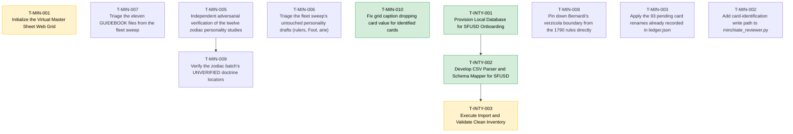

# 📋 Task Board

*(Auto-generated. Do not edit manually. Use `./bin/fleet` commands to transition tasks.)*

## 🕸️ Task Dependency Graph

---

## Repo: `intypiano`

### ✅ T-INTY-001 · P1 · ANY · DONE
**Provision Local Database for SFUSD Onboarding**
**Owner:** Worker-1

**Scope:**
- Create a new local database (e.g., `sfusd_piano`) using the existing `demo` or `unm_piano` database structure.
- Apply the intypiano schema (using SCHEMA.sql or current_schema.sql) to ensure all tables exist for the inventory tracking.
- Verify local database credentials and connectivity to this new instance.

**Definition of Done:**
- Local database is created and successfully running.
- Schema tables (inventory, clients, etc.) are present and empty (or initialized with core data).

*Audited against SHA:* `b38d1df087004ec826303a8b9c9bb0d38fee155b`

---
### ✅ T-INTY-002 · P1 · ANY · DONE
**Develop CSV Parser and Schema Mapper for SFUSD**
**Owner:** Worker-1

**Scope:**
- Read the CSV file located at `new_customers/SFUSD.csv`.
- Create a script (e.g. `import_sfusd.php` or a Python equivalent) to parse the CSV.
- Map CSV columns such as 'Make', 'Model', 'Serial Number', 'Location', 'Client Company', and 'Next Service Due On' to the internal `intypiano` schema.
- Handle data transformations, such as cleaning date formats and mapping boolean fields (e.g. 'Dampp Chaser Installed').

**Definition of Done:**
- The script accurately parses all 160+ rows from the CSV.
- A mapping document or the script itself is ready for execution against the database.

*Audited against SHA:* `b38d1df087004ec826303a8b9c9bb0d38fee155b`

---
### ⏳ T-INTY-003 · P1 · ANY · PEER_REVIEW
**Execute Import and Validate Clean Inventory**
**Owner:** Worker-1

**Scope:**
- Run the import script from T-INTY-002 against the newly created `sfusd_piano` local database.
- Validate that relationships between Clients (e.g., A.P. Giannini Middle School), Locations, and Pianos are correctly created.
- Ensure that active/inactive statuses and tuning intervals are properly stored.
- Perform a sanity check query to ensure the number of imported pianos matches the CSV and the data is clean.

**Definition of Done:**
- The `sfusd_piano` database is fully populated with the clean inventory.
- Spot checks verify that all imported pianos have correct makes, models, and locations.

*Audited against SHA:* `b38d1df087004ec826303a8b9c9bb0d38fee155b`

---

## Repo: `minchiate_tarot`

### 📋 T-MIN-005 · P1 · ANY · AUDITED
**Independent adversarial verification of the twelve zodiac personality studies**
**Owner:** None

**Scope:**
- Verify all twelve zodiac studies (research/pilots/drafts/PERSONALITY_TRUMP-24 through TRUMP-35, commits 2c233c4/c58e0f8/20ab16e/c4f389f on test) against the standard set by Element_Batch_Verification_Report.md and the Justice verification reports.
- The verifier must be a different agent/session from the batch author (Claude Fable 5, session of 10 Aug 2026); the author's inline mechanical checks do not count as the independent pass.
- Recompute every rank claim from the registry; fetch every load-bearing citation (JUS-C006/C008 reciprocations, Temperance and Fortitude resolvers, QC-075/QC-076 dispositions, Death/Devil/Love current records); diff each file against its wave siblings, the brief, and the failed stubs for clone symptoms.
- Check the cross-file edge matrix - all reciprocal records (LIB/VIR/SCO/ARI/CAP/SAG/ CAN/PIS/AQU/LEO/TAU/GEM claim tables) must agree in type, grading, and direction.
- Write Zodiac_Batch_Verification_Report.md in research/pilots/ with per-card verdicts (PASS / PASS_WITH_CORRECTIONS / FAIL) and apply corrections for anything found.

**Definition of Done:**
- research/pilots/Zodiac_Batch_Verification_Report.md exists with a verdict for each of the twelve cards and a checked cross-file edge matrix.
- Any FAIL is archived to research/archive/failed-runs/ and the card's disposition recorded, matching the Earth-study precedent.

*Audited against SHA:* `c4f389f`

---
### 📋 T-MIN-003 · P1 · ANY · AUDITED
**Apply the 93 pending card renames already recorded in ledger.json**
**Owner:** None

**Scope:**
- Verified by inspection of ledger.json on branch test-T-MIN-001 (worktree checkout of commit 0509f69): 93 of the 97 cards already carry identified: true, human_confirmed: true, and a populated type/value (Trump/Cups/Swords/ Batons/Coins + rank), but current_name still equals original_name for all 93 — meaning research/evidence/cards_raw/ still holds them under their raw geographic extraction filenames (e.g. 830124001_card_05.jpg) instead of their standardized archival names (e.g. Swords_6.jpg). Only 4 of 97 cards have actually been renamed.
- CARD_REVIEW_PROCESS_AND_IDENTIFYING.md Step 4 ("Final Standardization") defines this rename as the completion step of the identification workflow. The identification judgment work is already done and sitting unused in the ledger; this task is purely to apply it.
- Write a small one-shot script (e.g. finalize_identifications.py, following the pattern of the existing single-purpose scripts in the repo root such as dedupe_cards.py) that, for every ledger entry where identified is true and current_name == original_name, computes the target archival filename (Trump_N.jpg / <Suit>_N.jpg per the existing /api/update naming convention in git history at 2c233c4^:minchiate_reviewer.py), renames the file under research/evidence/cards_raw/, and updates current_name in ledger.json.
- Must refuse (log and skip, not crash) any rename whose target filename already exists, and must be safely re-runnable (a second run against an already-finalized ledger is a no-op).

**Definition of Done:**
- Running the script against the current ledger.json + cards_raw/ renames all 93 pending files to their archival names and updates ledger.json's current_name for each.
- Re-running the script immediately afterward makes zero further changes (idempotent), verified by hashing ledger.json / directory listing before and after the second run.
- No target-name collision silently overwrites an existing file.
- python3 minchiate_reviewer.py --check still exits 0 afterward (renamed files still resolve to their sheet geography via original_name's 9-digit prefix, which the sort key already reads from original_name rather than current_name).

*Audited against SHA:* `0509f6914e201ba192717c7a90c3c4154e5120fc`

---
### 📋 T-MIN-002 · P1 · ANY · AUDITED
**Add card-identification write path to minchiate_reviewer.py**
**Owner:** None

**Scope:**
- On branch test-T-MIN-001, minchiate_reviewer.py was rewritten from Flask to stdlib http.server (commits 1eb6550, 0509f69). The rewrite dropped the old Flask app's /api/update and /api/confirm POST routes entirely — the new ReviewerHandler implements only do_GET, no do_POST — so the running server is now read-only.
- CARD_REVIEW_PROCESS_AND_IDENTIFYING.md Step 2-4 and its "Next Steps" section explicitly define the reviewer app's purpose as letting a user click a card in the grid, assign its identity (Suit/Rank or Trump number), persist that judgment to ledger.json, and rename the underlying file to its archival name (e.g. Cups_03.jpg). None of that is implemented in the current read-only build.
- Add a do_POST handler (or equivalent) to ReviewerHandler exposing at least an update-identity endpoint that accepts an original_name/current_name plus type+value, validates against a target filename collision, renames the file under research/evidence/cards_raw/, updates ledger.json (identified, type, value, current_name), and returns JSON — matching the semantics the old Flask /api/update route had, but implemented stdlib-only per this branch's existing "no Flask/Jinja2" design constraint stated in the module docstring.
- Wire minimal client-side interaction in render_grid_html's output (a click handler / small inline form per card, or a simple prompt-based flow) so the identification can actually be entered from the browser, not only via curl.

**Definition of Done:**
- POST request to the new endpoint with a valid original_name/type/value updates ledger.json's identified/type/value fields and renames the file on disk, verified by re-reading ledger.json and os.path.exists on the new name.
- A request naming a target filename that already exists on disk is rejected (no rename performed, no file clobbered) with a non-200 response.
- Grid page loaded after an update reflects the new identity without manual ledger editing.
- python3 minchiate_reviewer.py --check still exits 0 (existing read-path behavior is not broken).

*Audited against SHA:* `0509f6914e201ba192717c7a90c3c4154e5120fc`

---
### ⏳ T-MIN-001 · P1 · ANY · HUMAN_REVIEW
**Initialize the Virtual Master Sheet Web Grid**
**Owner:** Worker-1

**Scope:**
- Create the base minchiate_reviewer.py application.
- Load the 97 extracted images and sort them geographically by their filename prefix.
- Serve a dynamic web grid layout reflecting the original master sheet.

**Definition of Done:**
- Server runs locally without errors.
- Renders a grid of 97 images in their stitched order in the browser.

*Audited against SHA:* `b51d4e4`

---
### 📋 T-MIN-007 · P2 · ANY · AUDITED
**Triage the eleven GUIDEBOOK files from the fleet sweep**
**Owner:** None

**Scope:**
- Verification-triage all eleven GUIDEBOOK_*.md files in research/pilots/drafts/ (TRUMP-01 through -05, -08, -36 through -40), which sit on main and test looking authoritative but are unverified fleet output.
- Establish first what a GUIDEBOOK file is supposed to be - no committed spec appears to exist; check the sweep's originating brief and whether the format duplicates, summarizes, or contradicts the personality studies.
- Check each file for the three known disguises (wrong-but-fluent, stub-with-a-label, clone-with-a-costume) with diffs against the personality studies and each other; recompute any rank or scoring claims against the registry.
- Recommend a disposition for the format itself - keep as a distinct deliverable (write the missing spec), fold into the personality studies, or archive - and per-file bins consistent with that recommendation.

**Definition of Done:**
- A triage report in research/pilots/ covers all eleven files with per-file bins and a reasoned recommendation on the GUIDEBOOK format's future.
- No GUIDEBOOK file remains uninspected; any clone or stub is archived with a disposition note.

*Audited against SHA:* `c4f389f`

---
### 📋 T-MIN-006 · P2 · ANY · AUDITED
**Triage the fleet sweep's untouched personality drafts (rulers, Fool, arie)**
**Owner:** None

**Scope:**
- Verification-triage the ten fleet-sweep personality drafts no verifier has touched; the four ruler studies (PERSONALITY_TRUMP-01 through TRUMP-04, 24-102 lines), the Fool (63 lines), and the five arie (PERSONALITY_TRUMP-36 through TRUMP-40, 31-63 lines).
- Assume the barbell found in the 10 Aug sweep; expect stubs-with-labels, wrong-but- fluent rank claims, and clones. Diff every file against the evidence pilot, the committed studies, and each other before reading on its own terms.
- Sort each file into one of three bins: KEEP (verify and correct to the committed standard), REWRITE (fail it, archive to research/archive/failed-runs/, and write a batch brief on the ZODIAC_BATCH_BRIEF model), or DEFER (record why).
- Mind the standing cautions - registry family field reads Trump for all trumps; the arie are commonly unnumbered so XXXVI-XL are editorial ranks; TRUMP-40 naming is only Moderate confidence (Trombe/Fame/Judgment variants; no Judgement-as-original-title).
- Do not rewrite the studies inside this task; produce the triage report and any needed batch briefs so authoring can be scoped as follow-up tasks.

**Definition of Done:**
- A triage report in research/pilots/ assigns every one of the ten files a bin with evidence (diffs run, ranks recomputed, citations spot-fetched).
- Any file failed as a clone or stub is archived with a disposition note, matching the Justice-clone precedent.

*Audited against SHA:* `c4f389f`

---
### ✅ T-MIN-010 · P2 · ANY · DONE
**Fix grid caption dropping card value for identified cards**
**Owner:** Worker-F10

**Scope:**
- In minchiate_reviewer.py (branch test-T-MIN-001, commit 0509f69), render_grid_html builds each card caption as: label = html.escape(card.get("type") or card["original_name"]) — this shows only the type string (e.g. "Swords") and silently drops the value/rank field entirely, even though ledger.json already stores it for 93 of 97 cards (confirmed by inspection: e.g. {"type": "Swords", "value": "6", ...} renders only as "Swords"). Every card of the same suit is indistinguishable in the grid caption, which defeats the anchor-identification workflow described in CARD_REVIEW_PROCESS_AND_IDENTIFYING.md Step 3 (Contextual Inference relies on being able to read neighboring cards' identities at a glance).
- Change the label to include both type and value when both are present (e.g. "Swords 6" or "Trump 15"), falling back to original_name only when the card is unidentified.

**Definition of Done:**
- For a card with type and value populated in the ledger, the rendered grid HTML's figcaption contains both the type and the value.
- For an unidentified card (empty type), the figcaption still falls back to original_name as before.
- python3 minchiate_reviewer.py --check still exits 0.

*Audited against SHA:* `0509f6914e201ba192717c7a90c3c4154e5120fc`

---
### 📋 T-MIN-008 · P2 · ANY · OPEN
**Pin down Bernardi's verzicola boundary from the 1790 rules directly**
**Owner:** None

**Scope:**
- Open the RULE-1790 (Bernardi) source directly and transcribe every verzicola combination example, replacing the Justice pilot's hedge ('I-V and beginning around XXVIII', pilot line 92) with an exact list.
- Thirteen committed studies currently lean on that hedge; the zodiac batch flags it as acutely open at XXVII (one numeral below) and XXVIII (the numeral the hedge names), and the element batch left 'whether XX-XXIII can form a verzicola' as a standing open question in all four files.
- Record whether the examples are exhaustive or exemplary in Bernardi's own text; do not convert examples into rules - the deliverable is the transcription plus locators (chapter and printed page), not an interpretation.
- If the boundary resolves, list the follow-up amendments needed (zodiac files XXVII/XXVIII sections 2 and 4, element files' open questions, Justice pilot cross-references) as a reconciliation queue; apply them only if the audit scopes that in.

**Definition of Done:**
- A sourced note in research/02-source-audit/ or research/pilots/ transcribes the verzicola examples with exact locators and states what the record can and cannot support.
- The reconciliation queue of affected files is listed with per-file line references.
- The hedge is superseded only by direct transcription, never by memory.

---
### 📋 T-MIN-009 · P3 · ANY · OPEN
**Verify the zodiac batch's UNVERIFIED doctrine locators**
**Owner:** None

**Scope:**
- The twelve zodiac studies deliberately hedge their classical-doctrine citations rather than invent locators. Resolve each to a real locator or downgrade the claim; 'Ptolemy Tetrabiblos Book I aspects-of-the-signs chapter (used for all six diametrical opposite edges); Aratus Phaenomena lines for the Chelae/Claws material (Libra/Scorpio) and the Parthenos grain-ear (Virgo); Sacrobosco De sphaera cap. II zodiac description and the tropics (Capricorn/Cancer); Isidore Etymologiae III day-equals-night gloss (Libra); the sun-domicile scheme (Leo); Hydrochoos and winter-rains (Aquarius); Dioscuri star-lore (Gemini).'
- Every resolution must come from an opened source with a page/line/chapter locator, never from memory - the citation audit's 208 untraceable references are the cautionary tale.
- Update the twelve claims tables and prose gradings in place (Moderate-pending- locators to High, or downgrade to [UNVERIFIED] wholesale where the source does not bear the claim); keep prose and tables in sync.

**Definition of Done:**
- No zodiac study contains the phrase 'locator UNVERIFIED' without either a resolved citation or an explicit downgrade recorded in its claims table.
- A short locator-resolution note records which sources were opened and what each yielded.

---
