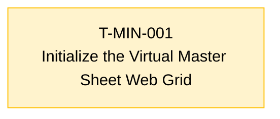

# 📋 Task Board

*(Auto-generated. Do not edit manually. Use `./bin/fleet` commands to transition tasks.)*

## 🕸️ Task Dependency Graph

---

## Repo: `minchiate_tarot`

### ⏳ T-MIN-001 · P1 · ANY · PEER_REVIEW
**Initialize the Virtual Master Sheet Web Grid**
**Owner:** Worker-1

**Scope:**
- Create the base minchiate_reviewer.py application.
- Load the 97 extracted images and sort them geographically by their filename prefix.
- Serve a dynamic web grid layout reflecting the original master sheet.

**Definition of Done:**
- Server runs locally without errors.
- Renders a grid of 97 images in their stitched order in the browser.

*Audited against SHA:* `b51d4e4`

---
