# 📋 Task Board

*(Auto-generated. Do not edit manually. Use `./bin/fleet` commands to transition tasks.)*

## 🕸️ Task Dependency Graph

```mermaid
graph TD
    classDef done fill:#d4edda,stroke:#28a745,color:#000;
    classDef blocked fill:#f8d7da,stroke:#dc3545,color:#000;
    classDef review fill:#fff3cd,stroke:#ffc107,color:#000;
    classDef active fill:#cce5ff,stroke:#007bff,color:#000;
    T-PTG-004["T-PTG-004<br/>Audit citation metadata accuracy: volume/issue-number mismatches between issue_label and title"]:::review
    T-PTG-008["T-PTG-008<br/>Tag-triggered feature-request conversation lane, parallel to the citation-grounded RAG pipeline"]:::active
    T-MIN-017["T-MIN-017<br/>Apply D4 — Cavalier/Knight naming policy (write policy + audit four cavalier registry rows)"]:::review
    T-MIN-016 --> T-MIN-017
    T-MIN-001["T-MIN-001<br/>Initialize the Virtual Master Sheet Web Grid"]:::done
    T-MIN-016["T-MIN-016<br/>Apply D3 — rename TRUMP-FOOL to SPECIAL-FOOL, sort_order 0, permanent alias"]:::done
    T-PTG-005["T-PTG-005<br/>Voicing-technique continuity + citation-format test matrix (all preset x tier combos)"]:::review
    T-INTY-021["T-INTY-021<br/>Local dev DB fallback hardcodes nonexistent caut_sfusd, breaking phpunit baseline"]:::done
    T-MIN-011["T-MIN-011<br/>Author the arie batch fresh — five celestial trump personality studies (TRUMP-36..40)"]:::done
    T-MIN-007["T-MIN-007<br/>Triage the eleven GUIDEBOOK files from the fleet sweep"]:::review
    T-PTG-002["T-PTG-002<br/>Stop citing every retrieved chunk — only cite what the model actually referenced"]
    T-PTG-001 --> T-PTG-002
    T-INTY-017["T-INTY-017<br/>Piano Dossier Data Entry Interface (Modern EAV)"]:::review
    T-PTG-003["T-PTG-003<br/>Lock in citation-numbering fix with a real-shape regression fixture"]
    T-PTG-001 --> T-PTG-003
    T-PTG-002 --> T-PTG-003
    T-MIN-006["T-MIN-006<br/>Triage the fleet sweep's untouched personality drafts (rulers, Fool, arie)"]:::done
    T-INTY-020["T-INTY-020<br/>Design (not build) nightly sync of Gazelle service history keyed on gazelle_id"]
    T-INTY-018 --> T-INTY-020
    T-INTY-019["T-INTY-019<br/>'Open in Gazelle' deep-link button on the Piano Dossier page"]
    T-INTY-018 --> T-INTY-019
    T-MIN-013["T-MIN-013<br/>Design the light-tier suit-card study format (spec + two pilot cards)"]:::review
    T-MIN-009["T-MIN-009<br/>Verify the zodiac batch's UNVERIFIED doctrine locators"]:::done
    T-MIN-005 --> T-MIN-009
    T-PTG-001["T-PTG-001<br/>Fix footnote list numbering to match inline citation markers"]:::review
    T-MIN-008["T-MIN-008<br/>Pin down Bernardi's verzicola boundary from the 1790 rules directly"]
    T-MIN-012["T-MIN-012<br/>Author the Papi/Fool batch — TRUMP-01/02/04 and the Fool fresh, TRUMP-03 corrections applied"]:::done
    T-INTY-018["T-INTY-018<br/>Add dedicated gazelle_id column, decoupled from piano_code"]:::review
    T-PTG-006["T-PTG-006<br/>Enhanced multi-turn conversational-quality testing system (Golden Hammer deep dive)"]:::done
    T-MIN-003["T-MIN-003<br/>Apply the 93 pending card renames already recorded in ledger.json"]:::review
    T-MIN-015["T-MIN-015<br/>Reconcile the Papi/Fool batch's deferred arie edges now that T-MIN-011 is merged"]:::done
    T-MIN-014["T-MIN-014<br/>Write back resolved dispositions into the Quarantine Register (CW-5/6/7/10 and their QC rows)"]:::done
    T-MIN-002["T-MIN-002<br/>Add card-identification write path to minchiate_reviewer.py"]:::done
    T-PTG-007["T-PTG-007<br/>Aggregate/statistical question handling (5th cognitive mode) — frequent contributors scenario"]:::done
    T-MIN-018["T-MIN-018<br/>Attempt direct web access to Bernardi 1790 (archive.org) to resolve the verzicola boundary before requiring a human download — supersedes T-MIN-008"]:::done
```

---

## Repo: `intypiano`

### ✅ T-INTY-021 · P0 · ANY · DONE
**Local dev DB fallback hardcodes nonexistent caut_sfusd, breaking phpunit baseline**
**Owner:** Worker-DBFallback1

**Scope:**
- Confirmed by reading classes/core/DatabaseManager.php lines 251-294 directly (not by inference): the localhost/127.0.0.1 branch (line 251) enters a sub-branch at line 267 (`if (isset($this->app->app) && $this->app->app== "cauttools")`) that is NOT a rare edge case -- `classes/redditlite_base.php` line 8 sets `public $app="cauttools";` as the class default, and essentially every entry point in the app (`admin_header_base.php` line 15, `admin/v2/_guard.php` line 17, `scripts/migrate.php`, most of `api/*.php`, and the PHPUnit `Integration` tests) explicitly re-sets `$r->app = "cauttools"` anyway. This branch is the normal path for local dev and CI, not an exception.
- Within that sub-branch (lines 272-291), `$_SERVER['SERVER_PORT']` selects the database: ports 8001-8010 map to `caut_demo01`..`caut_demo10` (the demo-pool infrastructure from the 2026-08-11 multi-tenant work, commit 8dbcaeb9) -- this part is legitimate and working. Every other port, including 2027 (the port CLAUDE.md and the whole PHPUnit suite standardize on, and the port `php -S localhost:2027 -t .` binds), falls into the `else` at line 278 and hardcodes `$db = "caut_sfusd"`. `config.php`'s `$db_configs['sfusd']` override (checked at lines 283-290) also resolves to `caut_sfusd` -- confirmed by reading config.php, so it provides no escape hatch locally.
- Confirmed `caut_sfusd` does not exist as a local database and nothing in the repo suggests it ever should on port 2027 -- `git blame` on lines 267-291 attributes the entire cauttools sub-branch to commit 8dbcaeb9 (2026-08-11, "Demo pool: ten pre-built slots, hostname mapping, and a 14-day reset"), i.e. the `caut_sfusd` hardcoded else-default was introduced at the same time as the demo-pool port logic, not inherited from older working code. There is no earlier commit where this fallback pointed anywhere else. CLAUDE.md is explicit that the local dev server should hit `intypiano_demo` ("The server hits `intypiano_demo`... Local login for the v2 admin: `cmiller` / `localdev1` on `intypiano_demo`"), and `intypiano_demo` does exist locally per the same doc.
- Confirmed this is NOT v2-admin-scoped: `admin_header_base.php` (the V1 admin gate) sets `$r->app = "cauttools"` and calls `$r->init()` exactly the same as `admin/v2/_guard.php` does, so V1 admin pages hit the identical broken fallback on port 2027. Blast radius is the whole local/CI test run, which matches the observed jump from the documented baseline (259 tests, 0 failures) to the current run (330 tests, 18 errors, 114 failures, 6 skipped) and the literal `Unknown database 'caut_sfusd'` fatal thrown from `classes/core/DatabaseManager.php:307` when hitting `admin/v2/piano.php` directly.
- The fix must be minimal and targeted: change ONLY the else-branch default at line 278-280 (and, if needed, whether the config.php sfusd override at lines 283-290 should still apply on this port) so that the standard local dev port (2027, and any non-demo-pool port covered by this branch) resolves to `intypiano_demo` instead of the hardcoded `caut_sfusd`. Do NOT rip out or restructure the `if (isset($this->app->app) && $this->app->app=="cauttools")` gate itself, and do NOT touch the `$server_port >= 8001 && $server_port <= 8010` demo-pool dispatch (lines 274-277) -- that is working multi-tenant infrastructure serving a different, unrelated purpose (the ten `demo01`..`demo10` slots) and must be left exactly as-is.
- Credentials: the demo-pool branch uses `root`/`root` (lines 268-269, set before the port check, so it already applies to the else-branch too) -- confirm during implementation whether `intypiano_demo` uses those same local credentials or needs its own, and set username/password/db together rather than leaving a mismatched combination.
- Out of scope: do not touch the non-localhost branches (sfusd.cauttools.com, unm.cauttools.com, demo01.cauttools.com, uh-test.cauttools.com, etc. -- lines 152-249), do not touch config.php or config_template.php, and do not investigate or fix the separate MAMP-port fallback at line 316 unless it turns out to be entangled with this fix.

**Definition of Done:**
- A fresh `./vendor/bin/phpunit` run (against `php -S localhost:2027 -t .` serving `intypiano_demo`, per CLAUDE.md) shows the error/failure count drop substantially from the current 18 errors / 114 failures -- the DoD is not satisfied by a partial improvement that still leaves `Unknown database` as a live cause of failures.
- Directly hitting `admin/v2/piano.php` (or any other admin/v2/* page) on localhost:2027 no longer throws `Uncaught mysqli_sql_exception: Unknown database`.
- The demo-pool ports (8001-8010) are verified unaffected: the fix did not alter `$server_port >= 8001 && $server_port <= 8010` or the `caut_demoNN` mapping it produces.
- The four "original localhost" ports/hosts in the outer branch (lines 251) that are not port 2099/8888/3031 -- confirm the fix does not regress the pre-existing `game_people` DB path used by those, since the cauttools sub-branch only fires when `$this->app->app=="cauttools"`, which is not every caller.

*Audited against SHA:* `3cf4775d3561b3746c6e55586921beb4492ec57d`

---
### ⏳ T-INTY-018 · P1 · ANY · HUMAN_REVIEW
**Add dedicated gazelle_id column, decoupled from piano_code**
**Owner:** Worker-Gazelle1

**Scope:**
- Verified live in intypiano_demo (which is anonymized production data, so this is not hypothetical) - all 126 inventory.piano_code values already look like Gazelle "Piano ID" strings (e.g. '110641', '110801', '152964'), not QR-specific codes. import_sfusd.php lines 31, 41-44 confirm the mechanism - it reads the Gazelle CSV's 'Piano ID' column and writes it straight into inventory.piano_code on import. So piano_code is silently overloaded today - it is simultaneously the QR lookup key AND the raw Gazelle identifier - and the user has rejected reusing it further, wanting a dedicated gazellecode (gazelle_id) column instead.
- CRITICAL - piano_code is not just a database key, it is physically printed on QR labels already deployed on real pianos. qr_report_generator.php, qr_avery5162_poc.php and piano/index.php all resolve piano_code to a piano via '/piano/{piano_code}' links baked into printed/laminated QR codes (see PIANO_QR_SETUP.md, 'Test 2 - View Piano Landing Page'). Do NOT regenerate or overwrite existing piano_code values - that breaks every QR code already taped to an instrument. The correct migration is additive - backfill the new gazelle_id column by COPYING the current piano_code value (since today they are identical for existing rows), not by moving/renaming the column.
- There are two tables that both currently carry piano_code and need the same treatment - v1 inventory (VARCHAR, no visible unique constraint found in this scout pass - confirm before writing DDL) and v2 pianos (ddl/132/001_v2_schema.sql line 37, VARCHAR(24) NULL, with UNIQUE KEY uniq_piano_code line 49). Note also that ddl/132/004_map_pianos.sql is the ONE-TIME migration that originally populated pianos.piano_code from inventory - this scout pass found no ongoing sync job between the two tables, so confirm whether new inventory rows (e.g. from a future SFUSD-style import) ever reach v2 pianos at all, and whether gazelle_id needs backfilling on both tables or whether v2 pianos is the only target that matters going forward (see docs/experts/schema-catalog.md v2 row).
- New ddl migration - next sequential directory after ddl/145 (currently ddl/145/001_piano_floor.sql + 002_verify.php is the highest). Follow that file's exact pattern - one ALTER TABLE per .sql file, a companion NNN_verify.php, comment block explaining why. Add 'gazelle_id VARCHAR(24) NULL' (match piano_code's width unless investigation shows Gazelle IDs run longer) to pianos (and inventory if the sync question above resolves that inventory still matters), with an index - decide UNIQUE vs plain KEY based on whether Gazelle IDs are confirmed globally unique (a duplicate/failed unique constraint would break future imports, so verify before choosing UNIQUE).
- Per CLAUDE.md - never use DatabaseManager::dosql() in migration code, use getConnection()->query(). Strict SQL mode stays on - do not add SET SESSION sql_mode='' to make a coercion pass. Never target unm_piano, unm_piano_readonly or unm_piano_test.
- Update import_sfusd.php to populate the new gazelle_id column with $piano_id going forward. Decide and document explicitly what piano_code should hold for NEW rows once gazelle_id exists (options - leave piano_code populated with the same Gazelle ID as before for continuity with the existing QR scheme, or start assigning piano_code independently at label-printing time - this is a product decision, not just a schema one, so state the chosen behavior in the PR/commit rather than silently picking one).
- Backfill existing rows - UPDATE gazelle_id = piano_code for all rows where piano_code looks like a Gazelle ID pattern (investigate whether any current piano_code values are NOT Gazelle IDs - e.g. hand-assigned QR codes for pianos with no Gazelle record - before blanket-copying every row).

**Definition of Done:**
- New ddl/<next>/001_*.sql adds gazelle_id to pianos (and inventory if in scope per the sync investigation above), with a verify script following the ddl/145 pattern, runnable via scripts/migrate.php against intypiano_demo (never unm_piano/unm_piano_readonly/unm_piano_test).
- Existing piano_code values are provably unchanged after migration - a before/after diff of SELECT id, piano_code FROM pianos shows zero modified rows, and qr_avery5162_poc.php / piano/index.php still resolve every existing piano_code to the same piano (spot-check at least 3 real codes from intypiano_demo).
- gazelle_id is populated for all rows where the investigation confirms piano_code currently holds a Gazelle ID (expected ~126/126 in demo data today, but confirm rather than assume 100%).
- import_sfusd.php writes gazelle_id going forward; the chosen behavior for piano_code on new imports is explicitly documented in the commit message.
- ./vendor/bin/phpunit does not introduce NEW failures/errors beyond the PM-captured baseline below. PM AUDIT NOTE (2026-08-12, repo-sha 3cf4775d) - CLAUDE.md's documented "259 tests, 0 failures" baseline is currently STALE and NOT reproducible. A clean run on this exact SHA (php -S localhost:2027 -t ., then ./vendor/bin/phpunit) produced Tests=330, Assertions=564, Errors=18, Failures=114, Skipped=6. This is a pre-existing regression, unrelated to Gazelle/gazelle_id - traced to admin/v2/* pages 500ing locally ("Uncaught mysqli_sql_exception - Unknown database 'caut_sfusd'" out of classes/core/DatabaseManager.php:307) since the new multi-tenant config.php/ DatabaseManager dispatch landed 2026-08-11 (commits 40d00b89..4751c925). Reproduced 3 independent ways (fresh php -S process, direct curl to admin/v2/piano.php, and a standalone PHP CLI simulation) - this is not an artifact of a stale/duplicate local server process. Do NOT let a Worker "fix" this DatabaseManager/config.php regression as part of this task - it is a separate, unrelated bug; file it as its own task instead. The Worker's bar for this task is - the SAME 330/18/114/6 shape (or better) after adding gazelle_id, not the stale 259/0 figure in CLAUDE.md.

*Audited against SHA:* `3cf4775d3561b3746c6e55586921beb4492ec57d`

---
### ⏳ T-INTY-017 · P1 · ANY · PEER_REVIEW
**Piano Dossier Data Entry Interface (Modern EAV)**
**Owner:** TaskForce

**Scope:**
- I
- m
- p
- l
- e
- m
- e
- n
- t
-  
- a
-  
- m
- o
- d
- e
- r
- n
- i
- z
- e
- d
-  
- E
- A
- V
-  
- a
- r
- c
- h
- i
- t
- e
- c
- t
- u
- r
- e
-  
- f
- o
- r
-  
- c
- o
- l
- l
- e
- c
- t
- i
- n
- g
-  
- d
- e
- t
- a
- i
- l
- e
- d
-  
- P
- i
- a
- n
- o
-  
- c
- o
- n
- d
- i
- t
- i
- o
- n
-  
- d
- o
- s
- s
- i
- e
- r
- s
- ,
-  
- b
- a
- s
- e
- d
-  
- o
- n
-  
- t
- h
- e
-  
- S
- t
- a
- n
- f
- o
- r
- d
-  
- T
- e
- m
- p
- l
- a
- t
- e
-  
- P
- D
- F
- .
- 

- I
- n
- c
- l
- u
- d
- e
- s
-  
- s
- c
- h
- e
- m
- a
-  
- (
- `
- d
- o
- s
- s
- i
- e
- r
- _
- f
- i
- e
- l
- d
- _
- d
- e
- f
- i
- n
- i
- t
- i
- o
- n
- s
- `
- ,
-  
- `
- p
- i
- a
- n
- o
- _
- d
- o
- s
- s
- i
- e
- r
- s
- `
- ,
-  
- `
- p
- i
- a
- n
- o
- _
- d
- o
- s
- s
- i
- e
- r
- _
- v
- a
- l
- u
- e
- s
- `
- )
- ,
-  
- 

- a
-  
- m
- o
- b
- i
- l
- e
- -
- f
- i
- r
- s
- t
-  
- d
- a
- t
- a
-  
- e
- n
- t
- r
- y
-  
- i
- n
- t
- e
- r
- f
- a
- c
- e
-  
- (
- `
- a
- d
- m
- i
- n
- /
- v
- 2
- /
- d
- o
- s
- s
- i
- e
- r
- _
- e
- d
- i
- t
- .
- p
- h
- p
- `
- )
-  
- w
- i
- t
- h
-  
- s
- e
- g
- m
- e
- n
- t
- e
- d
-  
- t
- o
- u
- c
- h
- -
- f
- r
- i
- e
- n
- d
- l
- y
-  
- g
- r
- a
- d
- i
- n
- g
-  
- b
- u
- t
- t
- o
- n
- s
- ,
-  
- 

- a
- n
- d
-  
- i
- n
- t
- e
- g
- r
- a
- t
- i
- o
- n
-  
- i
- n
- t
- o
-  
- t
- h
- e
-  
- e
- x
- i
- s
- t
- i
- n
- g
-  
- V
- 2
-  
- p
- i
- a
- n
- o
-  
- v
- i
- e
- w
-  
- (
- `
- a
- d
- m
- i
- n
- /
- v
- 2
- /
- p
- i
- a
- n
- o
- .
- p
- h
- p
- `
- )
- .
- 

**Definition of Done:**

*Audited against SHA:* `efef90953c62f09c2e6c74e3cee15c97ddf57980`

---
### 📋 T-INTY-019 · P2 · ANY · OPEN
**"Open in Gazelle" deep-link button on the Piano Dossier page**
**Owner:** None

**Scope:**
- PM NOTE (2026-08-12, left OPEN not audited) - this task's DoD requires manually verifying admin/v2/piano.php in a running local server with before/after evidence. As of repo-sha 3cf4775d, EVERY admin/v2/* page 500s on a fresh local checkout ("Uncaught mysqli_sql_exception - Unknown database 'caut_sfusd'" from classes/core/DatabaseManager.php:307), unrelated to Gazelle - it is a regression in the new multi-tenant config.php/ DatabaseManager dispatch added 2026-08-11 (commits 40d00b89..4751c925). Verified 3 independent ways (fresh php -S, direct curl, standalone PHP CLI repro). This task also structurally cannot be claimed before T-INTY-018 is DONE (bin/fleet.py's claim command checks dependency status == DONE, not just AUDITED/existence - confirmed by reading bin/fleet.py lines ~296-303), so there is no urgency to unlock it now. Recommended - file a separate bug task for the admin/v2 DatabaseManager regression and get it fixed BEFORE auditing this one, otherwise a Worker will be blocked on an unrelated pre-existing bug through no fault of their own. Re-run this scope's own verification (php -l admin/v2/piano.php && ./vendor/bin/phpunit) against a fresh sha before auditing.
- Small, low-risk UI addition. Add an "Open in Gazelle" button/link to admin/v2/piano.php (the Piano Dossier / instrument page shipped in T-INTY-017, integrated with dossier_edit.php) that opens the piano's record in the Gazelle CRM in a new tab, built from the new pianos.gazelle_id column added by T-INTY-018.
- Confirm the actual Gazelle web URL pattern before hardcoding it (this scout pass did not have access to a Gazelle account/docs to confirm the URL scheme - e.g. whether it's a path like https://app.gazellecrm.com/pianos/{id} or a query-string form). Do not guess and ship a link that 404s - verify with the user or find it in the CSV/API docs referenced by the original Gazelle Data Normalization tool work (git log shows commit 1ea83713 'feat(integrations) - build Gazelle Data Normalization tool' - check that work for any recorded Gazelle URL conventions first).
- Render conditionally - if pianos.gazelle_id IS NULL for this piano (e.g. it predates the Gazelle integration or was hand-entered), do not show a dead link; either hide the button or show a disabled/greyed state with a tooltip explaining why.
- Follow admin/v2/piano.php's existing conventions for buttons/links (CSRF is irrelevant here since this is a pure outbound GET link, not a form post, but match the existing visual style in that file rather than introducing a new button pattern).

**Definition of Done:**
- admin/v2/piano.php shows an "Open in Gazelle" link/button when the piano's gazelle_id is set, pointing at a confirmed-correct Gazelle URL pattern, and hides or disables it when gazelle_id is NULL.
- php -l admin/v2/piano.php passes.
- Manually verified in a running server (php -S localhost:2027 -t .) against at least one piano with a gazelle_id and one without, per CLAUDE.md's "prefer running over reading" rule - screenshot or terminal evidence of both states attached to the handoff.
- ./vendor/bin/phpunit still reports the 259-test baseline with 0 new failures.

---
### 📋 T-INTY-020 · P3 · ANY · AUDITED
**Design (not build) nightly sync of Gazelle service history keyed on gazelle_id**
**Owner:** None

**Scope:**
- This is a research/design task, not a build task. Do not write a sync job or cron script under this task. The original proposal (a prior Gemini/ Antigravity session, endorsed by the user in principle) wants a nightly sync of volatile Gazelle data - service history, tuning dates, condition reports - pulled into intypiano and keyed on the new pianos.gazelle_id column from T-INTY-018.
- PM AUDIT CORRECTION (2026-08-12) - the scout's framing that "Gazelle API access was never confirmed to exist" is WRONG and stale as of this repo-sha. classes/integration/GazelleAPI.php (added in commit 1ea83713, the same commit the scout cites) is a working private GraphQL client (https://gazelleapp.io/graphql/private) with a confirmed READ query (allPianos) and a confirmed WRITE mutation (updatePiano), already wired up and used in production by admin/v2/normalization.php's "Mass Edit" tool. API access is confirmed to exist. Do NOT scope this task as "determine whether an API exists" - go read those two files first.
- The REAL open question this design doc should answer instead - today's GazelleAPI usage takes a per-request, admin-pasted `gazelle_api_key` typed into a form field (see admin/v2/normalization.php lines ~18-83); there is no stored/persisted service-account credential anywhere in the repo. A nightly cron job has no admin sitting at a keyboard to paste a key each run, so the design doc must cover where that credential would live (config_local.php- style gitignored file? a new `gazelle_credentials` table? an env var?) and how it avoids the fate of the API-token bearer-secret pattern already used by api/v1/admin/logRefill.php (config/api_token.php, gitignored, INTYPIANO_API_TOKEN env override).
- Also flag explicitly - the existing GraphQL API is NOT read-only. It has a live `updatePiano` mutation capable of overwriting Gazelle's own data. A nightly sync job pulling FROM Gazelle should almost certainly restrict itself to the read-only `allPianos`-style query and never call the mutation path, but this is a design decision the doc must state explicitly, not something to leave implicit - a future Worker copy-pasting GazelleAPI.php usage could otherwise wire up writes by accident.
- The deliverable is a written design doc (per this repo's expert-page convention, likely docs/experts/gazelle-sync.md or under task_coordinator's Dewey Decimal 20-Architecture/ per that repo's own doc rules) covering - what data Gazelle can realistically expose beyond GazelleAPI.php's current make/model fields (does allPianos or a sibling query already return service history / tuning dates / condition reports, or only the make/model fields the Normalization tool uses - check the GraphQL schema, don't assume), how conflicts are resolved when both intypiano and Gazelle have edited the same piano's data since last sync (the original proposal's "detecting remote edits" item was deliberately NOT scoped as a task here - flag it as an open question this design doc should surface, not solve), what fields sync one-way vs. need human reconciliation, and what a minimal V1 sync would touch (proposed - only pianos rows where gazelle_id IS NOT NULL, from T-INTY-018).
- Do not scope pushing intypiano invoices/data back to Gazelle - that is a separate, more speculative future phase explicitly deferred by this scout pass (see feedback file), not by accident.

**Definition of Done:**
- A written design doc exists (exact location per whichever repo's doc convention applies - confirm intypiano has no equivalent Dewey rule before defaulting to task_coordinator's). It must not re-litigate whether Gazelle API access exists (confirmed - classes/integration/GazelleAPI.php, a working private GraphQL client already used in production by admin/v2/normalization.php). It must state clearly (a) what fields that API actually exposes today vs. what a nightly sync would need, (b) where a persisted service-account credential for an unattended cron job would live, since today's only working credential flow is an admin pasting a key per request, and (c) that the sync must be read-only against Gazelle even though the client library exposes a write mutation.
- The doc names which specific fields (service history, tuning dates, condition reports) are in scope for a V1 sync and which are deferred.
- The doc explicitly notes conflict/remote-edit detection as unsolved and out of scope for V1, so a future PM does not assume it was silently handled.
- No production code, migration, or cron job is added under this task - if the investigation finds enough clarity to justify a build, that becomes a new task, not scope creep on this one.

*Audited against SHA:* `3cf4775d3561b3746c6e55586921beb4492ec57d`

---

## Repo: `minchiate_tarot`

### ✅ T-MIN-001 · P1 · ANY · DONE
**Initialize the Virtual Master Sheet Web Grid**
**Owner:** Worker-1

**Scope:**
- Create the base minchiate_reviewer.py application.
- Load the 97 extracted images and sort them geographically by their filename prefix.
- Serve a dynamic web grid layout reflecting the original master sheet.

**Definition of Done:**
- Server runs locally without errors.
- Renders a grid of 97 images in their stitched order in the browser.

*Audited against SHA:* `b51d4e4`

---
### ✅ T-MIN-011 · P1 · ANY · DONE
**Author the arie batch fresh — five celestial trump personality studies (TRUMP-36..40)**
**Owner:** Worker-F11

**Scope:**
- Write five personality studies fresh — TRUMP-36 Star, TRUMP-37 Moon, TRUMP-38 Sun, TRUMP-39 World, TRUMP-40 Trumpets — to research/pilots/ARIE_BATCH_BRIEF.md (read it in full first; its required-reading list is binding). The archived fleet drafts in research/archive/failed-runs/ are inputs at most, NEVER base text; every card is written fresh to the brief.
- Work in waves (one or two) with an adversarial per-wave verification pass, on the ZODIAC_BATCH_BRIEF pattern that produced the verified 12-study zodiac batch; within-wave symmetry must be flagged for the verifier.
- Known trap (binding): the arie are unnumbered — registry historical_number is "unnumbered arie" for all five; XXXVI-XL and rank 36-40 are project bookkeeping (editorial only), stated in the secure core and never presented as printed fact.
- Known trap (binding): TRUMP-40 naming is Moderate confidence with Trombe / Trumpets / Fame / Fama / Last Judgment as recorded variants — disclose all of them, but never assert "Judgement as universal original title" and never smuggle the withdrawn summons/eschatology reading in structurally (CW-10 requires a §0 disposition that keeps the naming question open).
- Known trap (binding): NO pricing amounts for the arie. Bernardi 1790 transcription is bounded at XXVII (JUS-C006, pilot L80) — the arie are outside it; Minucci 1688 gives special value with no amounts (DEA-C004, exemplary list). Any specific amount must cite a real opened source or not appear; otherwise [UNVERIFIED] and queued in §5.
- The Quarantine Register rows QC-077 through QC-089 and CW-10 must each be dispositioned per card, with one owner per collective row (QC-077..080) and siblings citing the owner; committed studies' current text is the authority over register summary rows. Answer Gemini GEM-C016 (Star) on the record.
- Claim namespaces STA-/MOO-/SUN-/WOR-/TRO- only; never mint QC-### ids; no methodology stamps or YAML frontmatter; match the committed header format.

**Definition of Done:**
- Five files exist at research/pilots/drafts/PERSONALITY_TRUMP-36_Star.md, PERSONALITY_TRUMP-37_Moon.md, PERSONALITY_TRUMP-38_Sun.md, PERSONALITY_TRUMP-39_World.md, and PERSONALITY_TRUMP-40_Trumpets.md, each meeting the brief's output spec (~250-450 lines, §0 register disposition, secure core with recomputed ranks and two-witness scoring record, unnumbered-arie disclosure, project reading, §3 relationships, §4 open questions, §5 reviewer checklist, claims table with split confidence).
- No file contains an arie pricing amount without a real opened-source citation; no file presents XXXVI-XL as a printed number; TRUMP-40 contains no summons reading and no Judgement-as-original-title claim.
- A batch verification report in research/pilots/ records the adversarial per-wave pass, including diffs against the archived failed drafts confirming no clone text.

*Audited against SHA:* `f8bb1b8`

---
### ✅ T-MIN-012 · P1 · ANY · DONE
**Author the Papi/Fool batch — TRUMP-01/02/04 and the Fool fresh, TRUMP-03 corrections applied**
**Owner:** Worker-F12

**Scope:**
- Write four personality studies fresh — TRUMP-01 Ganellino, TRUMP-02 Ruler, TRUMP-04 Ruler, and TRUMP-FOOL — to research/pilots/PAPI_FOOL_BATCH_BRIEF.md (read it in full first; its required-reading list is binding). The archived fleet drafts in research/archive/failed-runs/ are inputs at most, NEVER base text.
- TRUMP-03 is NOT rewritten: it was the triage KEEP. Apply its five queued corrections from the brief in place (re-source RUL3-C004/C005 to pilot L92 and JUS-C006/DEA-C004; resolve the Papi-membership wobble into sourced usage facts; add the Minucci record with the exemplary-list caveat; regrade the capture/sacrifice claim [F] to [SI]; extend toward the committed 210-271-line standard), matching its existing style and keeping its RUL3- namespace.
- Known trap (binding): naming confidence is the block's defining fact — Low for II-IV, Low-Moderate for I (Ganellino/Papino/Bagatto/Little Juggler), High for the Fool. Disclose per card in the secure core, carry each card's names_to_avoid, and invent no titles — the archived drafts minted "Papa Due" and "Papo"; the registry says Sovrano for II-IV.
- Known trap (binding): the Fool's special value has NO amount in any real source — Minucci 1688 gives special value with no amount (DEA-C004); "5 points" has no corpus source and must not appear except as [UNVERIFIED]. Fool rewrite confronts CW-5 rather than inheriting it: disposition QC-043 through QC-050 row by row against each committed study's current text, and keep unranked-in-play / unnumbered-on-card / sort-57-bookkeeping as three distinct statements.
- Known trap (binding): respect the VI-XII Papi terminology rule — Bernardi calls VI-XII Papi by number too (JUS-C005), and prices I at five points, II-V at three (JUS-C006, pilot L80; transcription bounded at XXVII); the Papi-block boundary is usage-dependent and stays partly open. No identity claims (gender, regalia, posture) above [U] until crops exist — IMG-001 blocks G2 deck-wide; no "Gate-passed" claims.
- Claim namespaces GAN-/RUL2-/RUL4-/FOO- only; never mint QC-### ids; reciprocate or dispute the committed Love→Rulers rival edge (QC-053/054) with one owner for the collective row; edges to the arie (parallel batch, T-MIN-011) are offered-not-imposed on the AIR-C011 model. Waves of 2-3 with adversarial per-wave verification.

**Definition of Done:**
- Four fresh files exist at research/pilots/drafts/ for TRUMP-01, TRUMP-02, TRUMP-04, and the Fool, each meeting the brief's output spec (~250-450 lines, §0 register disposition, secure core with recomputed ranks and two-witness scoring record, naming-confidence disclosure, project reading, §3 relationships, §4 open questions, §5 reviewer checklist, claims table with split confidence).
- The existing PERSONALITY_TRUMP-03 file carries all five queued corrections, verified line by line against the brief's correction list.
- No file contains an invented Italian title, a Fool point amount stated as fact, or a Gate-passed claim; the VI-XII Papi terminology facts appear sourced, not asserted.
- A batch verification report in research/pilots/ records the adversarial per-wave pass, including diffs against the archived failed drafts confirming no clone text.

*Audited against SHA:* `f8bb1b8`

---
### ✅ T-MIN-002 · P1 · ANY · DONE
**Add card-identification write path to minchiate_reviewer.py**
**Owner:** Worker-F14

**Scope:**
- On branch test-T-MIN-001, minchiate_reviewer.py was rewritten from Flask to stdlib http.server (commits 1eb6550, 0509f69). The rewrite dropped the old Flask app's /api/update and /api/confirm POST routes entirely — the new ReviewerHandler implements only do_GET, no do_POST — so the running server is now read-only.
- CARD_REVIEW_PROCESS_AND_IDENTIFYING.md Step 2-4 and its "Next Steps" section explicitly define the reviewer app's purpose as letting a user click a card in the grid, assign its identity (Suit/Rank or Trump number), persist that judgment to ledger.json, and rename the underlying file to its archival name (e.g. Cups_03.jpg). None of that is implemented in the current read-only build.
- Add a do_POST handler (or equivalent) to ReviewerHandler exposing at least an update-identity endpoint that accepts an original_name/current_name plus type+value, validates against a target filename collision, renames the file under research/evidence/cards_raw/, updates ledger.json (identified, type, value, current_name), and returns JSON — matching the semantics the old Flask /api/update route had, but implemented stdlib-only per this branch's existing "no Flask/Jinja2" design constraint stated in the module docstring.
- Wire minimal client-side interaction in render_grid_html's output (a click handler / small inline form per card, or a simple prompt-based flow) so the identification can actually be entered from the browser, not only via curl.

**Definition of Done:**
- POST request to the new endpoint with a valid original_name/type/value updates ledger.json's identified/type/value fields and renames the file on disk, verified by re-reading ledger.json and os.path.exists on the new name.
- A request naming a target filename that already exists on disk is rejected (no rename performed, no file clobbered) with a non-200 response.
- Grid page loaded after an update reflects the new identity without manual ledger editing.
- python3 minchiate_reviewer.py --check still exits 0 (existing read-path behavior is not broken).

*Audited against SHA:* `0509f6914e201ba192717c7a90c3c4154e5120fc`

---
### ⏳ T-MIN-003 · P1 · ANY · HUMAN_REVIEW
**Apply the 93 pending card renames already recorded in ledger.json**
**Owner:** Worker-F17

**Scope:**
- Verified by inspection of ledger.json on branch test-T-MIN-001 (worktree checkout of commit 0509f69): 93 of the 97 cards already carry identified: true, human_confirmed: true, and a populated type/value (Trump/Cups/Swords/ Batons/Coins + rank), but current_name still equals original_name for all 93 — meaning research/evidence/cards_raw/ still holds them under their raw geographic extraction filenames (e.g. 830124001_card_05.jpg) instead of their standardized archival names (e.g. Swords_6.jpg). Only 4 of 97 cards have actually been renamed.
- CARD_REVIEW_PROCESS_AND_IDENTIFYING.md Step 4 ("Final Standardization") defines this rename as the completion step of the identification workflow. The identification judgment work is already done and sitting unused in the ledger; this task is purely to apply it.
- Write a small one-shot script (e.g. finalize_identifications.py, following the pattern of the existing single-purpose scripts in the repo root such as dedupe_cards.py) that, for every ledger entry where identified is true and current_name == original_name, computes the target archival filename (Trump_N.jpg / <Suit>_N.jpg per the existing /api/update naming convention in git history at 2c233c4^:minchiate_reviewer.py), renames the file under research/evidence/cards_raw/, and updates current_name in ledger.json.
- Must refuse (log and skip, not crash) any rename whose target filename already exists, and must be safely re-runnable (a second run against an already-finalized ledger is a no-op).

**Definition of Done:**
- Running the script against the current ledger.json + cards_raw/ renames all 93 pending files to their archival names and updates ledger.json's current_name for each.
- Re-running the script immediately afterward makes zero further changes (idempotent), verified by hashing ledger.json / directory listing before and after the second run.
- No target-name collision silently overwrites an existing file.
- python3 minchiate_reviewer.py --check still exits 0 afterward (renamed files still resolve to their sheet geography via original_name's 9-digit prefix, which the sort key already reads from original_name rather than current_name).

*Audited against SHA:* `0509f6914e201ba192717c7a90c3c4154e5120fc`

---
### ✅ T-MIN-016 · P2 · codex · DONE
**Apply D3 — rename TRUMP-FOOL to SPECIAL-FOOL, sort_order 0, permanent alias**
**Owner:** Worker-F18

**Scope:**
- PM-F7 ARCHITECTURAL DECISION (audit 2026-08-12, confirmed against branch test @09f857d): verified zero hits for "alias" in research/05-registry-and-audit/ and research/04-dossier-spec/ — the gap is real, not a scout false positive. Fix: add a new OPTIONAL field named `aliases` (a list of strings) to (1) Stage5_Master_Card_Registry.csv as a new trailing column `aliases` (semicolon-separated if multiple, e.g. "TRUMP-FOOL"), (2) the corresponding key in each row object of Stage5_Master_Card_Registry.json, and (3) `administrative_identity.aliases` (type array of strings, optional, NOT in the schema's `required` list) in research/04-dossier-spec/Stage4_Card_Dossier_Schema.json and the matching Card_Dossier_Skeletons.json entries. This ONE mechanism is used for both D3's former-id alias here (SPECIAL-FOOL row gets aliases: ["TRUMP-FOOL"]) and D4's Knight search-alias in T-MIN-017 (which depends on this task and reuses the same field) — do not invent a second, differently-shaped mechanism in either task. Document the field's meaning (one sentence) inline in Stage4_Card_Dossier_Schema.json via a JSON Schema `description` on the new property, and in the registry's own notes/header if the CSV format supports a comment; if not, document it in the same alias note this task already requires.
- PM-F7 FINDING (audit 2026-08-12): Stage4_Card_Dossier_Schema.json's `administrative_identity.sort_order` is constrained `"minimum": 1, "maximum": 97`. Setting sort_order to 0 in Card_Dossier_Skeletons.json's TRUMP-FOOL/SPECIAL-FOOL entry (per this task's own instruction below) will violate that schema constraint as currently written. Required fix: change `"minimum": 1` to `"minimum": 0` on that one property in Stage4_Card_Dossier_Schema.json (a one-line, backward-compatible widening — every other card's sort_order stays >=1 in practice, only the Fool's special-family exception uses 0) so the skeleton entry remains schema-valid. Do this as part of this task, not a follow-up.
- PM-F7 CORRECTION (audit 2026-08-12): PERSONALITY_TRUMP-40_Trumpets.md was spot-checked and contains ZERO literal "TRUMP-FOOL" token occurrences on branch test @09f857d (grep -c returns 0). Its TRO-C002/TRO-C006/TRO-C018 citations and the L272-282 reciprocal-edge prose reference "the Fool" (bare prose) and "FOO-C014" (the Fool study's own claim-id prefix, already independent of the dossier/file id "TRUMP-FOOL"), never the token "TRUMP-FOOL" itself. No id-token edit is needed or expected in this file — do not hunt for one. Leave it completely untouched; it will still satisfy the zero-occurrence verification check trivially. The other ten files in the list below were spot-checked (TRUMP-01, TRUMP-19 read in full; all ten confirmed via `grep -c "TRUMP-FOOL"` returning >=1) and are real, live citations requiring the rename.
- Editorial decision D3 (tasks/human/editorial_decisions_2026-08-12.md) sets the card id to SPECIAL-FOOL, sort_order 0, with a permanent alias from TRUMP-FOOL for backward compatibility. Scout blast-radius grep (branch test) found TRUMP-FOOL as a live PRIMARY identifier in these files, which is the full rename surface: research/05-registry-and-audit/Stage5_Master_Card_Registry.csv (row col 1, card_id), Stage5_Master_Card_Registry.json ("card_id": "TRUMP-FOOL"), and Card_Dossier_Skeletons.json ("dossier_id": "TRUMP-FOOL", "database_id": "TRUMP-FOOL", and the two question_id values TRUMP-FOOL-Q-IMG-001 / TRUMP-FOOL-Q-NAME-001, which must become SPECIAL-FOOL-Q-IMG-001 / SPECIAL-FOOL-Q-NAME-001).
- Rename the id everywhere it is the primary identifier: the registry CSV and JSON rows, the Card_Dossier_Skeletons.json entry (dossier_id, database_id, question_id prefixes), and the committed study file research/pilots/drafts/PERSONALITY_TRUMP-FOOL_Fool.md — including its filename (rename to PERSONALITY_SPECIAL-FOOL_Fool.md) and every place inside it where TRUMP-FOOL is used as the card's own id (e.g. the "Card:" line, FOO-C001/FOO-C003/FOO-C006 evidence-column citations of "TRUMP-FOOL row"/"TRUMP-FOOL blocking_issue").
- Set sort_order to 0 in the registry CSV and JSON and in Card_Dossier_Skeletons.json. Before writing this, re-read FOO-C003 in PERSONALITY_TRUMP-FOOL_Fool.md (soon SPECIAL-FOOL): it already separates three distinct statements — unnumbered on the card, outside the ranked trump ladder (family Special), and sort 57 as project bookkeeping convention ("registry key, may be 0"). Sort_order=0 does not contradict any of the three as currently worded (the file already anticipates sort key 0). Update the sort-order number in FOO-C001/FOO-C003 prose from 57 to 0 while preserving the three-statement distinction verbatim in substance — do not merge or drop any of the three. If, on closer reading, you find sort=0 DOES contradict one of the three statements as written, do not resolve the contradiction yourself: leave the prose as-is, set sort_order=0 in the registry only, and add a one-line flag in this task's scope-file notes (or a TODO comment) naming the contradiction for human/PM attention.
- Add a documented permanent alias TRUMP-FOOL -> SPECIAL-FOOL. Scout finding: as of 09f857d, NEITHER the registry CSV/JSON schema NOR research/04-dossier-spec/Stage4_Card_Dossier_Schema.json has any alias/former-id/redirect field — grep for "alias" across research/05-registry-and-audit/ and research/04-dossier-spec/ returns zero hits. There is no existing aliasing mechanism to hook into. Do not silently invent a new schema field to paper over this. Required output: add a plain-language, clearly-labeled note (e.g. a "former_id"/"aliases" column added to the registry CSV+JSON+skeleton schema, OR — if a schema change feels too invasive for a rename task — a documented note in the registry's notes field plus a short paragraph in REORGANIZATION_PLAN.md or a new short note under research/05-registry-and-audit/ stating plainly "no alias field exists in the schema; TRUMP-FOOL must be tracked as a former id by [wherever you put it] until a real alias/redirect mechanism is built." Either path is acceptable; but the absence must be visible in the deliverable, not worked around invisibly.
- Update every OTHER committed study file that cites the Fool by its registry row as an evidence source (id-as-citation, not just narrative prose about "the Fool"). Full list found by scout grep on branch test: research/pilots/drafts/PERSONALITY_TRUMP-01_Ganellino.md (GAN-C012), PERSONALITY_TRUMP-02_Ruler.md (RUL2-C012), PERSONALITY_TRUMP-04_Ruler.md (RUL4-C012), PERSONALITY_TRUMP-05_Love.md (LOV-C017), PERSONALITY_TRUMP-09_Wheel_of_Fortune.md (WHE-C014), PERSONALITY_TRUMP-11_Old_Man_Time.md (OLD-C015), PERSONALITY_TRUMP-13_Death.md (DEA-C014), PERSONALITY_TRUMP-14_Devil.md (DEV-C019), PERSONALITY_TRUMP-15_House_of_the_Devil.md (HOU-C018), PERSONALITY_TRUMP-19_Charity.md (CHA-C005, references "TRUMP-FOOL and TRUMP-19" symbol sharing in prose too), and PERSONALITY_TRUMP-40_Trumpets.md (TRO-C002, TRO-C006, TRO-C018 — this file also has a typed reciprocal edge, "Fool -> Trumpets (XL): opposite", in its narrative prose around L272-282 that names the Fool's own claim FOO-C014; update its id citations to SPECIAL-FOOL but do not alter the typed-edge conclusion, grading, or direction). In every one of these files, change only the id token (TRUMP-FOOL -> SPECIAL-FOOL) in citation/evidence columns and any bare id mentions; do not touch surrounding claim text, grading, or conclusions.
- Do NOT touch: research/archive/failed-runs/* (archived/superseded, historical record — leave TRUMP-FOOL as-is there), research/pilots/Papi_Fool_Batch_Verification_Report.md, Quarantine_Register_Outside_Set_Claims.md, Fleet_Sweep_Personality_Triage_Report.md, Wave2_Virtue_Verification_Report.md, SIGNOFF_OPUS5.md, REORGANIZATION_PLAN.md's own body text, tasks/human/*, tasks/agent/*, or any other audit-trail/report/planning document that narrates project history using the old id — these are point-in-time records, not live identifiers, and rewriting them would falsify the audit trail. Also do not touch build_graph_contract.py or research/01-strategy/graph_contract_v1.json / VISUALIZATION_GAPS_IDENTIFIED.md unless doing so is trivially required to keep the id rename internally consistent within this same commit — if unsure, leave code/contract files alone and flag them instead of guessing.
- Do not touch the prose content or claims of any study beyond identifier and sort-order fields — this is a rename, not a rewrite.

**Definition of Done:**
- An optional `aliases` field (list of strings) exists on the SPECIAL-FOOL row in Stage5_Master_Card_Registry.csv and Stage5_Master_Card_Registry.json, and as `administrative_identity.aliases` in Stage4_Card_Dossier_Schema.json (optional, not required) and the SPECIAL-FOOL entry in Card_Dossier_Skeletons.json, containing "TRUMP-FOOL".
- Stage4_Card_Dossier_Schema.json's administrative_identity.sort_order minimum is 0 (widened from 1) so the SPECIAL-FOOL skeleton entry with sort_order 0 validates against the schema.
- Zero occurrences of "TRUMP-FOOL" remain as a primary identifier (card_id/dossier_id/database_id/ question_id prefix/filename/citation token) in Stage5_Master_Card_Registry.csv, Stage5_Master_Card_Registry.json, Card_Dossier_Skeletons.json, and the eleven listed committed drafts files plus the renamed Fool study file; the ONLY acceptable remaining occurrences of the literal string "TRUMP-FOOL" in those specific files are inside a clearly labeled alias/former-id note.
- The registry (CSV + JSON) and Card_Dossier_Skeletons.json all show sort_order/sort key 0 for the Fool/SPECIAL-FOOL row.
- A documented former-id/alias note for TRUMP-FOOL -> SPECIAL-FOOL exists and is discoverable from the registry or its accompanying docs; if no schema aliasing field was added, the absence is explicitly stated in that same note, not silently omitted.
- research/archive/failed-runs/*, the named audit/report/planning files, and any file not explicitly listed in scope are byte-for-byte unchanged (git diff --name-only against the audited sha touches only the files named in scope).
- No claim text, grading, or conclusion in any of the eleven cross-referencing drafts changed beyond the id token itself.

*Audited against SHA:* `09f857d`

---
### ✅ T-MIN-006 · P2 · ANY · DONE
**Triage the fleet sweep's untouched personality drafts (rulers, Fool, arie)**
**Owner:** Worker-F6

**Scope:**
- Verification-triage the ten fleet-sweep personality drafts no verifier has touched; the four ruler studies (PERSONALITY_TRUMP-01 through TRUMP-04, 24-102 lines), the Fool (63 lines), and the five arie (PERSONALITY_TRUMP-36 through TRUMP-40, 31-63 lines).
- Assume the barbell found in the 10 Aug sweep; expect stubs-with-labels, wrong-but- fluent rank claims, and clones. Diff every file against the evidence pilot, the committed studies, and each other before reading on its own terms.
- Sort each file into one of three bins: KEEP (verify and correct to the committed standard), REWRITE (fail it, archive to research/archive/failed-runs/, and write a batch brief on the ZODIAC_BATCH_BRIEF model), or DEFER (record why).
- Mind the standing cautions - registry family field reads Trump for all trumps; the arie are commonly unnumbered so XXXVI-XL are editorial ranks; TRUMP-40 naming is only Moderate confidence (Trombe/Fame/Judgment variants; no Judgement-as-original-title).
- Do not rewrite the studies inside this task; produce the triage report and any needed batch briefs so authoring can be scoped as follow-up tasks.

**Definition of Done:**
- A triage report in research/pilots/ assigns every one of the ten files a bin with evidence (diffs run, ranks recomputed, citations spot-fetched).
- Any file failed as a clone or stub is archived with a disposition note, matching the Justice-clone precedent.

*Audited against SHA:* `c4f389f`

---
### ✅ T-MIN-015 · P2 · ANY · DONE
**Reconcile the Papi/Fool batch's deferred arie edges now that T-MIN-011 is merged**
**Owner:** Worker-F16

**Scope:**
- Read the four explicit deferral notes first, exact claim IDs: GAN-C012 (research/pilots/drafts/PERSONALITY_TRUMP-01_Ganellino.md, claims table + its Sec.3 prose "no typed edge — arie batch in flight, reconciliation deferred"), RUL2-C012 (PERSONALITY_TRUMP-02_Ruler.md, same pattern), RUL4-C013 (PERSONALITY_TRUMP-04_Ruler.md, "no committed text to reconcile against"), and FOO-C014 (PERSONALITY_TRUMP-FOOL_Fool.md, "arie batch in flight (T-MIN-011, unmerged), AIR-C011 offered-not-imposed model noted"). All four cite T-MIN-011 as the blocker; T-MIN-011 is now merged to test (five files: PERSONALITY_TRUMP-36_Star.md through -40_Trumpets.md).
- Ganellino/Rulers side (GAN-C012, RUL2-C012, RUL4-C013): check all five committed arie files for any mention of Ganellino, Papi, or Rulers — as of the merge, none of the five arie files assert or imply such an edge (confirmed absent by grep). Per the scope-forbid clause below, this means the correct close is most likely an explicit mutual decline with stated grounds, not an invented edge; but re-verify the arie files yourself before concluding that, since study text can have moved.
- Fool/Trumpets side (FOO-C014 and the Trumpets file's TRO-C018): TRO-C018 reads "No Fool edge: the Fool/papi batch is briefed in parallel; the structural contrast is queued (Sec.4) and left to that batch to offer" — this is a live, still-open invitation on the arie side, not a decline. Decide whether the Fool study now types this edge (the AIR-C011 offered-not-imposed model FOO-C014 names is the precedent: one side asserts, offered to the other, asymmetry recorded until reciprocated) or explicitly declines it with grounds. If typed, update BOTH PERSONALITY_TRUMP-FOOL_Fool.md and PERSONALITY_TRUMP-40_Trumpets.md claims tables and prose in sync (matching type, direction, grading); TRO-C018's "left to that batch to offer" language must not survive unchanged either way — replace it with the resolution.
- Scope forbids inventing any relationship not implied by either existing file's current text — no new thematic reading connecting the low block to the celestial arie may be introduced; if no textual hook exists, record the mutual decline and say so plainly rather than manufacturing a connection.
- Do not touch TRUMP-02/TRUMP-04's other claims, TRUMP-36/37/38/39's files, or any other study file beyond the four named plus TRUMP-40 (only if the Fool/Trumpets edge is typed).

**Definition of Done:**
- GAN-C012, RUL2-C012, and RUL4-C013 no longer read as open deferrals; each carries either a typed low-block-to-arie edge (updated in sync with the relevant arie file) or an explicit mutual decline with stated grounds.
- FOO-C014 and PERSONALITY_TRUMP-40_Trumpets.md's TRO-C018 are resolved in sync with each other, not just on the Fool side.
- No new relationship is asserted that is not implied by the existing text of either side; any decline states its grounds rather than being a silent removal.
- git diff --name-only against the audited sha touches only PERSONALITY_TRUMP-01_Ganellino.md, PERSONALITY_TRUMP-02_Ruler.md, PERSONALITY_TRUMP-04_Ruler.md, PERSONALITY_TRUMP-FOOL_Fool.md, and (only if the Fool/Trumpets edge is typed) PERSONALITY_TRUMP-40_Trumpets.md.

*Audited against SHA:* `19c26db`

---
### ✅ T-MIN-014 · P2 · ANY · DONE
**Write back resolved dispositions into the Quarantine Register (CW-5/6/7/10 and their QC rows)**
**Owner:** Worker-F15

**Scope:**
- Full sweep first: read research/pilots/Quarantine_Register_Outside_Set_Claims.md CW-1 through CW-10 in full (L809-962) and confirm which already carry a "STATUS —" paragraph (CW-1, CW-2, CW-3, CW-4, CW-8, CW-9 already do — read them as the exact pattern to match) and which do not (CW-5, CW-6, CW-7, CW-10 currently have none, despite being resolved in committed studies). CW-11 (Courts) and CW-12 (Pips) have no verified study yet and must be left untouched/still open.
- For each of CW-5, CW-6, CW-7, CW-10, write a "STATUS —" paragraph in the same format as the existing CW-8/CW-9 blocks, citing the study file, section, and claim ID(s) that resolved it: CW-5 (the Fool split it into a substantiated structural half and a refused mechanical half — PERSONALITY_TRUMP-FOOL_Fool.md Sec.0, FOO-C007); CW-6 (elements replaced it with a mode-of-energy reading — AIR-C006, and per Element_Batch_Verification_Report.md M-2, Fire owns the Death-edge sub-disposition at FIR-C017, cited by EAR-/WAT-/AIR-); CW-7 (all twelve zodiac cards dispositioned it card-by-card, rejecting the "origin family" slogan — see Zodiac_Batch_Verification_Report.md L127, L232, and its n-4 finding); CW-10 (the Trumpets file confronted and rejected the "summons" convergence structurally, not just lexically — PERSONALITY_TRUMP-40_Trumpets.md Sec.0, TRO-C012, and the Arie_Batch_Verification_Report.md CW-10 structure sweep).
- Write a disposition annotation (matching the register's existing per-claim citation style) against every QC row named as resolved-but-undispositioned in the three batch verification reports' own "register maintenance queued" notes: Element_Batch_Verification_Report.md (QC-055 through QC-066, esp. the M-2 consolidation under Fire's FIR-C017 and the M-4 Water-only QC-066); Zodiac_Batch_Verification_Report.md n-4 (QC-070, QC-072, QC-075, QC-076, plus the twelve per-card CW-7 dispositions); Arie_Batch_Verification_Report.md "Register maintenance queued" note (QC-077 through QC-089 and QC-107, with the one-owner-per-collective-row table in that report Sec.2 as the exact citation map); Papi_Fool_Batch_Verification_Report.md (QC-043 through QC-054, including the QC-049 "immune party" heading the report flags as stale).
- Do NOT edit any file under research/pilots/drafts/ or any study file — this task only writes into Quarantine_Register_Outside_Set_Claims.md. Verify by diff that no other tracked file changed.
- If two verified studies assert incompatible dispositions for the same row (e.g. a claim resolved one way by one batch and cited differently by another), do NOT resolve it yourself — add a "STATUS — FLAGGED, needs human adjudication" note quoting both readings, and leave the row otherwise as-is.

**Definition of Done:**
- Quarantine_Register_Outside_Set_Claims.md carries a STATUS paragraph for CW-5, CW-6, CW-7, and CW-10, each citing the specific study file, section, and claim ID(s) that produced the resolution, formatted like the existing CW-8/CW-9 blocks.
- Every QC row named in the four batches' verification-report "register maintenance queued" sections (QC-043 through QC-054, QC-055 through QC-066, QC-070/QC-072/QC-075/QC-076, QC-077 through QC-089, QC-107) carries an inline disposition or STATUS annotation citing its resolving claim ID.
- Any genuinely conflicting dispositions are flagged for human review, not silently resolved.
- git diff --name-only against the audited sha shows only Quarantine_Register_Outside_Set_Claims.md changed.

*Audited against SHA:* `19c26db`

---
### ✅ T-MIN-018 · P2 · codex · DONE
**Attempt direct web access to Bernardi 1790 (archive.org) to resolve the verzicola boundary before requiring a human download — supersedes T-MIN-008**
**Owner:** Worker-F19

**Scope:**
- This task supersedes T-MIN-008 (still OPEN, unaudited — audited_at/audited_by/audited_repo_sha all null as of this writing) pending a PM decision on which of the two stays open. T-MIN-008 was scoped assuming the Bernardi 1790 source (RULE-1790) had to be manually acquired because it exists only as a bibliographic pointer to https://archive.org/details/bub_gb_4_rdG3SVa48C (68 pages), not physically stored in the repo. This task preserves T-MIN-008's original scope and definition_of_done in full (see below, verbatim) but adds an explicit, mandatory FIRST step: attempt direct WebFetch/WebSearch of archive.org's own OCR/plaintext exposure for that item before concluding a human must download anything.
- Precedent: T-MIN-009 (DONE) resolved a structurally similar problem — hedged zodiac locators — entirely via WebFetch/WebSearch against public web editions (LacusCurtius, Perseus/Scaife, Thorndike, Topostext), with zero local repo storage of the sources. Read research/pilots/Zodiac_Locator_Resolution_Note.md in full before starting; its "Method" section and "Sources opened" table are the standard this task is held to (open the actual source, cite exact locators, downgrade to [UNVERIFIED] rather than inventing).
- MANDATORY FIRST STEP: attempt to open archive.org item bub_gb_4_rdG3SVa48C via its public endpoints before doing anything else. Try, in order, and document what was tried and what each attempt returned (HTTP status, content found or not): (a) the item's metadata API, https://archive.org/metadata/bub_gb_4_rdG3SVa48C, to discover available derivative files (djvu.txt, _text.pdf, etc.); (b) the plaintext/OCR view, typically https://archive.org/stream/bub_gb_4_rdG3SVa48C/bub_gb_4_rdG3SVa48C_djvu.txt (the exact filename segment must be confirmed from the metadata API response, not assumed); (c) the item's own details/download page for a full-text or PDF derivative; (d) a general WebSearch for the same Bernardi 1790 rules text hosted on any other public digitization (Google Books, a library digital collection, etc.) if archive.org's own OCR is unusable (e.g. garbled, paywalled, or the derivative does not exist for this item).
- Only if (a) through (d) are genuinely attempted and fail — not merely found inconvenient — is it acceptable to conclude a human must acquire a physical/PDF copy. "Genuinely fail" means: endpoints 404/error, or the OCR text is present but too degraded to locate/read the verzicola passage with confidence, or no readable derivative exists at all. Document exactly what was tried and what each attempt returned before falling back to that conclusion; a bare "could not find it" without documented attempts is not acceptable.
- If direct access succeeds: transcribe every verzicola combination example from Bernardi's 1790 text directly, replacing the Justice pilot's hedge ("I-V and beginning around XXVIII", pilot line 92) with an exact list, with exact locators (chapter and printed page, or the archive.org page/leaf number if no printed page number is legible). Record whether the examples are exhaustive or exemplary in Bernardi's own text; do not convert examples into rules — the deliverable is the transcription plus locators, not an interpretation.
- Thirteen committed studies currently lean on the hedge; the zodiac batch flags it as acutely open at XXVII (one numeral below) and XXVIII (the numeral the hedge names), and the element batch left "whether XX-XXIII can form a verzicola" as a standing open question in all four files. If the boundary resolves, list the follow-up amendments needed (zodiac files XXVII/XXVIII sections 2 and 4, element files' open questions, Justice pilot cross-references) as a reconciliation queue; apply the amendments only if the audit that unlocks this task scopes that in — do not silently apply them un-audited.
- If direct web access genuinely fails after documented attempts: write the same conclusion T-MIN-008 anticipated (a human must acquire a physical/PDF copy of archive.org item bub_gb_4_rdG3SVa48C) but back it with the documented attempt log from this task, not with an unexamined assumption.

**Definition of Done:**
- A documented attempt log exists (in the same output note) showing what was tried against archive.org (metadata API, stream/OCR view, details page) and any fallback WebSearch, with outcomes for each — win or fail.
- A sourced note in research/02-source-audit/ or research/pilots/ either (a) transcribes the verzicola examples with exact locators and states what the record can and cannot support, using direct web access as the source, or (b) states plainly that direct web access was attempted and genuinely failed, with the attempt log as evidence, before recommending human acquisition.
- The reconciliation queue of affected files is listed with per-file line references, if the boundary resolved.
- The hedge is superseded only by direct transcription or a documented failed-attempt log, never by memory or assumption.
- This task's output note explicitly states it supersedes/replaces T-MIN-008's rationale; it does not archive or delete T-MIN-008 itself (that is a PM/human decision).

*Audited against SHA:* `09f857d`

---
### ⏳ T-MIN-007 · P2 · ANY · HUMAN_REVIEW
**Triage the eleven GUIDEBOOK files from the fleet sweep**
**Owner:** Worker-F7

**Scope:**
- Verification-triage all eleven GUIDEBOOK_*.md files in research/pilots/drafts/ (TRUMP-01 through -05, -08, -36 through -40), which sit on main and test looking authoritative but are unverified fleet output.
- Establish first what a GUIDEBOOK file is supposed to be - no committed spec appears to exist; check the sweep's originating brief and whether the format duplicates, summarizes, or contradicts the personality studies.
- Check each file for the three known disguises (wrong-but-fluent, stub-with-a-label, clone-with-a-costume) with diffs against the personality studies and each other; recompute any rank or scoring claims against the registry.
- Recommend a disposition for the format itself - keep as a distinct deliverable (write the missing spec), fold into the personality studies, or archive - and per-file bins consistent with that recommendation.

**Definition of Done:**
- A triage report in research/pilots/ covers all eleven files with per-file bins and a reasoned recommendation on the GUIDEBOOK format's future.
- No GUIDEBOOK file remains uninspected; any clone or stub is archived with a disposition note.

*Audited against SHA:* `c4f389f`

---
### ⏳ T-MIN-013 · P2 · ANY · HUMAN_REVIEW
**Design the light-tier suit-card study format (spec + two pilot cards)**
**Owner:** Worker-F13

**Scope:**
- Write research/pilots/SUIT_CARD_FORMAT_SPEC.md defining a compact per-card study format for the 56 suit cards. Required sections: registry facts (restated, never improved), rank-in-suit arithmetic (recomputed inline), Bernardi scoring where sourced (bounded-transcription caveat carried), iconography baseline, a brief project reading, and a mini claims table — every claim provenance-graded with the same [F]/[SI]/[U]/[UNVERIFIED] discipline as the trump studies.
- This is the venture plan's dependency: teamwork/VENTURE_BRIEF.md §2 line 7 (trumps at full verified depth, 56 suit cards at a lighter standard tier so "research complete" is a reachable pre-launch milestone). The format must be cheap enough to produce 56 times but carry the same honesty discipline — [UNVERIFIED] over invention, no padding to look thorough.
- Write TWO pilot cards to the new format — suggested SUIT-COINS-04 (Four of Coins) and SUIT-CUPS-12 (Cavalier of Cups), which have existing full pilot dossiers (research/pilots/Pilot1_SUIT-COINS-04_* and Pilot2_SUIT-CUPS-12_*) to cross-check against. This redundancy is intentional: the light-tier pilots must not contradict the full dossiers, and any divergence found is itself a finding to record.
- Deliver a short comparison of the two light-tier pilots against their two existing full dossiers, stating what the light tier keeps, what it drops, and whether anything dropped is load-bearing for reader honesty (the visible Verified/Draft/Stub maturity mechanic in the venture brief).
- The format decision itself is the human's — this task produces the proposal and evidence, not a fleet-wide rollout; do not begin authoring the remaining 54 cards.

**Definition of Done:**
- research/pilots/SUIT_CARD_FORMAT_SPEC.md exists and defines the compact format with all required sections and the provenance-grading rules.
- Two pilot suit-card studies written to the spec exist in research/pilots/ (or a drafts/ subpath the spec designates), each internally consistent with its existing full pilot dossier or with divergences explicitly recorded.
- A short comparison document (or a comparison section in the spec) evaluates the light tier against the two full dossiers and states the trade-offs for the human's format decision.
- human_review_required is honored — the task ends at HUMAN_REVIEW with the format proposal, not with additional suit cards authored.

*Audited against SHA:* `f8bb1b8`

---
### 📋 T-MIN-008 · P2 · ANY · OPEN
**Pin down Bernardi's verzicola boundary from the 1790 rules directly**
**Owner:** None

**Scope:**
- Open the RULE-1790 (Bernardi) source directly and transcribe every verzicola combination example, replacing the Justice pilot's hedge ('I-V and beginning around XXVIII', pilot line 92) with an exact list.
- Thirteen committed studies currently lean on that hedge; the zodiac batch flags it as acutely open at XXVII (one numeral below) and XXVIII (the numeral the hedge names), and the element batch left 'whether XX-XXIII can form a verzicola' as a standing open question in all four files.
- Record whether the examples are exhaustive or exemplary in Bernardi's own text; do not convert examples into rules - the deliverable is the transcription plus locators (chapter and printed page), not an interpretation.
- If the boundary resolves, list the follow-up amendments needed (zodiac files XXVII/XXVIII sections 2 and 4, element files' open questions, Justice pilot cross-references) as a reconciliation queue; apply them only if the audit scopes that in.

**Definition of Done:**
- A sourced note in research/02-source-audit/ or research/pilots/ transcribes the verzicola examples with exact locators and states what the record can and cannot support.
- The reconciliation queue of affected files is listed with per-file line references.
- The hedge is superseded only by direct transcription, never by memory.

---
### ✅ T-MIN-009 · P3 · ANY · DONE
**Verify the zodiac batch's UNVERIFIED doctrine locators**
**Owner:** Worker-F9

**Scope:**
- The twelve zodiac studies deliberately hedge their classical-doctrine citations rather than invent locators. Resolve each to a real locator or downgrade the claim; 'Ptolemy Tetrabiblos Book I aspects-of-the-signs chapter (used for all six diametrical opposite edges); Aratus Phaenomena lines for the Chelae/Claws material (Libra/Scorpio) and the Parthenos grain-ear (Virgo); Sacrobosco De sphaera cap. II zodiac description and the tropics (Capricorn/Cancer); Isidore Etymologiae III day-equals-night gloss (Libra); the sun-domicile scheme (Leo); Hydrochoos and winter-rains (Aquarius); Dioscuri star-lore (Gemini).'
- Every resolution must come from an opened source with a page/line/chapter locator, never from memory - the citation audit's 208 untraceable references are the cautionary tale.
- PM scope clarification (PM-F3, 2026-08-11): external source access IS in scope and required - workers may open web editions and library APIs (e.g. archive.org, Perseus/Scaife, LacusCurtius, digitized incunabula of Sacrobosco/Isidore) to read Ptolemy, Aratus, Sacrobosco, and Isidore; resolving locators from memory remains forbidden.
- PM scope clarification (PM-F3, 2026-08-11): write the locator-resolution note as research/pilots/Zodiac_Locator_Resolution_Note.md (matching Zodiac_Locator_Resolution*.md) and name each of the twelve ids TRUMP-24 through TRUMP-35 in it.
- Update the twelve claims tables and prose gradings in place (Moderate-pending- locators to High, or downgrade to [UNVERIFIED] wholesale where the source does not bear the claim); keep prose and tables in sync.

**Definition of Done:**
- No zodiac study contains the phrase 'locator UNVERIFIED' without either a resolved citation or an explicit downgrade recorded in its claims table.
- A short locator-resolution note records which sources were opened and what each yielded.

*Audited against SHA:* `274b981`

---
### ⏳ T-MIN-017 · P3 · codex · PEER_REVIEW
**Apply D4 — Cavalier/Knight naming policy (write policy + audit four cavalier registry rows)**
**Owner:** Worker-F20

**Scope:**
- PM-F7 ARCHITECTURAL DECISION (audit 2026-08-12): this task depends on T-MIN-016, which adds an optional `aliases` field (list of strings) to Stage5_Master_Card_Registry.csv, Stage5_Master_Card_Registry.json, Stage4_Card_Dossier_Schema.json (`administrative_identity.aliases`), and Card_Dossier_Skeletons.json. Claim T-MIN-016 first (or confirm it is already DONE/merged) before starting this task, so the field exists once, not twice with two different shapes. RESOLUTION of the two-option choice below in the original scope: use the `aliases` field — add "Knight" to the `aliases` list for all four cavalier rows (SUIT-SWORDS-12, SUIT-BATONS-12, SUIT-CUPS-12, SUIT-COINS-12) in both the registry CSV and JSON. This is the SAME mechanism T-MIN-016 uses for TRUMP-FOOL's former-id alias — one consistent field for both a former-id alias and a search alias. Do not also add a second, differently-named field. Leave Knight in historical_names as well (do not remove it from there); `aliases` is additive, a machine-readable pointer, not a replacement for the historical_names prose. State this resolution explicitly in the naming policy doc so a reader does not have to re-derive it from the registry alone.
- Editorial decision D4 (tasks/human/editorial_decisions_2026-08-12.md) sets: Cavalier (Cavallo) is the public heading for the four cavalier court cards; Knight is a subordinate search alias. This extends the existing "names to avoid" precedent already on the Page row. No live URL/slug system exists yet — this is policy + registry data-consistency only, NOT a routing or slug-generation change.
- Scout audit of the four cavalier rows in research/05-registry-and-audit/Stage5_Master_Card_Registry.csv (branch test, commit 09f857d) found: SUIT-SWORDS-12, SUIT-BATONS-12, SUIT-CUPS-12, SUIT-COINS-12 all already carry canonical_name = "Cavalier of <Suit>" (already correct per D4) and historical_names = "Cavallo / Cavaliere / Knight / Horse" (Knight is already present, but folded into historical_names rather than called out as a search alias — the registry schema has no distinct field for 'search alias' or 'subordinate alias', only historical_names and names_to_avoid). All four rows' names_to_avoid column currently reads only "Page" — this is the existing precedent D4 explicitly extends.
- Write the naming policy itself, once, in a discoverable location. Prefer research/04-dossier-spec/ (the existing dossier-spec home) if a suitable file exists there to extend; otherwise create a short new file research/04-dossier-spec/NAMING_POLICY.md (or research/pilots/NAMING_POLICY.md only if 04-dossier-spec is a worse fit on inspection — pick one, do not create both). The policy statement must cover: (1) historical accuracy governs the public heading (canonical_name) — e.g. Cavalier not Knight, matching the existing Page exclusion precedent; (2) familiar/common English terms (Knight, etc.) are retained as search aliases, not headings; (3) explicitly state this is a naming/data-consistency policy only — no URL/slug routing system exists yet to implement it.
- Audit and, if needed, update the four cavalier registry rows (SUIT-SWORDS-12, SUIT-BATONS-12, SUIT-CUPS-12, SUIT-COINS-12 in Stage5_Master_Card_Registry.csv and the corresponding entries in Stage5_Master_Card_Registry.json) for heading/alias consistency with the new policy: confirm canonical_name stays "Cavalier of <Suit>" for all four (already correct — do not change if already correct), and make Knight's status as an explicit search alias unambiguous in the record — either by adding it to a clearly-labeled alias representation (if you add a new column/field, add it consistently to all four rows, document the new field's meaning inline or in the naming policy doc, and do not invent per-row inconsistent formats), or by leaving Knight inside historical_names but adding one explicit sentence to the naming policy doc stating that, for these four rows specifically, historical_names doubles as the search-alias list until a dedicated field exists. Either approach is acceptable; pick one and apply it uniformly across all four rows, and say in the policy doc which approach was taken and why.
- Do NOT invent a URL-slug or routing system. The url_slug column already exists and already reads cavalier-of-<suit> for all four rows (e.g. cavalier-of-cups) — leave url_slug values untouched; this task is naming/heading policy and registry alias-consistency only.
- Do not touch Pilot2_SUIT-CUPS-12_Cavalier_of_Cups.md or the STANDARD_SUIT-CUPS-12_Cavalier_of_Cups.md draft's prose/claims content — those are content files, not registry/policy files, and out of scope for this task.

**Definition of Done:**
- A single naming-policy document exists at a discoverable path (research/04-dossier-spec/ preferred) stating the Cavalier-heading / Knight-alias rule, citing the Page precedent, explicitly noting no URL/slug system exists yet, and stating that Knight's alias status is recorded via the `aliases` field added by T-MIN-016.
- All four cavalier rows in both Stage5_Master_Card_Registry.csv and Stage5_Master_Card_Registry.json have canonical_name "Cavalier of <Suit>" and have "Knight" recorded in an `aliases` field/column (the same field T-MIN-016 introduces for TRUMP-FOOL), consistent across all four rows, with historical_names left unchanged (Knight remains there too — additive, not a replacement).
- url_slug values for the four cavalier rows are unchanged from cavalier-of-swords / cavalier-of-batons / cavalier-of-cups / cavalier-of-coins.
- git diff --name-only against the audited sha touches only the new/edited policy file and the two registry files (CSV + JSON) — no pilot/draft study content files are touched.

*Audited against SHA:* `09f857d`

---

## Repo: `newmexicoptg.org`

### ⏳ T-PTG-001 · P0 · ANY · HUMAN_REVIEW
**Fix footnote list numbering to match inline citation markers**
**Owner:** Claude-Worker

**Scope:**
- journalgpt/lib/JournalAnswerService.php — the ask() method, specifically the block converting raw OpenAI annotations (the file-citation tag OpenAI wraps in special bracket characters) into inline [1], [2], ... markers (the $uniqueTags map), and the separate block below it that appends a Footnotes list by enumerating $citationsOutput 1..N.
- Root cause confirmed live in production: a 'Golden Hammer Award recipients' answer had only 4 unique inline markers ([1]-[4]) in the model's prose, but the appended footnote block listed 24 numbered entries — footnote numbers 1-24 do not correspond to inline markers 1-4 at all. The two numbering systems are built independently: inline numbers come from the order unique annotation tags first appear in the raw answer text; footnote numbers come from the order $parsedCitations were resolved (chunk-derived citations from every retrieved chunk, in retrieval order, plus Tier-4 corpus-scan fallback results appended after). Nothing ties a footnote's number or content to which inline marker it is supposed to back.
- Fix must make the footnote list contain exactly the citations that correspond to inline markers, numbered identically to those markers, in the same first-appearance order — not a dump of every retrieved-but-possibly-uncited chunk.

**Definition of Done:**
- Footnote count in the rendered answer equals the count of distinct inline [n] markers actually present in the cleaned answer text (never more, never fewer).
- Footnote [n] links to the same source the model's inline [n] marker was standing in for (i.e. the annotation-to-citation mapping is preserved through the pipeline, not re-derived independently for the footnote block).
- A citation that was retrieved (present in retrieved_chunks or found by the Tier-4 corpus scan) but never actually referenced by an inline marker in the model's prose does not appear as a numbered footnote.
- New regression test added to journalgpt/tests/JournalAnswerServiceTest.php reproducing this shape: a StubOpenAIClient answer with only 4 unique annotations in the text but retrieved_chunks/corpus-scan data that would independently resolve to 15+ citations. Assert count(inline markers) === count(footnotes).
- Existing test suite (tests/JournalAnswerServiceTest.php) still passes in full, including the existing hedged-answer/citation-always-works regression tests.

*Audited against SHA:* `9e74d39c82a5980f488695fb4e4e5e1dd46bdb54`

---
### 📋 T-PTG-002 · P1 · ANY · AUDITED
**Stop citing every retrieved chunk — only cite what the model actually referenced**
**Owner:** None

**Scope:**
- journalgpt/lib/JournalAnswerService.php — resolveCitationsFromChunks() (turns EVERY entry in $retrievedChunks into a citation, one per chunk, regardless of whether the model's answer actually drew on it) and fallbackExtractCitationsFromAnswer() (Tier-4 corpus-wide phrase scan, capped at MAX_FALLBACK_CITATIONS = 6 per call but still additive on top of chunk citations).
- This is the upstream cause behind T-PTG-001's symptom: File Search / Assistants retrieval commonly returns 10-20+ chunks touching many issues/pages of the Journal for a broad query (e.g. 'Golden Hammer Award recipients' spans years of issues). Today every one of those chunks becomes its own citation entry, deduped only by (article_uid, page) — never checked against whether the model's prose contains an annotation actually pointing at that chunk.
- T-PTG-001 fixes the numbering/footnote-list symptom (footnotes must match inline markers 1:1). This task fixes the underlying data problem so citation volume itself stays sane even before T-PTG-001's filtering: adjacent-page citations to the same article should collapse into one entry with a page range rather than N separate entries, and the Tier-4 answer-text fallback should only ever supplement — never dominate — a citation list.

**Definition of Done:**
- resolveCitationsFromChunks (or its caller) collapses consecutive/adjacent pages within the same article_uid into a single citation entry with a page range (e.g. pp. 21-23) instead of 3 separate entries — verify against the real example where article_id=145 pages 23/24/25 all cited separately in one answer.
- Tier-4 fallbackExtractCitationsFromAnswer results are clearly and structurally distinguished from directly-retrieved/annotated citations (e.g. a source: 'fallback_scan' vs source: 'retrieval' field on each citation record) so downstream consumers (including T-PTG-001's inline-matching logic) can tell which citations the model actually pointed to vs. which were discovered independently by scanning corpus text for matching phrases.
- No regression in existing grounded-answer tests — a genuinely single-source answer still returns exactly one citation.
- New regression test added to journalgpt/tests/JournalAnswerServiceTest.php using a StubOpenAIClient with 10+ retrieved_chunks across multiple issues, asserting page-range collapsing and that fallback-scan citations are tagged distinctly from retrieval citations.

*Audited against SHA:* `9e74d39c82a5980f488695fb4e4e5e1dd46bdb54`

---
### 📋 T-PTG-003 · P1 · ANY · AUDITED
**Lock in citation-numbering fix with a real-shape regression fixture**
**Owner:** None

**Scope:**
- journalgpt/tests/JournalAnswerServiceTest.php
- journalgpt/tests/eval_dataset.sample.json (or a new sibling fixture file) — add a fixture reproducing the actual reported 'Golden Hammer Award recipients' case shape as closely as possible without shipping real user data: a multi-paragraph answer with a handful of inline [n] markers, and a StubOpenAIClient retrieved_chunks payload spanning many issues/pages (2019 through 2025) so the test exercises real cross-issue volume, not just 2-3 chunks.
- This task exists because T-PTG-001 and T-PTG-002's own regression tests are necessarily synthetic/minimal; this task's job is to add a second, independent test built directly from the bug report so the fix is verified against the actual failure shape, not just a simplified version of it.

**Definition of Done:**
- New test method added asserting, end-to-end through JournalAnswerService::ask() (not just the internal resolver methods), that the final answer string's footnote count equals its inline marker count, and every footnote's citation_label refers to an article/page combination that genuinely appears in the stubbed retrieved_chunks/annotations — no orphaned or fabricated footnote.
- Test fails against the pre-T-PTG-001/002 code (verify by temporarily checking out the prior revision or reasoning through the diff) and passes after.
- Full suite (tests/JournalAnswerServiceTest.php) passes.

*Audited against SHA:* `9e74d39c82a5980f488695fb4e4e5e1dd46bdb54`

---
### ✅ T-PTG-006 · P1 · ANY · DONE
**Enhanced multi-turn conversational-quality testing system (Golden Hammer deep dive)**
**Owner:** Claude-FleetCommander

**Scope:**
- journalgpt/tests/manual_conversation_matrix.php (new) — generalizes manual_voicing_continuity_matrix.php into a scenario-driven harness: runs an arbitrary N-turn conversation loaded from a JSON scenario file (not hardcoded to one Q&A pair), tagging each turn with a cognitive-mode `type` (factual_retrieval / synthesis / speculative / sentiment_aggregation) and an `expect_grounded` flag so type-appropriate quality checks can be applied.
- journalgpt/tests/scenarios/golden_hammer_deep_dive.json (new) — Chip's 4-turn scenario: 'Who won the Golden Hammer award over the last five years?' -> 'Tell me about their biographies. Do they have anything in common?' -> 'Imagine that you were in a room with all of them. What do you think they would talk about?' -> 'What are some of the concerns for this organization that have been voiced in the last five years?'. Deliberately mixes a purely factual turn, a cross-referencing synthesis turn, an EXPLICITLY SPECULATIVE turn (should never be treated as a grounded corpus claim), and a sentiment-aggregation turn requiring synthesis across many scattered sources.
- Purpose: go beyond 'does it cite correctly' (T-PTG-005) into 'does the conversation feel like a genuinely capable assistant, not a rigid grounding-rule robot' — specifically whether the strict corpus-grounding system instruction causes the speculative turn to refuse or produce a stilted non-answer instead of engaging naturally while drawing on the real biographical facts established earlier in the conversation.

**Definition of Done:**
- Scenario executed against at least 3 preset/tier combinations covering the speed spectrum (e.g. scholarly/quick, scholarly/medium, scholarly/deep).
- For each combination, record whether the speculative turn (turn 3) refused, gave a stilted 'I cannot speculate' non-answer, or engaged naturally while staying grounded in the real facts from turns 1-2 — this is the key quality signal this scenario is built to surface.
- For each combination, verify turns 1/2/4 (the grounded ones) still produce correct, well-formed citations per the existing T-PTG-001/002 checks.
- Findings written up identifying any combination where the speculative turn behaves poorly, with a concrete recommendation (e.g. system-instruction wording change) if a pattern emerges — not just raw JSON dumps.

*Audited against SHA:* `700b5e56fd49ea8ac74666d0a5580c6bbc99d3f2`

---
### ⏳ T-PTG-004 · P1 · ANY · HUMAN_REVIEW
**Audit citation metadata accuracy: volume/issue-number mismatches between issue_label and title**
**Owner:** Claude-Worker

**Scope:**
- journalgpt articles table (volume, issue_number, title columns) and journalgpt/corpus/manifest.json (volume/number fields used by the Tier-4 fallback path).
- Found live in the reported bug example — footnote [2]: '2022-10-01 Vol. 69 No. 10 — "Piano Technicians Journal — October 2022 Issue (Vol. 65 No. 10)", p. 21'. The issue_label (built from articles.volume / articles.issue_number) says 'Vol. 69 No. 10'; the article's own title string for the same October 2022 issue says '(Vol. 65 No. 10)'. Both cannot be right for the same physical issue — this is a direct violation of the 'must give reference to the right journal number' hard requirement, independent of the footnote-numbering bug in T-PTG-001.
- Also audit for similarly generic/low-information titles like 'Piano Technicians PTJ 2025-05 Issue Content' that read as synthesized placeholders rather than real article titles — these make citations technically present but practically useless to a member trying to verify a source.

**Definition of Done:**
- Write a one-off audit script (or SQL query) that finds every article row where a volume/issue-number embedded in title disagrees with the row's own volume/issue_number columns, and report the count and sample rows.
- Root-cause how the two diverged (bad import script, manual edit, two different numbering schemes merged at some point, etc.) — write findings into a task_coordinator feedback file per the README's feedback protocol, not just fixed silently.
- For confirmed-wrong rows, correct volume/issue_number (or title, whichever is actually wrong per the source PDF) via a migration or corrective script, not a one-off manual DB edit with no record.
- Flag (but do not necessarily rewrite) titles that are generic placeholders rather than real article titles, with a recommendation for the human on how to best source the real titles.
- Note: the local dev DB (journal_ai_test, 92 seeded articles) shows zero mismatches from cli/audit_citation_metadata.php (already written; see repo) — the affected rows may only exist in the full production corpus. Run the audit against production data (or the fullest available corpus snapshot), not just the local pilot subset, before concluding there is nothing to fix.

*Audited against SHA:* `9e74d39c82a5980f488695fb4e4e5e1dd46bdb54`

---
### ⏳ T-PTG-005 · P1 · ANY · PEER_REVIEW
**Voicing-technique continuity + citation-format test matrix (all preset x tier combos)**
**Owner:** Claude-FleetCommander

**Scope:**
- journalgpt/tests/manual_voicing_continuity_matrix.php (new) — runs a real two-turn conversation through JournalAnswerService::ask() for a given (preset, tier) combination: turn 1 asks 'Have voicing technique changed over the years? Are there different viewpoints of what should be done? Do any contradict another?'; turn 2 asks the follow-up 'Who talks about this first?' in the SAME conversation_id.
- Exercises all 6 combinations: preset in {scholarly, quick} x tier in {quick, medium, deep} (quick=gpt-4o-mini, medium=gpt-4o, deep=o3-mini). Makes REAL OpenAI API calls against the configured key — not free, not part of the automated test suite.
- Purpose: (a) verify turn 2 actually resolves 'this'/'first' against turn 1's context (conversation continuity, per Chip's question about whether follow-ups work at all), and (b) verify citation format correctness (page_verified, url/pdf_url shape, page-range collapsing, no leaked 【…】 markers) holds across every tier, not just the tiers already covered by the automated unit tests with a StubOpenAIClient.

**Definition of Done:**
- All 6 (preset, tier) combinations executed successfully (or their failure mode is understood and recorded — e.g. Deep tier timing out before the T-PTG-timeout fix).
- For each combination, record: did turn 2 correctly resolve the follow-up against turn 1's topic, or did it behave as if starting fresh?
- For each combination, record whether citations are well-formed: every citation has a real article_id + page, citation_label matches the printed_page/printed_page_end shown, url/pdf_url follow the source.php?article_id=X&page=Y shape, and the answer text carries no raw 【…】 annotation markers.
- Findings written up (this task's own execution log / a feedback file) — not just raw JSON dumps — identifying any combination that fails continuity or citation format, with a specific hypothesis for why if one fails.

*Audited against SHA:* `267ebaf267b3cd0b5b0727baa79c26b858cf32ac`

---
### 🛠 T-PTG-008 · P2 · ANY · CLAIMED
**Tag-triggered feature-request conversation lane, parallel to the citation-grounded RAG pipeline**
**Owner:** Worker-PTG-FeatureRequest1

**Scope:**
- PROBLEM: Every message today runs through one pipeline: index.php UI -> AJAX POST -> api/ask.php -> Authorization::requireRole() -> Csrf::validate() -> UsagePolicy::checkAllowance() -> JournalAnswerService::ask() -> OpenAI File Search against the vector store -> citation/page-marker resolution -> messages/usage_events rows -> JSON response with citations[] and is_grounded. The product owner wants a second conversation type for feature requests that a member explicitly tags in their own message text (their design decision, e.g. a leading '/feature request' marker -- explicit tagging was chosen specifically over auto-intent-classification, which would misfire on genuinely ambiguous messages like 'does PTG have a source on X, or is that a gap'). A tagged message must skip the RAG pipeline entirely: no getActiveVectorStoreId()/callOpenAIResponsesApi() call, no resolveCitationsFromChunks(), no fallbackExtractCitationsFromAnswer(), no citations[] or is_grounded badge in the response (there is nothing to cite). Instead it enters a conversational triage flow: the assistant acknowledges the idea and asks clarifying questions (who runs into this, how often, what would the feature look like) across multiple turns, the way a human PM/Scout would triage an idea, until 'enough' detail exists.
- ROUTER LOCATION: journalgpt/api/ask.php (lines ~60-111 in the current file) is the single place every question passes through before JournalAnswerService::ask() is called. The router that detects the tag belongs here, immediately after CSRF validation and before the tier/preset/model resolution -- so a feature-request message never reaches getActiveVectorStoreId(), the OpenAI call, or the citation resolver at all. A companion decision: does the tag have to be the first token of the message (simplest, matches the PM's own '/feature request' example), or is it detected anywhere in the text? The PM must pick one and say why -- 'anywhere in the text' risks false positives on a technical question that happens to mention wanting a feature.
- PARALLEL SERVICE: journalgpt/lib/JournalAnswerService.php is entirely citation-machinery (parsePageMarkers, resolveCitationsFromChunks, fallbackExtractCitationsFromAnswer, collapseAdjacentPageCitations, the Zero-Guessing withholding logic at lines ~414-437). None of that applies to a feature-request turn. Build a parallel service (e.g. FeatureRequestService, new file under journalgpt/lib/) with its own system prompt -- conversational PM/Scout persona, explicitly NOT grounded-in-corpus, asks about who/how-often/what-it-would-look-like -- and its own 'ask'-shaped entry point that still goes through OpenAIClient but with no vector_store_id / file_search tool attached. Decide and document what 'enough detail' means to end the triage and close out the conversation: a minimum covered-dimension set (e.g. who + frequency + desired behavior all mentioned across turns) or the member explicitly saying they're done (e.g. 'that's everything' / a UI 'submit request' action) -- and note this is a judgment call, not something to leave fully open-ended, since a Worker needs a concrete stopping condition to implement and test against.
- QUOTA DECISION (surface, do not silently assume): UsagePolicy::checkAllowance() enforces DEFAULT_MEMBER_MONTHLY_QUOTA=100/month, DEFAULT_MAX_DAILY_REQUESTS=30/day, and the org-wide DEFAULT_ORG_MONTHLY_BUDGET_USD=$100.00 hard cap (usage_events.estimated_cost summed for the month, journalgpt/lib/UsagePolicy.php lines 38-136). A feature-request turn still calls OpenAI (for the conversational reply) and still costs real tokens, so it should very likely still count against the org monthly dollar cap regardless of the per-user question quota decision -- letting feature-request turns bypass the budget cap entirely would let a member run the org's spend to zero with proposals, not questions, which is a real cost-control loophole to avoid, not a hypothetical one. Whether it counts against the member's personal monthly QUESTION quota (100/month) is a genuine product call the PM should make explicit in the audited scope one way or the other -- e.g. 'feature-request turns are exempt from monthly_question_quota because they're not drawing on the corpus (the whole point of the quota), but multi-turn triage still costs real API tokens/dollars so it counts fully against org_monthly_budget_usd via usage_events' is a defensible default, but the PM should state the choice, not let it fall out of whichever code path is easiest to write.
- STORAGE AND THE task_coordinator QUESTION -- the crux of this feature: journalgpt/ is a PHP app on GoDaddy-style FTP shared hosting. .github/workflows/deploy.yml confirms this: it is a push-triggered FTP sync (SamKirkland/FTP-Deploy-Action) to test/main branches, and it explicitly EXCLUDES **/.git, **/.github, **/docs, **/tasks, and **/*.md from the deployed file set. The deployed production PHP process therefore has no git checkout of task_coordinator on the server, no git binary usable from a web request in any believable shared-hosting configuration, and no filesystem path to a sibling repo's tasks/active/ directory -- a live api/ask.php request writing directly into task_coordinator/tasks/active/*.yaml is not achievable as described and must not be the design. The buildable answer: completed feature-request conversations get stored in journalgpt's OWN MySQL database (a new table, e.g. feature_request_conversations or a type/status flag added to the existing conversations table -- messages already exist per-turn in the messages table via the existing role/content/citations_json schema in migrations/001_journal_ai.sql, so the per-turn content can likely reuse messages with citations_json left null for this lane) with a status such as draft/gathering/complete. A SEPARATE, later, human-or-agent-run step -- a Scout invoked periodically by a developer, or a small CLI script under journalgpt/cli/ or journalgpt/spikes/ (the repo already has this pattern: spikes/run_seed_users.php is a standalone web/CLI-runnable script) -- queries the DB for status=complete feature-request conversations, formats the gathered requirements into a task.schema.json-conformant YAML, and writes it into task_coordinator/tasks/active/ from a machine that actually has both repos checked out. The production PHP app itself must never touch task_coordinator directly, must never shell out to git, and must never assume a filesystem path to a sibling repo exists. Document this pull-based handoff explicitly in whatever design doc or PR description implements this task -- don't leave it implicit in code.
- AUTH/DB CONTEXT: journalgpt/lib/Auth.php and Authorization.php gate api/ask.php with Authorization::requireRole(null) (any authenticated member) before anything else runs -- a feature-request-tagged message still needs a logged-in member, same as today. journalgpt/migrations/001_journal_ai.sql is the baseline schema (users, conversations, messages, usage_events, application_settings); migrations/008_shared_conversations_and_tiers.sql and 009_debug_logs.sql are later additions worth reading before designing a new table or column, so the PM/Worker doesn't collide with an existing conversations.* column or duplicate a concept already added (e.g. check whether 008 already introduced any conversation 'tier' or 'type' concept that this feature could extend instead of duplicating).
- DECISION 1 (tag matching): The tag MUST be the first token of the trimmed message body, case-insensitive (e.g. `/feature request ...` or `/feature-request ...`), not detected anywhere in the text. Rationale confirmed by reading api/ask.php: a substring/anywhere-in-text match risks misrouting a genuine technical question that happens to mention wanting a feature (the Scout's own example) into the non-grounded triage lane, silently withholding a corpus-grounded answer the member was entitled to. First-token matching is a single trim() + str_starts_with() check immediately after CSRF validation in api/ask.php (~line 58), before tier/preset/model resolution -- cheap, deterministic, and testable with a fixed string, unlike an anywhere-match which would require the Worker to invent and justify a heuristic.
- DECISION 2 (stopping condition): 'Enough detail' = a concrete, machine-checkable dimension-coverage set, not a model self-assessment. The triage is COMPLETE when all three dimensions -- who (which member/role hits this), how often (frequency/impact), and what it would look like (desired behavior) -- have each been extracted into a structured field (not just present somewhere in raw text) across the turns, OR the member explicitly ends the flow via a closing phrase / 'submit request' UI action, whichever comes first. The per-turn structured extraction (e.g. a small JSON object {who, how_often, what} progressively filled in and stored per-turn or on the conversation row) IS the mechanism the DoD's 'sufficient for later extraction into a task_coordinator YAML' requirement depends on -- storing only free-text turns would fail that DoD bullet even if the conversation reads correctly to a human, because a later automated script needs fields, not prose to re-parse. The Worker must implement and test this dimension-tracking explicitly, not leave it to model judgment embedded in a system prompt.
- DECISION 3 (quota): CONFIRMED as the Scout's suggested default, verified against the actual UsagePolicy.php queries (read directly, not assumed): getMonthlyUserQuestionCount() filters usage_events on event_type = 'query', while getMonthlyOrgSpend() sums estimated_cost with NO event_type filter. This means the clean, low-risk implementation is: feature-request turns write their own usage_events rows with a distinct event_type (e.g. 'feature_request') and a real estimated_cost -- they are automatically excluded from the per-user monthly_question_quota count (which only counts event_type='query') while automatically still counting toward org_monthly_budget_usd (which sums all rows regardless of event_type). This requires NO change to UsagePolicy.php's existing logic or its passing test suite -- confirmed by running UsagePolicyTest.php locally (5/5 passed) against the current schema. The Worker must NOT route feature-request cost through a codepath that skips writing to usage_events entirely, or the org budget cap becomes bypassable (the exact loophole the Scout flagged).
- DECISION 4 (migration 008 / conversation type): CONFIRMED via direct read of migrations/001_journal_ai.sql, 008_shared_conversations_and_tiers.sql, and 009_debug_logs.sql (009 is the latest, is unrelated -- debug_logs table only): 008 does NOT introduce a conversation type/category concept. The `tier` column 008 adds (to `messages` and `usage_events`) encodes MODEL tier (quick/medium/deep) -- an orthogonal concept to conversation category and must not be conflated or reused for this feature. The `conversations` table (001) has no type/category column at all; 008 only added `is_public`/`share_slug` to it. The Worker must add a NEW column, e.g. `conversations.conversation_type ENUM('rag','feature_request') NOT NULL DEFAULT 'rag'` (naming at Worker's discretion, but must be a new, clearly-named column, not an overload of `tier`), via a new migration (010_*.sql, following the existing numbering convention).
- VERIFICATION NOTE (PM, 2026-08-12): .github/workflows/deploy.yml read directly -- confirmed the exclude list on both the test and main FTP deploy jobs includes **/tasks, **/tasks/**, **/.github, **/.github/**, **/docs, **/docs/**, and **/*.md. The Scout's claim that production PHP has no path to task_coordinator is correct as described. Also confirmed the DB_HOST=127.0.0.1 test pattern is real and works: ran `DB_HOST=127.0.0.1 DB_NAME=journal_ai_test DB_USER=root DB_PASS=root php journalgpt/tests/AskEndpointTest.php` and `.../UsagePolicyTest.php` against a local MySQL 9.3.0 instance -- both suites passed end-to-end (3/3 and 5/5 respectively) including DB-backed assertions, not just the anonymous/CSRF checks that run without a DB connection. This repo's 'prove it against a running server' testing convention is real and the Worker can and must use it for the DoD's multi-turn and no-regression requirements -- a code-only assertion is not an acceptable substitute where the harness already exists and works.

**Definition of Done:**
- A message beginning with the agreed feature-request tag, POSTed to api/ask.php, does NOT trigger a call to getActiveVectorStoreId(), callOpenAIResponsesApi() with a vector_store_id attached, or any citation-resolution method on JournalAnswerService -- verified by either a code-path assertion/test double or by inspecting debug_logs for that request showing no vector store usage.
- The JSON response for a tagged message contains no citations array with real entries and no is_grounded:true citation badge signal -- the frontend has nothing to render as a 'Sources Grounded in Journal' chip for this lane.
- A multi-turn feature-request conversation is observable end-to-end -- at least 2-3 back-and-forth turns where the assistant's replies are conversational triage questions (who/how often/what it would look like), not corpus-grounded answers, and this is demonstrated against a running server per this repo's own testing convention (DB_HOST=127.0.0.1 php journalgpt/tests/... pattern), not asserted from reading code.
- The 'enough detail to close out' stopping condition implemented is concrete and testable (e.g. a specific set of dimensions detected as covered, or an explicit user confirmation action) -- not left as a vague 'the AI decides it has enough'.
- A completed/closed feature-request conversation produces a well-formed row (or set of rows) in journalgpt's own MySQL DB with enough structured content that a later, separate script could turn it into a task_coordinator/tasks/active/*.yaml file conforming to schemas/task.schema.json -- this task's DoD does NOT include writing that separate extraction script/Scout, only proving the stored data is sufficient for one to exist. Note that clearly in the eventual PR/handoff so a follow-on task can pick up the extraction step.
- The quota/budget decision from scope (whether feature-request turns count against monthly_question_quota, and confirmation they DO count against org_monthly_budget_usd) is implemented consistently with whatever the PM audits it to be, and existing UsagePolicy tests / the 259-test-baseline-equivalent suite for this repo still pass.
- Existing RAG-pipeline behavior for untagged messages is unchanged -- no regression in citation resolution, Zero-Guessing withholding, or the 4-5 cognitive modes covered by T-PTG-005/006/007.

*Audited against SHA:* `2915a622d26b0dfa151f5da6070cad4c9688d3ae`

---
### ✅ T-PTG-007 · P2 · ANY · DONE
**Aggregate/statistical question handling (5th cognitive mode) — frequent contributors scenario**
**Owner:** Claude-FleetCommander

**Scope:**
- journalgpt/tests/scenarios/frequent_contributors_aggregate.json (new) — real production conversation (2026-08-12, conversation_id=47, user_id=1) found via the reviewing-production-conversations skill: 'who writes the most articles?' -> 'enuermate the top 10 most frequent contributoprs' (typos preserved verbatim) -> 'list the names of their articles along with them'.
- This is a genuinely new cognitive mode beyond the 4 T-PTG-006 covers (factual retrieval / synthesis / speculative / sentiment aggregation): a question that requires a COUNT or RANKING across the entire corpus, which a single ~20-chunk semantic retrieval architecturally cannot produce reliably — it only ever sees a small, unrepresentative sample, never the full corpus.
- Production evidence (debug_logs id=15) shows the model DID verbally hedge ('did not specify a definitive list... a comprehensive ranking... is not available in the provided excerpts') but still printed a confident-looking numbered 1-10 list beneath that caveat — the visual formatting undercuts the verbal honesty.

**Definition of Done:**
- Scenario executed across enough preset/tier combinations to know whether the hedge-but-still-rank behavior is consistent or occasional (model-specific).
- Determine whether the current verbal caveat is sufficient, or whether a concrete change is warranted: e.g. system-instruction guidance requiring the model to state the sample-vs-corpus limitation BEFORE presenting any list for a count/ranking question, or to avoid a definitively-numbered list format entirely when the underlying data is acknowledged incomplete.
- If a fix is implemented, verify it doesn't regress the 4 existing cognitive modes (T-PTG-005/006 coverage) or the citation-format checks.
- Findings written up (task_coordinator/feedback/) with a clear recommendation even if the conclusion is 'current hedged behavior is acceptable, no code change needed' — per the skill, 'no action needed' is a valid outcome.

*Audited against SHA:* `ae296aee492b1d0ed245b4497027c43f0907e902`

---
