# 📋 Task Board

*(Auto-generated. Do not edit manually. Use `./bin/fleet` commands to transition tasks.)*

## 🕸️ Task Dependency Graph

```mermaid
graph TD
    classDef done fill:#d4edda,stroke:#28a745,color:#000;
    classDef blocked fill:#f8d7da,stroke:#dc3545,color:#000;
    classDef review fill:#fff3cd,stroke:#ffc107,color:#000;
    classDef active fill:#cce5ff,stroke:#007bff,color:#000;
    T-PTG-045["T-PTG-045<br/>Phase 4: Member Knowledge Profiles"]:::review
    T-PTG-004["T-PTG-004<br/>Audit citation metadata accuracy: volume/issue-number mismatches between issue_label and title"]:::review
    T-PTG-024["T-PTG-024<br/>JournalGPT v3 Phase 4: ClaimValidator (claim-level citation verification)"]
    T-PTG-023 --> T-PTG-024
    T-PTG-025["T-PTG-025<br/>JournalGPT v3 Phase 5: IP hardening review (public sharing, bulk-extraction, source authorization)"]
    T-PTG-024 --> T-PTG-025
    T-PTG-005["T-PTG-005<br/>Voicing-technique continuity + citation-format test matrix (all preset x tier combos)"]:::review
    T-PTG-044["T-PTG-044<br/>Phase 3: Citation Analytics & Logging"]:::review
    T-PTG-022["T-PTG-022<br/>JournalGPT v3 Phase 2b: EvidenceRanker"]
    T-PTG-020 --> T-PTG-022
    T-PTG-043["T-PTG-043<br/>Phase 2: RAG Pipeline Optimization"]:::review
    T-PTG-014["T-PTG-014<br/>Add an admin 'reply to conversation' tool, then use it to notify conversation 51 that color schemes shipped"]:::review
    T-PTG-002["T-PTG-002<br/>Stop citing every retrieved chunk — only cite what the model actually referenced"]
    T-PTG-001 --> T-PTG-002
    T-INTY-017["T-INTY-017<br/>Piano Dossier Data Entry Interface (Modern EAV)"]:::review
    T-PTG-003["T-PTG-003<br/>Lock in citation-numbering fix with a real-shape regression fixture"]
    T-PTG-001 --> T-PTG-003
    T-PTG-002 --> T-PTG-003
    T-PTG-042["T-PTG-042<br/>Phase 1: Metadata Index"]:::review
    T-PTG-023["T-PTG-023<br/>JournalGPT v3 Phase 3: AnswerSynthesizer + Journal-vs-explanation distinction"]
    T-PTG-022 --> T-PTG-023
    T-PTG-019["T-PTG-019<br/>JournalGPT v3 Phase 1b: ResearchPlanner + contextual follow-up understanding"]:::done
    T-PTG-018 --> T-PTG-019
    T-INTY-019["T-INTY-019<br/>'Open in Gazelle' deep-link button on the Piano Dossier page"]
    T-INTY-018 --> T-INTY-019
    T-PTG-020["T-PTG-020<br/>JournalGPT v3 Phase 2: intelligent retrieval (EvidenceRetriever, multi-query search, dedup)"]
    T-PTG-019 --> T-PTG-020
    T-PTG-016["T-PTG-016<br/>SECURITY: admin_reply.php lets any logged-in member post fake assistant messages into ANY member's conversation (IDOR)"]:::review
    T-PTG-017["T-PTG-017<br/>Implement member feature request (conversation 53): better mobile screen real estate management for the engine-controls-bar"]:::review
    T-PTG-001["T-PTG-001<br/>Fix footnote list numbering to match inline citation markers"]:::review
    T-MIN-008["T-MIN-008<br/>Pin down Bernardi's verzicola boundary from the 1790 rules directly"]
    T-PTG-021["T-PTG-021<br/>Fix stale JournalChatRenderTest assertion breaking the golden hammer suite (pre-existing, not caused by today's tasks)"]
    T-PTG-026["T-PTG-026<br/>JournalGPT v3 Phase 6: replay benchmark and tune (final evaluation pass)"]
    T-PTG-025 --> T-PTG-026
    T-PTG-015 --> T-PTG-026
    T-PTG-046["T-PTG-046<br/>Fix broken citation links in history viewer for article_id=0"]:::done
```

---

## Repo: `intypiano`

### ⏳ T-INTY-017 · P1 · ANY · PEER_REVIEW
**Piano Dossier Data Entry Interface (Modern EAV)**
**Owner:** TaskForce

**Scope:**
- Implement a modernized EAV architecture for collecting detailed Piano condition dossiers, based on the Stanford Template PDF.
- Includes schema (`dossier_field_definitions`, `piano_dossiers`, `piano_dossier_values`).
- Mobile-first data entry interface (`admin/v2/dossier_edit.php`) with segmented touch-friendly grading buttons.
- Integration into the existing V2 piano view (`admin/v2/piano.php`).

**Definition of Done:**
- SQL migration script created for the new tables and base seed data.
- `dossier_edit.php` is fully functional on mobile viewports.
- `piano.php` correctly links to the new dossier view.
- Tested via PHP linting.

*Audited against SHA:* `efef90953c62f09c2e6c74e3cee15c97ddf57980`

---
### 📋 T-INTY-019 · P2 · ANY · AUDITED
**"Open in Gazelle" deep-link button on the Piano Dossier page**
**Owner:** None

**Scope:**
- PM NOTE (2026-08-12, previously left OPEN, now AUDITED) - the admin/v2 regression that blocked this task is fixed. Verified live, not by reading - started `php -S localhost:2027 -t .` against repo-sha 6d955d99, logged in as cmiller (had to reset both `tuner.tpassword` via the documented MD5 UPDATE AND set a bcrypt `users.password_hash` + `users.email` locally - the demo DB's `users` row for cmiller had a NULL email, which the email-based login added by the 2026-08-11 auth migration requires; TESTING-LOCALLY.md's cmiller/localdev1 instructions are stale on this exact point), then hit admin/v2/piano.php?id=1 (pianos.gazelle_id = '110641', NOT NULL) and ?id=6 (gazelle_id NULL) directly. Both returned HTTP 200 with real page content ("Yamaha U-1 (1978)" / "Unknown (2010)" titles), zero occurrences of "caut_sfusd", "Fatal", "Uncaught", or "Exception" in either response body. T-INTY-021 (the fix) is confirmed DONE in task_coordinator. The admin/v2 blocker is gone.
- DEPENDENCY STATUS CORRECTION - T-INTY-018 is HUMAN_REVIEW, NOT DONE, as of this audit (peer review passed, ReviewerSonnet5 verdict PASS 2026-08-12, awaiting a human `fleet close`). Do not take a prior claim that it is "DONE" at face value - checked the YAML directly. This does not block auditing (bin/fleet.py's `cmd_audit` has no dependency check at all, only `cmd_claim` does, confirmed by reading both functions), so auditing now is safe and saves a round-trip once T-INTY-018 closes. But `fleet claim` WILL still correctly refuse this task until T-INTY-018's status is exactly DONE - a Worker hitting that refusal is expected, not a bug, and should wait / ping a PM to close T-INTY-018 rather than work around it. The underlying schema work is real already, independent of the close - ddl/146 (001-004) adds `pianos.gazelle_id VARCHAR(24)` and `inventory.gazelle_id`, both backfilled - verified live in intypiano_demo (`SELECT id, piano_code, gazelle_id FROM pianos` shows populated rows for 126 pianos and NULLs for the rest).
- GAZELLE WEB URL PATTERN - STILL GENUINELY UNKNOWN, DO NOT GUESS. Re-checked per this audit's instructions - grepped the whole repo (including the new classes/integration/GazelleAPI.php from commit 1ea83713, and admin/v2/normalization.php which uses it) for any Gazelle URL. The ONLY Gazelle URL anywhere in the codebase is the private GraphQL API endpoint `https://gazelleapp.io/graphql/private` (classes/integration/GazelleAPI.php line 5) - a machine API endpoint, not a human-facing web app URL, and POSTing GraphQL queries there tells you nothing about what path a browser needs to open a piano's record (e.g. `/pianos/{id}`, a query string, a UUID-based route, etc - all unconfirmed). T-INTY-020 (the parallel Gazelle-sync design task) also does not resolve this - it is scoped to the GraphQL API, not the web UI, and its own scope text does not mention a web URL either. This repo has no way to discover the answer without a live Gazelle account/docs. Per PM instruction, this is not being left as an open-ended "confirm before hardcoding" - the Worker MUST NOT guess a URL pattern and ship it. Definition of Done below is revised accordingly.
- Small, low-risk UI addition. Add an "Open in Gazelle" button/link to admin/v2/piano.php (the Piano Dossier / instrument page shipped in T-INTY-017, integrated with dossier_edit.php) that opens the piano's record in the Gazelle CRM in a new tab, built from the new pianos.gazelle_id column added by T-INTY-018.
- STOP CONDITION, do not skip - this PM audit re-confirmed the Gazelle web URL pattern is genuinely unknown and unresolvable from this repo (see PM note above). Before writing any URL-construction code, the Worker MUST ask the user (or whoever owns the Gazelle account) for the exact URL pattern used to open a piano record in the Gazelle web app - e.g. by opening a piano in the Gazelle UI and reading the address bar - and record the confirmed pattern in the commit message. If that answer is not obtainable in this session, STOP and hand the task back with the specific blocking question ("what is the URL to view a piano record in the Gazelle web UI, given its Gazelle ID?") rather than shipping a guessed URL. A guessed URL that silently 404s is worse than an admittedly-incomplete feature.
- Render conditionally - if pianos.gazelle_id IS NULL for this piano (e.g. it predates the Gazelle integration or was hand-entered), do not show a dead link; either hide the button or show a disabled/greyed state with a tooltip explaining why.
- Follow admin/v2/piano.php's existing conventions for buttons/links (CSRF is irrelevant here since this is a pure outbound GET link, not a form post, but match the existing visual style in that file rather than introducing a new button pattern).

**Definition of Done:**
- EITHER (a) admin/v2/piano.php shows an "Open in Gazelle" link/button when the piano's gazelle_id is set, pointing at a Gazelle URL pattern the Worker has EXPLICITLY CONFIRMED (not guessed) via the user/account owner, with that confirmation source stated in the commit message, and hides or disables the button when gazelle_id is NULL; OR (b) if confirmation is not obtainable this session, the Worker submits nothing and instead returns the task to the PM/user with the specific blocking question spelled out in the PM-audit note above. Shipping a hardcoded, unconfirmed URL guess is an explicit non-goal and fails this DoD even if the code otherwise works.
- php -l admin/v2/piano.php passes.
- Manually verified in a running server (php -S localhost:2027 -t .) against at least one piano with a gazelle_id and one without, per CLAUDE.md's "prefer running over reading" rule - screenshot or terminal evidence of both states attached to the handoff. Note for the Worker - as of this audit, local login for cmiller required resetting BOTH `tuner.tpassword` (MD5, per TESTING-LOCALLY.md) AND `users.email` + `users.password_hash` (bcrypt) on intypiano_demo, because the 2026-08-11 auth migration made login email-based and the demo `users` row for cmiller had a NULL email. If login fails with "Invalid email or password" using the documented cmiller/localdev1, check `users.email` first before assuming something else broke.
- PM AUDIT NOTE ON TEST BASELINE (2026-08-12, repo-sha 6d955d99) - neither CLAUDE.md's stale "259 tests, 0 failures" nor T-INTY-018's captured "330/564/Errors=18/Failures=114/Skipped=6" is reproducible right now. A clean run on this exact sha (server up on :2027, then ./vendor/bin/phpunit) produced Tests=330, Assertions=666, Errors=1, Failures=68 - fewer errors/failures than T-INTY-018's snapshot, consistent with T-INTY-021's admin/v2 fix landing in between, but still not 0. Do NOT let a Worker chase these pre-existing failures as part of this task - they are unrelated to Gazelle. The bar for this task is - no NEW errors/failures beyond this 330/666/1/68 shape.

*Audited against SHA:* `6d955d9962a89d24af8a5d8052eb1d67b1ea0186`

---

## Repo: `minchiate_tarot`

### 📋 T-MIN-008 · P2 · ANY · OPEN
**Pin down Bernardi's verzicola boundary from the 1790 rules directly**
**Owner:** None

**Scope:**
- Open the RULE-1790 (Bernardi) source directly and transcribe every verzicola combination example, replacing the Justice pilot's hedge ('I-V and beginning around XXVIII', pilot line 92) with an exact list.
- Thirteen committed studies currently lean on that hedge; the zodiac batch flags it as acutely open at XXVII (one numeral below) and XXVIII (the numeral the hedge names), and the element batch left 'whether XX-XXIII can form a verzicola' as a standing open question in all four files.
- Record whether the examples are exhaustive or exemplary in Bernardi's own text; do not convert examples into rules - the deliverable is the transcription plus locators (chapter and printed page), not an interpretation.
- If the boundary resolves, list the follow-up amendments needed (zodiac files XXVII/XXVIII sections 2 and 4, element files' open questions, Justice pilot cross-references) as a reconciliation queue; apply them only if the audit scopes that in.

**Definition of Done:**
- A sourced note in research/02-source-audit/ or research/pilots/ transcribes the verzicola examples with exact locators and states what the record can and cannot support.
- The reconciliation queue of affected files is listed with per-file line references.
- The hedge is superseded only by direct transcription, never by memory.

---

## Repo: `newmexicoptg.org`

### ⏳ T-PTG-016 · P0 · ANY · HUMAN_REVIEW
**SECURITY: admin_reply.php lets any logged-in member post fake assistant messages into ANY member's conversation (IDOR)**
**Owner:** Worker-SecFix1

**Scope:**
- FINDING SOURCE: an automated post-commit security review flagged `journalgpt/admin_reply.php` (shipped by T-PTG-014, merged to `main` at commit e2edf34, already pushed -- confirm whether it has auto-deployed to production, per this repo's known git-push-auto-deploy behavior) as HIGH severity: Authorization (IDOR) -- cross-user assistant-message injection.
- THE ACTUAL BUG: `admin_reply.php` calls `Authorization::requireRole(null)` (any authenticated pilot user, member or administrator) and then looks up the target conversation with a plain `SELECT id FROM conversations WHERE id = :id` -- NOT scoped to the current user. This means ANY logged-in member can POST to this page with an arbitrary `conversation_id` and have a fake `role=assistant` message inserted into ANY OTHER member's private conversation, impersonating the AI assistant (or effectively PTG staff) in a conversation they have no relationship to.
- WHY THE FLEET COORDINATOR'S OWN GUIDANCE ON T-PTG-014 WAS WRONG AND MUST NOT BE REPEATED: T-PTG-014's scope explicitly told the Worker to match `admin_migrate.php`'s precedent of `Authorization::requireRole(null)`, reasoning that no administrator-role account exists in production. That reasoning does not transfer to this tool. `admin_migrate.php` lets any member trigger idempotent, blast-radius-limited schema migrations against the whole app -- annoying if misused, but not a content-injection or impersonation vector against a SPECIFIC OTHER MEMBER. `admin_reply.php` lets one member inject fake "assistant" content directly into another specific member's private conversation, which is a materially different and more dangerous capability (social engineering / trust manipulation against a real person, not just operational friction). Do not copy the `requireRole(null)` pattern here just because another admin-ish page in this codebase uses it -- evaluate each tool's actual blast radius on its own.
- REAL-WORLD EXPOSURE CHECK (Scout verified via `debug_logs.php`): every logged production interaction to date shows `user_id: 1` -- there is currently no second real member account visible in production activity, so this has almost certainly not been exploited against a real second party yet. This is P0 because it must be fixed BEFORE any second member is onboarded, not because there is known active exploitation today -- do not downgrade priority on the assumption it is already fine.
- FIX SCOPE, PART 1 (code): change `journalgpt/admin_reply.php` to require the real administrator role -- `Authorization::requireRole(Authorization::ROLE_ADMIN)` -- instead of `requireRole(null)`. Do NOT take the "scope to own conversations only" alternative (`WHERE id = :id AND user_id = :uid`) -- that would defeat the tool's actual purpose, which is specifically to let an admin (Chip) post into OTHER members' conversations for announcements (this is exactly how T-PTG-014 was used: Chip needed to reply into member conversation 51, which is not his own conversation).
- FIX SCOPE, PART 2 (data): since no `administrator`-role account exists in production today (confirmed during T-PTG-014's scoping), the ROLE_ADMIN gate alone would lock Chip out of his own tool unless his account is promoted. Add a small, idempotent CLI script (matching the existing convention in `journalgpt/cli/*.php`, e.g. `journalgpt/cli/promote_admin.php`) that takes an email argument and sets that user's `role_id` to the `administrator` role's id (looked up by name, not a hardcoded id, in case seed order ever changes). The Worker cannot run this against production directly (no production DB credentials are available in this environment, confirmed repeatedly this session) -- the DoD requires handing Chip the exact command to run himself against production, not attempting to run it there.
- REGRESSION CHECK: `journalgpt/tests/AdminReplyTest.php` (added by T-PTG-014) currently asserts that an authenticated MEMBER can successfully post a reply -- that assertion is now WRONG per this fix and must be updated to assert the opposite (a plain member is rejected with 403, only an administrator-role user succeeds). Do not leave the old test passing against the old, insecure behavior -- update it to actually test the fixed access control, not just keep tests green by coincidence.
- EXPLICITLY OUT OF SCOPE: do not touch `admin_migrate.php`'s own `requireRole(null)` -- that tool's tradeoff is a separate judgment call already made and not part of this security finding. Do not build a full RBAC system or per-conversation ACLs -- a single ROLE_ADMIN gate is sufficient and matches this codebase's existing two-role model (member/administrator).

**Definition of Done:**
- journalgpt/admin_reply.php requires Authorization::ROLE_ADMIN, not requireRole(null) -- a plain member account gets a 403, matching Authorization::denyAccess()'s existing behavior.
- journalgpt/tests/AdminReplyTest.php is updated so its test assertions match the new, correct access control (member rejected, administrator succeeds) -- not just left passing by accident.
- A new journalgpt/cli/promote_admin.php script exists, idempotent, looks up the administrator role id by name (not hardcoded), takes an email argument, and the handoff includes the EXACT command for Chip to run against production himself (since the Worker cannot reach production DB credentials from this environment).
- The handoff explicitly states this fix has NOT yet been applied to production role data (only the code gate ships automatically via merge) -- Chip must run the promote_admin.php command himself before he can use admin_reply.php again post-fix, and the handoff must say this plainly so it isn't missed.
- php -l passes on journalgpt/admin_reply.php and journalgpt/cli/promote_admin.php.
- The existing test suite still passes in full -- journalgpt/tests/AskEndpointTest.php, journalgpt/tests/UsagePolicyTest.php, and journalgpt/tests/JournalAnswerServiceTest.php all run clean (0 failures).

*Audited against SHA:* `e2edf343520a3418114da8997f31ae5dc3f245ec`

---
### ⏳ T-PTG-001 · P0 · ANY · HUMAN_REVIEW
**Fix footnote list numbering to match inline citation markers**
**Owner:** Claude-Worker

**Scope:**
- journalgpt/lib/JournalAnswerService.php — the ask() method, specifically the block converting raw OpenAI annotations (the file-citation tag OpenAI wraps in special bracket characters) into inline [1], [2], ... markers (the $uniqueTags map), and the separate block below it that appends a Footnotes list by enumerating $citationsOutput 1..N.
- Root cause confirmed live in production: a 'Golden Hammer Award recipients' answer had only 4 unique inline markers ([1]-[4]) in the model's prose, but the appended footnote block listed 24 numbered entries — footnote numbers 1-24 do not correspond to inline markers 1-4 at all. The two numbering systems are built independently: inline numbers come from the order unique annotation tags first appear in the raw answer text; footnote numbers come from the order $parsedCitations were resolved (chunk-derived citations from every retrieved chunk, in retrieval order, plus Tier-4 corpus-scan fallback results appended after). Nothing ties a footnote's number or content to which inline marker it is supposed to back.
- Fix must make the footnote list contain exactly the citations that correspond to inline markers, numbered identically to those markers, in the same first-appearance order — not a dump of every retrieved-but-possibly-uncited chunk.

**Definition of Done:**
- Footnote count in the rendered answer equals the count of distinct inline [n] markers actually present in the cleaned answer text (never more, never fewer).
- Footnote [n] links to the same source the model's inline [n] marker was standing in for (i.e. the annotation-to-citation mapping is preserved through the pipeline, not re-derived independently for the footnote block).
- A citation that was retrieved (present in retrieved_chunks or found by the Tier-4 corpus scan) but never actually referenced by an inline marker in the model's prose does not appear as a numbered footnote.
- New regression test added to journalgpt/tests/JournalAnswerServiceTest.php reproducing this shape: a StubOpenAIClient answer with only 4 unique annotations in the text but retrieved_chunks/corpus-scan data that would independently resolve to 15+ citations. Assert count(inline markers) === count(footnotes).
- Existing test suite (tests/JournalAnswerServiceTest.php) still passes in full, including the existing hedged-answer/citation-always-works regression tests.

*Audited against SHA:* `9e74d39c82a5980f488695fb4e4e5e1dd46bdb54`

---
### 📋 T-PTG-002 · P1 · ANY · AUDITED
**Stop citing every retrieved chunk — only cite what the model actually referenced**
**Owner:** None

**Scope:**
- journalgpt/lib/JournalAnswerService.php — resolveCitationsFromChunks() (turns EVERY entry in $retrievedChunks into a citation, one per chunk, regardless of whether the model's answer actually drew on it) and fallbackExtractCitationsFromAnswer() (Tier-4 corpus-wide phrase scan, capped at MAX_FALLBACK_CITATIONS = 6 per call but still additive on top of chunk citations).
- This is the upstream cause behind T-PTG-001's symptom: File Search / Assistants retrieval commonly returns 10-20+ chunks touching many issues/pages of the Journal for a broad query (e.g. 'Golden Hammer Award recipients' spans years of issues). Today every one of those chunks becomes its own citation entry, deduped only by (article_uid, page) — never checked against whether the model's prose contains an annotation actually pointing at that chunk.
- T-PTG-001 fixes the numbering/footnote-list symptom (footnotes must match inline markers 1:1). This task fixes the underlying data problem so citation volume itself stays sane even before T-PTG-001's filtering: adjacent-page citations to the same article should collapse into one entry with a page range rather than N separate entries, and the Tier-4 answer-text fallback should only ever supplement — never dominate — a citation list.

**Definition of Done:**
- resolveCitationsFromChunks (or its caller) collapses consecutive/adjacent pages within the same article_uid into a single citation entry with a page range (e.g. pp. 21-23) instead of 3 separate entries — verify against the real example where article_id=145 pages 23/24/25 all cited separately in one answer.
- Tier-4 fallbackExtractCitationsFromAnswer results are clearly and structurally distinguished from directly-retrieved/annotated citations (e.g. a source: 'fallback_scan' vs source: 'retrieval' field on each citation record) so downstream consumers (including T-PTG-001's inline-matching logic) can tell which citations the model actually pointed to vs. which were discovered independently by scanning corpus text for matching phrases.
- No regression in existing grounded-answer tests — a genuinely single-source answer still returns exactly one citation.
- New regression test added to journalgpt/tests/JournalAnswerServiceTest.php using a StubOpenAIClient with 10+ retrieved_chunks across multiple issues, asserting page-range collapsing and that fallback-scan citations are tagged distinctly from retrieval citations.

*Audited against SHA:* `9e74d39c82a5980f488695fb4e4e5e1dd46bdb54`

---
### 📋 T-PTG-003 · P1 · ANY · AUDITED
**Lock in citation-numbering fix with a real-shape regression fixture**
**Owner:** None

**Scope:**
- journalgpt/tests/JournalAnswerServiceTest.php
- journalgpt/tests/eval_dataset.sample.json (or a new sibling fixture file) — add a fixture reproducing the actual reported 'Golden Hammer Award recipients' case shape as closely as possible without shipping real user data: a multi-paragraph answer with a handful of inline [n] markers, and a StubOpenAIClient retrieved_chunks payload spanning many issues/pages (2019 through 2025) so the test exercises real cross-issue volume, not just 2-3 chunks.
- This task exists because T-PTG-001 and T-PTG-002's own regression tests are necessarily synthetic/minimal; this task's job is to add a second, independent test built directly from the bug report so the fix is verified against the actual failure shape, not just a simplified version of it.

**Definition of Done:**
- New test method added asserting, end-to-end through JournalAnswerService::ask() (not just the internal resolver methods), that the final answer string's footnote count equals its inline marker count, and every footnote's citation_label refers to an article/page combination that genuinely appears in the stubbed retrieved_chunks/annotations — no orphaned or fabricated footnote.
- Test fails against the pre-T-PTG-001/002 code (verify by temporarily checking out the prior revision or reasoning through the diff) and passes after.
- Full suite (tests/JournalAnswerServiceTest.php) passes.

*Audited against SHA:* `9e74d39c82a5980f488695fb4e4e5e1dd46bdb54`

---
### 📋 T-PTG-021 · P1 · ANY · AUDITED
**Fix stale JournalChatRenderTest assertion breaking the golden hammer suite (pre-existing, not caused by today's tasks)**
**Owner:** None

**Scope:**
- FINDING: Chip asked that no future work be pushed to main without running the full "golden hammer" regression suite (`journalgpt/tests/security_and_eval_suite.php`, which runs 8 PHP suites plus the Python eval_runner.py -- 9 suites total). Running it as a baseline check surfaced one pre-existing failure: `JournalChatRenderTest.php:115` asserts the rendered `index.php` HTML contains the exact literal substring `href="assets/journal-chat.css"` (no query string). `index.php`'s actual stylesheet link has ALWAYS included a cache-busting `?v=<hash>` query param (confirmed via git history -- this predates every task from today's session), so this exact-substring assertion has likely been failing since the test was first written (single commit in its git history, `b89a4d7`, never updated since). This is a stale/wrong test assertion, not a real product bug -- confirmed the actual rendered HTML is correct and functional (T-PTG-013 extended the same versioned-link pattern to 6 more pages earlier today specifically because it is the correct, intentional behavior).
- FIX SCOPE: update `journalgpt/tests/JournalChatRenderTest.php:115` to check for a pattern that tolerates the version query string, e.g. a regex or `strpos` on `href="assets/journal-chat.css?v=` (matching the actual, correct, intentional markup) instead of the exact stale string. Do not weaken the assertion into something that would pass regardless of correctness (e.g. do not just delete the check) -- it should still fail if the stylesheet link is missing or malformed.
- SCAN FOR SIMILAR STALENESS: since this test file has apparently never been updated since its original creation, check its other 10 required snippets (title, journal-chat.js src, csrf_token, allowanceCount, messagesContainer, questionForm, questionInput, sendButton, grounding disclaimer text, "Test Member") against the CURRENT index.php to confirm none of the others have silently drifted stale in the same way -- if any others are found stale, fix them too and note each one in the handoff.

**Definition of Done:**
- The full golden hammer suite (`DB_HOST=127.0.0.1 DB_NAME=journal_ai_test DB_USER=root DB_PASS=root php journalgpt/tests/security_and_eval_suite.php`) reports 9/9 suites passing, 0 failures.
- The fixed assertion still meaningfully verifies the stylesheet is linked correctly -- confirm by temporarily breaking the link in a local copy (e.g. renaming the href) and re-running the test to see it correctly fail, then restoring it, per this repo's existing TDD convention (see other recent tasks' handoffs this session for the pattern: prove a test can fail before trusting that it can pass).
- Any other stale snippet assertions found during the scan are fixed and listed in the handoff, or the handoff explicitly states none were found.
- php -l passes on journalgpt/tests/JournalChatRenderTest.php.

*Audited against SHA:* `ebf93f751dbe07c86f8e3c296bbe7c9e3c88465c`

---
### ✅ T-PTG-046 · P1 · ANY · DONE
**Fix broken citation links in history viewer for article_id=0**
**Owner:** Antigravity

**Scope:**

**Definition of Done:**
- i
- n
- d
- e
- x
- .
- p
- h
- p
-  
- a
- n
- d
-  
- f
- e
- a
- t
- u
- r
- e
- d
- .
- p
- h
- p
-  
- a
- r
- e
-  
- u
- p
- d
- a
- t
- e
- d
-  
- t
- o
-  
- c
- h
- e
- c
- k
-  
- i
- f
-  
- $
- a
- r
- t
- i
- c
- l
- e
- I
- d
-  
- >
-  
- 0
-  
- b
- e
- f
- o
- r
- e
-  
- w
- r
- a
- p
- p
- i
- n
- g
-  
- t
- h
- e
-  
- c
- i
- t
- a
- t
- i
- o
- n
-  
- c
- h
- i
- p
-  
- i
- n
-  
- a
- n
-  
- <
- a
-  
- h
- r
- e
- f
- >
-  
- t
- a
- g
- .
-  
- I
- f
-  
- $
- a
- r
- t
- i
- c
- l
- e
- I
- d
-  
- i
- s
-  
- 0
- ,
-  
- i
- t
-  
- r
- e
- n
- d
- e
- r
- s
-  
- a
-  
- s
- p
- a
- n
- .

*Audited against SHA:* `aec972badc76340e73dc2334d812d18d4ae7a65f`

---
### ⏳ T-PTG-004 · P1 · ANY · HUMAN_REVIEW
**Audit citation metadata accuracy: volume/issue-number mismatches between issue_label and title**
**Owner:** Claude-Worker

**Scope:**
- journalgpt articles table (volume, issue_number, title columns) and journalgpt/corpus/manifest.json (volume/number fields used by the Tier-4 fallback path).
- Found live in the reported bug example — footnote [2]: '2022-10-01 Vol. 69 No. 10 — "Piano Technicians Journal — October 2022 Issue (Vol. 65 No. 10)", p. 21'. The issue_label (built from articles.volume / articles.issue_number) says 'Vol. 69 No. 10'; the article's own title string for the same October 2022 issue says '(Vol. 65 No. 10)'. Both cannot be right for the same physical issue — this is a direct violation of the 'must give reference to the right journal number' hard requirement, independent of the footnote-numbering bug in T-PTG-001.
- Also audit for similarly generic/low-information titles like 'Piano Technicians PTJ 2025-05 Issue Content' that read as synthesized placeholders rather than real article titles — these make citations technically present but practically useless to a member trying to verify a source.

**Definition of Done:**
- Write a one-off audit script (or SQL query) that finds every article row where a volume/issue-number embedded in title disagrees with the row's own volume/issue_number columns, and report the count and sample rows.
- Root-cause how the two diverged (bad import script, manual edit, two different numbering schemes merged at some point, etc.) — write findings into a task_coordinator feedback file per the README's feedback protocol, not just fixed silently.
- For confirmed-wrong rows, correct volume/issue_number (or title, whichever is actually wrong per the source PDF) via a migration or corrective script, not a one-off manual DB edit with no record.
- Flag (but do not necessarily rewrite) titles that are generic placeholders rather than real article titles, with a recommendation for the human on how to best source the real titles.
- Note: the local dev DB (journal_ai_test, 92 seeded articles) shows zero mismatches from cli/audit_citation_metadata.php (already written; see repo) — the affected rows may only exist in the full production corpus. Run the audit against production data (or the fullest available corpus snapshot), not just the local pilot subset, before concluding there is nothing to fix.

*Audited against SHA:* `9e74d39c82a5980f488695fb4e4e5e1dd46bdb54`

---
### ⏳ T-PTG-045 · P1 · ANY · PEER_REVIEW
**Phase 4: Member Knowledge Profiles**
**Owner:** Worker-Phase4

**Scope:**

**Definition of Done:**
- -
-  
- "
- M
- y
-  
- K
- n
- o
- w
- l
- e
- d
- g
- e
-  
- P
- r
- o
- f
- i
- l
- e
- "
-  
- p
- a
- g
- e
-  
- i
- s
-  
- a
- c
- c
- e
- s
- s
- i
- b
- l
- e
- .
- 

- -
-  
- M
- e
- t
- r
- i
- c
- s
-  
- c
- o
- m
- b
- i
- n
- e
-  
- l
- o
- g
- s
-  
- a
- n
- d
-  
- m
- e
- t
- a
- d
- a
- t
- a
-  
- t
- a
- g
- s
- .
- 

- -
-  
- Q
- u
- i
- z
-  
- b
- u
- t
- t
- o
- n
-  
- i
- n
- t
- e
- g
- r
- a
- t
- e
- s
-  
- w
- i
- t
- h
-  
- l
- e
- a
- s
- t
- -
- k
- n
- o
- w
- n
-  
- t
- a
- g
- s
- .
- 

- -
-  
- T
- e
- s
- t
- s
-  
- p
- a
- s
- s
-  
- i
- n
-  
- `
- p
- h
- p
-  
- t
- e
- s
- t
- s
- /
- s
- e
- c
- u
- r
- i
- t
- y
- _
- a
- n
- d
- _
- e
- v
- a
- l
- _
- s
- u
- i
- t
- e
- .
- p
- h
- p
- `
- .
- 

*Audited against SHA:* `32132e5bb4912764677e47cdd11bd39de9621698`

---
### ⏳ T-PTG-005 · P1 · ANY · PEER_REVIEW
**Voicing-technique continuity + citation-format test matrix (all preset x tier combos)**
**Owner:** Claude-FleetCommander

**Scope:**
- journalgpt/tests/manual_voicing_continuity_matrix.php (new) — runs a real two-turn conversation through JournalAnswerService::ask() for a given (preset, tier) combination: turn 1 asks 'Have voicing technique changed over the years? Are there different viewpoints of what should be done? Do any contradict another?'; turn 2 asks the follow-up 'Who talks about this first?' in the SAME conversation_id.
- Exercises all 6 combinations: preset in {scholarly, quick} x tier in {quick, medium, deep} (quick=gpt-4o-mini, medium=gpt-4o, deep=o3-mini). Makes REAL OpenAI API calls against the configured key — not free, not part of the automated test suite.
- Purpose: (a) verify turn 2 actually resolves 'this'/'first' against turn 1's context (conversation continuity, per Chip's question about whether follow-ups work at all), and (b) verify citation format correctness (page_verified, url/pdf_url shape, page-range collapsing, no leaked 【…】 markers) holds across every tier, not just the tiers already covered by the automated unit tests with a StubOpenAIClient.

**Definition of Done:**
- All 6 (preset, tier) combinations executed successfully (or their failure mode is understood and recorded — e.g. Deep tier timing out before the T-PTG-timeout fix).
- For each combination, record: did turn 2 correctly resolve the follow-up against turn 1's topic, or did it behave as if starting fresh?
- For each combination, record whether citations are well-formed: every citation has a real article_id + page, citation_label matches the printed_page/printed_page_end shown, url/pdf_url follow the source.php?article_id=X&page=Y shape, and the answer text carries no raw 【…】 annotation markers.
- Findings written up (this task's own execution log / a feedback file) — not just raw JSON dumps — identifying any combination that fails continuity or citation format, with a specific hypothesis for why if one fails.

*Audited against SHA:* `267ebaf267b3cd0b5b0727baa79c26b858cf32ac`

---
### ⏳ T-PTG-044 · P1 · ANY · PEER_REVIEW
**Phase 3: Citation Analytics & Logging**
**Owner:** Worker-Phase3

**Scope:**

**Definition of Done:**
- -
-  
- T
- a
- b
- l
- e
-  
- `
- j
- o
- u
- r
- n
- a
- l
- g
- p
- t
- _
- c
- i
- t
- a
- t
- i
- o
- n
- _
- l
- o
- g
- s
- `
-  
- i
- s
-  
- c
- r
- e
- a
- t
- e
- d
- .
- 

- -
-  
- B
- a
- c
- k
- e
- n
- d
-  
- w
- r
- i
- t
- e
- s
-  
- r
- o
- w
- s
-  
- o
- n
-  
- a
- n
- s
- w
- e
- r
-  
- g
- e
- n
- e
- r
- a
- t
- i
- o
- n
- .
- 

- -
-  
- A
- d
- m
- i
- n
-  
- d
- a
- s
- h
- b
- o
- a
- r
- d
-  
- s
- h
- o
- w
- s
-  
- a
- n
- a
- l
- y
- t
- i
- c
- s
- .
- 

- -
-  
- T
- e
- s
- t
- s
-  
- p
- a
- s
- s
-  
- i
- n
-  
- `
- p
- h
- p
-  
- t
- e
- s
- t
- s
- /
- s
- e
- c
- u
- r
- i
- t
- y
- _
- a
- n
- d
- _
- e
- v
- a
- l
- _
- s
- u
- i
- t
- e
- .
- p
- h
- p
- `
- .
- 

*Audited against SHA:* `32132e5bb4912764677e47cdd11bd39de9621698`

---
### ⏳ T-PTG-043 · P1 · ANY · PEER_REVIEW
**Phase 2: RAG Pipeline Optimization**
**Owner:** Worker-Phase2

**Scope:**

**Definition of Done:**
- -
-  
- `
- J
- o
- u
- r
- n
- a
- l
- A
- n
- s
- w
- e
- r
- S
- e
- r
- v
- i
- c
- e
- `
-  
- q
- u
- e
- r
- i
- e
- s
-  
- t
- h
- e
-  
- i
- n
- d
- e
- x
-  
- f
- i
- r
- s
- t
- .
- 

- -
-  
- P
- r
- o
- m
- p
- t
-  
- s
- t
- r
- u
- c
- t
- u
- r
- e
-  
- i
- s
-  
- s
- i
- m
- p
- l
- i
- f
- i
- e
- d
-  
- f
- o
- r
-  
- c
- h
- u
- n
- k
- s
- .
- 

- -
-  
- C
- i
- t
- a
- t
- i
- o
- n
-  
- b
- a
- d
- g
- e
- s
-  
- a
- r
- e
-  
- g
- e
- n
- e
- r
- a
- t
- e
- d
-  
- n
- a
- t
- i
- v
- e
- l
- y
-  
- b
- y
-  
- P
- H
- P
-  
- b
- a
- c
- k
- e
- n
- d
-  
- u
- s
- i
- n
- g
-  
- l
- o
- o
- k
- u
- p
- .
- 

- -
-  
- T
- e
- s
- t
- s
-  
- p
- a
- s
- s
-  
- i
- n
-  
- `
- p
- h
- p
-  
- t
- e
- s
- t
- s
- /
- s
- e
- c
- u
- r
- i
- t
- y
- _
- a
- n
- d
- _
- e
- v
- a
- l
- _
- s
- u
- i
- t
- e
- .
- p
- h
- p
- `
- .
- 

*Audited against SHA:* `32132e5bb4912764677e47cdd11bd39de9621698`

---
### ⏳ T-PTG-042 · P1 · ANY · PEER_REVIEW
**Phase 1: Metadata Index**
**Owner:** None

**Scope:**

**Definition of Done:**
- -
-  
- D
- a
- t
- a
- b
- a
- s
- e
-  
- t
- a
- b
- l
- e
-  
- `
- j
- o
- u
- r
- n
- a
- l
- g
- p
- t
- _
- a
- r
- t
- i
- c
- l
- e
- s
- `
-  
- o
- r
-  
- m
- e
- t
- a
- d
- a
- t
- a
-  
- J
- S
- O
- N
-  
- i
- s
-  
- c
- r
- e
- a
- t
- e
- d
-  
- a
- n
- d
-  
- p
- o
- p
- u
- l
- a
- t
- e
- d
- .
- 

- -
-  
- C
- L
- I
-  
- s
- c
- r
- i
- p
- t
-  
- i
- s
-  
- w
- o
- r
- k
- i
- n
- g
-  
- t
- o
-  
- p
- a
- r
- s
- e
-  
- a
- n
- d
-  
- b
- u
- i
- l
- d
-  
- t
- h
- e
-  
- i
- n
- d
- e
- x
- .
- 

- -
-  
- T
- e
- s
- t
- s
-  
- p
- a
- s
- s
-  
- i
- n
-  
- `
- p
- h
- p
-  
- t
- e
- s
- t
- s
- /
- s
- e
- c
- u
- r
- i
- t
- y
- _
- a
- n
- d
- _
- e
- v
- a
- l
- _
- s
- u
- i
- t
- e
- .
- p
- h
- p
- `
- .
- 

*Audited against SHA:* `32132e5bb4912764677e47cdd11bd39de9621698`

---
### 📋 T-PTG-024 · P2 · ANY · AUDITED
**JournalGPT v3 Phase 4: ClaimValidator (claim-level citation verification)**
**Owner:** None

**Scope:**
- CONTEXT FOR ANY AGENT PLATFORM PICKING THIS UP: read journalgpt/v3/v3.md section 14 (Claim Verification) and section 15 (Existing Citation System, which MUST be preserved, not replaced) before starting. Gated on T-PTG-023 (AnswerSynthesizer).
- WHAT TO BUILD, per v3.md section 14 exactly: create `journalgpt/lib/ClaimValidator.php`. Journal-derived claims (as distinguished by T-PTG-023's AnswerSynthesizer) should be validated individually, not all-or-nothing. Desired behavior per v3.md's table: supported Journal claim -> retain + cite; unsupported Journal attribution -> remove, rewrite, or regenerate; assistant explanation -> retain when appropriately framed; uncertain conclusion -> explicitly identify uncertainty. v3.md section 14 is explicit: "Do not automatically discard an entire useful answer because one citation cannot be resolved" -- this replaces today's coarser all-or-nothing grounding behavior with per-claim validation.
- MUST PRESERVE THE EXISTING CITATION RESOLVER, per v3.md section 15: continue using the existing article mappings, provider file IDs, page markers, manifest data, local corpus matching, page verification, printed-page info, and protected source URLs. ClaimValidator feeds BETTER evidence metadata to the existing resolver -- it does not replace or duplicate the resolver's job of turning a supported claim into an exact citation link.
- GOLDEN HAMMER GATE (hard requirement, per Chip's explicit direction this session): before merging to main, run `DB_HOST=127.0.0.1 DB_NAME=journal_ai_test DB_USER=root DB_PASS=root php journalgpt/tests/security_and_eval_suite.php` and confirm 9/9 PASS with zero regressions.
- EXPLICITLY OUT OF SCOPE: IP hardening / public-sharing review (Phase 5), evaluation tuning (Phase 6). Do not build a new citation-resolution mechanism -- reuse the existing resolver exactly per v3.md section 15's explicit instruction.

**Definition of Done:**
- ClaimValidator.php exists per v3.md section 14's four-way behavior table (supported/unsupported/explanation/uncertain), and integrates with the EXISTING citation resolver rather than reimplementing citation lookup.
- A new test file (journalgpt/tests/ClaimValidatorTest.php) covers all four behaviors in the table with concrete test cases, and specifically proves the "do not discard the whole answer over one bad citation" requirement -- a multi-claim answer where one claim's citation fails to resolve must still return the other, valid claims intact rather than a blanket refusal.
- Wired into the live path after T-PTG-023's synthesis step, before the response is returned to the member.
- The golden hammer suite (security_and_eval_suite.php) passes 9/9 with zero regressions, and eval_runner.py's citation-accuracy and grounding scoring specifically show no regression vs. the Phase 3 baseline (record the before/after scores in the handoff).
- php -l passes on all new/modified PHP files.

*Audited against SHA:* `ebf93f751dbe07c86f8e3c296bbe7c9e3c88465c`

---
### 📋 T-PTG-025 · P2 · ANY · AUDITED
**JournalGPT v3 Phase 5: IP hardening review (public sharing, bulk-extraction, source authorization)**
**Owner:** None

**Scope:**
- CONTEXT FOR ANY AGENT PLATFORM PICKING THIS UP: read journalgpt/v3/v3.md sections 2.1, 17-19 (Intellectual Property Protection, Bulk Extraction Protection, Public Sharing Review) before starting. Gated on T-PTG-024 (ClaimValidator) -- by this point the answer pipeline has fundamentally changed (planning, multi-query retrieval, ranking, synthesis with explanation-vs-Journal distinction, per-claim validation), so this phase re-audits the existing IP/security protections against the NEW pipeline shape, not just the old one.
- WHAT TO REVIEW/HARDEN, per v3.md exactly: (1) section 17 -- confirm the browser never receives OpenAI API keys, vector-store credentials, corpus filesystem paths, extracted corpus dumps, or private storage credentials, across ALL the new lib classes added in Phases 1-4 (ConversationStateService, ResearchPlanner, EvidenceRetriever, EvidenceRanker, AnswerSynthesizer, ClaimValidator) -- a new class is a new place a leak could be introduced. (2) section 18 -- confirm bulk-extraction refusal (already tested in security_and_eval_suite.php's TC-SEC-001/002 cases) still works correctly against the new multi-query retrieval pipeline, which by design fetches MORE passages per question than the old single-search pipeline -- verify this increased retrieval breadth has not created a new bulk-extraction loophole. (3) section 19 -- review the existing public conversation-sharing feature (find it in the codebase -- grep for "shared" conversations, `SharedConversationsTest.php` already exists) and confirm unauthenticated users still cannot gain protected PDF access via a shared conversation, even though shared conversations may now include the new explanation-vs-Journal-distinguished content and per-claim-validated citations from Phases 3-4.
- GOLDEN HAMMER GATE (hard requirement, per Chip's explicit direction this session): before merging to main, run `DB_HOST=127.0.0.1 DB_NAME=journal_ai_test DB_USER=root DB_PASS=root php journalgpt/tests/security_and_eval_suite.php` and confirm 9/9 PASS with zero regressions, including SharedConversationsTest.php and AuthAccessTest.php specifically.
- EXPLICITLY OUT OF SCOPE: Phase 6 evaluation/tuning. This is a review-and-harden task, not a new-feature task -- if the review finds everything already correctly protected against the new pipeline, the DoD is still satisfied by documenting that finding with evidence, not by inventing unnecessary new restrictions.

**Definition of Done:**
- A written review (in the handoff, not a new doc file unless the Worker judges one is needed) explicitly addresses all three v3.md areas (secret/credential exposure across the new Phase 1-4 classes, bulk-extraction refusal against the wider multi-query retrieval, and public-sharing PDF-access boundary) with concrete evidence for each -- either "confirmed already safe, here is the test/grep that proves it" or "found a gap, here is the fix."
- Any gap found is fixed, with a new or extended test proving the fix (e.g. extending SharedConversationsTest.php or security_and_eval_suite.php's existing TC-SEC-* cases).
- Add at least one NEW automated test case specifically targeting bulk-extraction attempts against the new multi-query retrieval pipeline (e.g. "give me everything you found across all your searches"), since this is a genuinely new attack surface the old single-search pipeline didn't have.
- The golden hammer suite (security_and_eval_suite.php) passes 9/9 with zero regressions.
- php -l passes on all modified PHP files.

*Audited against SHA:* `ebf93f751dbe07c86f8e3c296bbe7c9e3c88465c`

---
### 📋 T-PTG-022 · P2 · ANY · AUDITED
**JournalGPT v3 Phase 2b: EvidenceRanker**
**Owner:** None

**Scope:**
- CONTEXT FOR ANY AGENT PLATFORM PICKING THIS UP: read journalgpt/v3/v3.md section 11 (Evidence Ranking) before starting. This is the second half of Phase 2, gated on T-PTG-020 (EvidenceRetriever) being DONE.
- WHAT TO BUILD, per v3.md section 11 exactly: create `journalgpt/lib/EvidenceRanker.php`. Not every passage T-PTG-020's EvidenceRetriever collects should go directly to the final answering model. Rank evidence by: relevance to user intent, relevance to conversation context, source quality, specificity, redundancy, citation resolvability. Output a compact evidence bundle for synthesis (v3.md section 11's exact phrase).
- GOLDEN HAMMER GATE (hard requirement, per Chip's explicit direction this session): before merging to main, run `DB_HOST=127.0.0.1 DB_NAME=journal_ai_test DB_USER=root DB_PASS=root php journalgpt/tests/security_and_eval_suite.php` and confirm 9/9 PASS with zero regressions -- the current app must keep working exactly as before for members using it today while this v3 work proceeds in parallel.
- EXPLICITLY OUT OF SCOPE: AnswerSynthesizer, ClaimValidator (Phase 3-4). Do not change the live wiring T-PTG-020 established beyond inserting this ranking step between retrieval and synthesis.

**Definition of Done:**
- EvidenceRanker.php exists per v3.md section 11's six ranking criteria, and demonstrably reduces/reorders a raw evidence set into a compact bundle.
- A new test file (journalgpt/tests/EvidenceRankerTest.php) covers at least: a redundant/duplicate passage being down-ranked or dropped, and a highly relevant passage being ranked above a tangentially related one for a specific test question.
- Wired into the live path after T-PTG-020's retriever, before wherever synthesis currently happens (still the existing JournalAnswerService synthesis step at this point, since AnswerSynthesizer.php doesn't exist yet).
- The golden hammer suite (security_and_eval_suite.php) passes 9/9 with zero regressions.
- The existing test suite chain (AskEndpointTest, UsagePolicyTest, JournalAnswerServiceTest, ConversationStateServiceTest, ResearchPlannerTest, EvidenceRetrieverTest) still passes in full.
- php -l passes on all new/modified PHP files.

*Audited against SHA:* `ebf93f751dbe07c86f8e3c296bbe7c9e3c88465c`

---
### 📋 T-PTG-023 · P2 · ANY · AUDITED
**JournalGPT v3 Phase 3: AnswerSynthesizer + Journal-vs-explanation distinction**
**Owner:** None

**Scope:**
- CONTEXT FOR ANY AGENT PLATFORM PICKING THIS UP: read journalgpt/v3/v3.md sections 12-13 (Answer Synthesis, Two Kinds of Knowledge) before starting. Gated on T-PTG-022 (EvidenceRanker).
- WHAT TO BUILD, per v3.md section 12: create `journalgpt/lib/AnswerSynthesizer.php`. Receives: the member's question, recent conversation, T-PTG-018's persistent research state, T-PTG-019's research plan, and T-PTG-022's ranked evidence bundle. Produces the best useful answer possible.
- THE CORE NEW BEHAVIOR, per v3.md section 13 exactly: the synthesizer must explicitly distinguish "Journal-supported information" (requires evidence and citation, e.g. "The Journal describes friction at the bearing points as...") from "Assistant explanation" (interpretation/comparison/general reasoning, e.g. "A useful way to picture this mechanically is..." -- must NOT be falsely represented as something PTJ published). This is v3.md's stated mechanism for "how JournalGPT can become significantly more conversational without compromising citation integrity" -- the single most important behavioral change in this phase.
- GOLDEN HAMMER GATE (hard requirement, per Chip's explicit direction this session): before merging to main, run `DB_HOST=127.0.0.1 DB_NAME=journal_ai_test DB_USER=root DB_PASS=root php journalgpt/tests/security_and_eval_suite.php` and confirm 9/9 PASS with zero regressions.
- EXPLICITLY OUT OF SCOPE: ClaimValidator (Phase 4 -- validating individual claims is a separate, later step; this phase only produces the answer with the two kinds of content clearly distinguished, it does not yet verify each Journal-attributed claim against evidence). Do not weaken the existing hard requirement (v3.md section 2.2/2.3) that Journal-attributed claims must be cited and citations must resolve -- this phase adds explanation capability, it does not loosen grounding requirements.

**Definition of Done:**
- AnswerSynthesizer.php exists per v3.md section 12's inputs and produces answers that visibly/structurally distinguish Journal-supported content from assistant explanation (Worker's exact mechanism -- e.g. distinct markup, a structured field separating the two -- documented in the handoff).
- A new test file (journalgpt/tests/AnswerSynthesizerTest.php) proves the distinction works: at least one test case where the answer correctly separates a cited Journal fact from an explanatory aside, and confirms the explanatory aside is never citation-tagged as if it were a Journal claim.
- Wired into the live path, replacing/extending wherever synthesis currently happens in JournalAnswerService.
- The golden hammer suite (security_and_eval_suite.php) passes 9/9 with zero regressions, including the existing citation-grounding test cases in JournalAnswerServiceTest.php and the eval_runner.py rubric (grounding/citation/uncertainty scoring) -- this phase must not regress citation accuracy while adding explanatory capability.
- php -l passes on all new/modified PHP files.

*Audited against SHA:* `ebf93f751dbe07c86f8e3c296bbe7c9e3c88465c`

---
### 📋 T-PTG-020 · P2 · ANY · AUDITED
**JournalGPT v3 Phase 2: intelligent retrieval (EvidenceRetriever, multi-query search, dedup)**
**Owner:** None

**Scope:**
- CONTEXT FOR ANY AGENT PLATFORM PICKING THIS UP: read journalgpt/v3/v3.md sections 9-10 (Multi-Query Journal Search, Evidence Retriever) and section 32's Phase 2 description before starting. This is the first task that actually integrates prior work into the live pipeline -- v3.md section 32 says "At this point, run the benchmark again. This is the first major go/no-go checkpoint," so this task's DoD requires a benchmark comparison, not just unit tests.
- WHAT TO BUILD, per v3.md section 10 exactly: create `journalgpt/lib/EvidenceRetriever.php`. Responsibilities: execute T-PTG-019's ResearchPlanner-produced search queries (plural -- multiple targeted searches per v3.md section 9, not one literal-interpretation search) against the existing OpenAI File Search / vector store integration (reuse `journalgpt/lib/OpenAIClient.php`, do not rebuild retrieval plumbing that already works -- v3.md section 3 is explicit that existing OpenAI integration, vector-store indexing, and File Search must be preserved, not replaced); collect passages; normalize retrieval metadata; preserve source identity and page information; deduplicate overlapping chunks; prevent one source from dominating results; limit total evidence size.
- THIS TASK DOES THE FIRST LIVE INTEGRATION: unlike T-PTG-018/019, this task DOES wire ResearchPlanner + EvidenceRetriever into an actual code path -- but per v3.md section 27 (Failure Handling), it must degrade gracefully: "Planner unavailable -> use direct retrieval" and "One search fails -> continue with successful searches when sufficient." Do not make the new pipeline a hard replacement with no fallback -- if you cannot safely make it the default live path without risking a production regression, wire it behind a clearly-named feature flag/tier option instead and say so explicitly in the handoff (Worker's judgment call, but must be justified, not silently punted).
- THE GO/NO-GO CHECKPOINT, per v3.md section 32: after this task, replay T-PTG-015's benchmark against BOTH the old pipeline and the new EvidenceRetriever-based pipeline and compare retrieval quality (did it find the right Journal material for the benchmark's documented disappointing cases, especially the follow-up and multi-source categories). This comparison result belongs in the handoff and determines whether later phases (3-6) are worth continuing -- do not just claim success without this comparison.
- EXPLICITLY OUT OF SCOPE: EvidenceRanker (T-PTG-021), AnswerSynthesizer, ClaimValidator. Do not remove or bypass the existing citation resolver -- v3.md section 15 requires preserving it; this task only improves what evidence FEEDS the existing resolver, it does not replace the resolver itself.

**Definition of Done:**
- EvidenceRetriever.php exists per v3.md section 10's responsibilities, executes multi-query plans from ResearchPlanner, deduplicates, and bounds evidence size.
- A new test file (journalgpt/tests/EvidenceRetrieverTest.php) covers multi-query execution, deduplication of overlapping chunks, and graceful degradation when a single search fails.
- The new pipeline is wired into an actual reachable code path (default or behind a stated flag/tier per this task's scope), with graceful fallback to direct retrieval if the planner is unavailable, per v3.md section 27.
- The Go/No-Go benchmark comparison from this task's scope is performed and its result (better, worse, or mixed retrieval quality vs. the old pipeline, with specifics) is recorded plainly in the handoff -- this is the single most important piece of evidence for whether Phase 3+ should proceed.
- GOLDEN HAMMER GATE (hard requirement, per Chip's explicit direction this session): before merging to main, run `DB_HOST=127.0.0.1 DB_NAME=journal_ai_test DB_USER=root DB_PASS=root php journalgpt/tests/security_and_eval_suite.php` and confirm 9/9 PASS with zero regressions. This task is the FIRST to wire new code into a live path -- this gate is especially critical here, since a mistake could break the app for members using it today.
- The existing test suite still passes in full (AskEndpointTest.php, UsagePolicyTest.php, JournalAnswerServiceTest.php, ConversationStateServiceTest.php, ResearchPlannerTest.php) -- 0 regressions to the existing citation-grounded RAG lane.
- php -l passes on all new/modified PHP files.

*Audited against SHA:* `ebf93f751dbe07c86f8e3c296bbe7c9e3c88465c`

---
### 📋 T-PTG-026 · P2 · ANY · AUDITED
**JournalGPT v3 Phase 6: replay benchmark and tune (final evaluation pass)**
**Owner:** None

**Scope:**
- CONTEXT FOR ANY AGENT PLATFORM PICKING THIS UP: read journalgpt/v3/v3.md sections 24-26 (Evaluation Dataset, Evaluation Metrics, Observability) and section 32's Phase 6 description before starting. This is the final phase, gated on T-PTG-025 (IP hardening) AND T-PTG-015 (the original Phase 0 benchmark, for direct before/after comparison).
- WHAT TO DO, per v3.md section 32 exactly: "Replay benchmark and tune: prompts, retrieval breadth, model choice, evidence limits, tier behavior, latency, cost." Run T-PTG-015's full 30-50 example benchmark against the NOW-COMPLETE v2/v3 pipeline (Phases 1-5 all merged) and score it against v3.md section 25's metrics: conversational understanding, retrieval quality, answer usefulness, citation accuracy, citation relevance, continuity, uncertainty handling, IP compliance, latency, cost.
- THIS IS THE FINAL GO/NO-GO, not just a tuning pass: for every one of T-PTG-015's original disappointing examples, the handoff must state whether the new pipeline actually fixes it (e.g. does the new pipeline correctly resolve the "why?" follow-up now that ConversationStateService + ResearchPlanner exist?) or whether it does not -- do not present an average score improvement as success if specific, previously-broken cases documented in the benchmark are still broken. v3.md's own Success Criteria (section 34) is a concrete multi-turn conversation example ("What does the Journal say about false beats?" -> "What causes them?" -> "Is that different in wound strings?" -> "So what would you check first?") -- test this exact flow live as part of the evaluation.
- GOLDEN HAMMER GATE (hard requirement, per Chip's explicit direction this session): before merging any tuning changes to main, run `DB_HOST=127.0.0.1 DB_NAME=journal_ai_test DB_USER=root DB_PASS=root php journalgpt/tests/security_and_eval_suite.php` and confirm 9/9 PASS with zero regressions after every tuning iteration, not just once at the end.
- EXPLICITLY OUT OF SCOPE: building any new pipeline component -- Phases 1-5 are done by this point, this phase only tunes what exists (prompts, thresholds, retrieval breadth, model/tier choice) based on the benchmark replay results. Do not add new lib classes here.

**Definition of Done:**
- T-PTG-015's full benchmark is replayed against the complete new pipeline, and results are scored per v3.md section 25's metrics, with per-example before/after comparison (not just aggregate scores) for every originally-disappointing example.
- v3.md's section 34 success-criteria conversation flow (false beats -> causes -> wound strings comparison -> practical synthesis) is tested live and the handoff states plainly whether it now works as the PRD envisions.
- At least one tuning iteration is made based on benchmark results (prompt, retrieval breadth, evidence limit, or tier behavior adjustment) with a documented before/after score change, proving the tuning loop actually works, not just that a single pass was run.
- The golden hammer suite (security_and_eval_suite.php) passes 9/9 with zero regressions after all tuning changes.
- The handoff includes a clear final recommendation to Chip: is JournalGPT v3 ready to be the default experience for all members, or does it need further work before full rollout, with specific reasoning tied to the benchmark results.

*Audited against SHA:* `ebf93f751dbe07c86f8e3c296bbe7c9e3c88465c`

---
### ✅ T-PTG-019 · P2 · ANY · DONE
**JournalGPT v3 Phase 1b: ResearchPlanner + contextual follow-up understanding**
**Owner:** Antigravity

**Scope:**
- CONTEXT FOR ANY AGENT PLATFORM PICKING THIS UP: read journalgpt/v3/v3.md sections 4 (Primary Problem), 8-9 (Research Planner, Multi-Query Journal Search), and 28-29 (Code Organization, Target JournalAnswerService Flow) before starting. This is Phase 1's second deliverable, building on T-PTG-018's ConversationStateService (already DONE if you can claim this task -- the fleet dependency check enforces it).
- WHAT TO BUILD, per v3.md section 8 exactly: create `journalgpt/lib/ResearchPlanner.php`. Given a member's question plus recent conversation plus T-PTG-018's persistent conversation state, it must determine (structured output, NOT prose meant for the member -- v3.md is explicit: "Planner output must be structured data, not prose intended for the user" and "Do not expose private model chain-of-thought"): user intent, the underlying technical topic, relevant prior context, PTJ-likely terminology, whether multiple searches are needed, and what kind of answer is expected. v3.md gives a full example JSON shape (intent/topic/search_queries) -- read it directly.
- INTEGRATION POINT, per v3.md section 9 and the real production evidence in T-PTG-015's benchmark: this is what fixes the exact failure mode documented there -- a member typing a bare "why?" or "what about an upright?" as a follow-up, which the current pipeline treats as a standalone, context-free question. The planner must consult T-PTG-018's ConversationStateService to resolve such follow-ups against the actual prior topic.
- DO NOT WIRE THIS INTO THE LIVE ANSWER PATH YET: build ResearchPlanner.php as a standalone, independently testable unit (matching v3.md section 28's target architecture where JournalAnswerService.php becomes "primarily an orchestrator" -- that orchestration wiring is a LATER integration step, not this task). Do not modify JournalAnswerService.php's actual production `ask()` flow in this task -- that risks a live regression before the full pipeline (retrieval, ranking, synthesis, validation) exists to actually consume the planner's output correctly. Building it in isolation first, proven against the benchmark's follow-up examples via direct unit tests, is the safer sequencing.
- EXPLICITLY OUT OF SCOPE: EvidenceRetriever, EvidenceRanker, AnswerSynthesizer, ClaimValidator (all later phases). Wiring ResearchPlanner into the live `ask()` endpoint (a follow-up integration task once Phase 2's retrieval work also exists, since a planner alone with no new retrieval to consume its multi-query output isn't useful in production yet).

**Definition of Done:**
- ResearchPlanner.php exists per v3.md section 8's shape, consumes T-PTG-018's ConversationStateService output plus recent conversation, and returns structured planning data (not prose).
- A new test file (journalgpt/tests/ResearchPlannerTest.php) demonstrates, using at least 2 of T-PTG-015's benchmark follow-up examples (the "why?" and "what about an upright?"-style cases) as fixtures, that the planner correctly resolves the follow-up's intent using persistent conversation state rather than treating it as context-free.
- GOLDEN HAMMER GATE (hard requirement, per Chip's explicit direction this session): before merging to main, run `DB_HOST=127.0.0.1 DB_NAME=journal_ai_test DB_USER=root DB_PASS=root php journalgpt/tests/security_and_eval_suite.php` and confirm 9/9 PASS with zero regressions -- the current app must keep working exactly as before for members using it today while this v3 work proceeds in parallel.
- The existing test suite still passes in full (AskEndpointTest.php, UsagePolicyTest.php, JournalAnswerServiceTest.php, ConversationStateServiceTest.php) -- 0 regressions, since this task does not touch the live answer pipeline.
- php -l passes on all new/modified PHP files.
- The handoff states explicitly that ResearchPlanner is NOT yet wired into the live ask() endpoint, per this task's scope, and names which future task should do that integration (Phase 2's retrieval task, once EvidenceRetriever exists to consume multi-query plans).

*Audited against SHA:* `ebf93f751dbe07c86f8e3c296bbe7c9e3c88465c`

---
### ⏳ T-PTG-017 · P2 · ANY · HUMAN_REVIEW
**Implement member feature request (conversation 53): better mobile screen real estate management for the engine-controls-bar**
**Owner:** Worker-Mobile1

**Scope:**
- SOURCE: a real member (user_id 1, conversation_id 53) used the `/featurerequest` triage lane (shipped T-PTG-008, tag-matching fixed T-PTG-009) on 2026-08-12 21:22-21:25 and completed all three triage dimensions -- confirmed via `debug_logs.php?conversation_id=53` (log ids 26-29, `preset: feature_request`, final `status: fr_complete`): idea = "better mobile support"; who/context = "for when you're in the car"; how_often = "once a week"; what_it_would_look_like = "better screen real estate management". This is the first feature request to make it through the triage lane end-to-end successfully (conversation 51, the earlier color-schemes request, only worked after T-PTG-009's fix and was handled as a separate task). No automated script exists yet to convert `feature_request_details.status = 'complete'` rows into fleet tasks (confirmed: no such script in journalgpt/cli/) -- the Fleet Coordinator is doing this conversion manually this time.
- INTERPRETING THE VAGUE REQUEST: "better screen real estate management" plus "for when you're in the car" plus "once a week" points at quick, low-frequency mobile glances at journalgpt, where wasted horizontal/vertical space on a small screen is the actual pain point -- not a request for a native app, offline mode, or voice interface (those would be separate, much larger asks the member did not describe). Scout confirmed a concrete, scoped root cause by reading the CSS directly: `journalgpt/assets/journal-chat.css:727` has a single `@media (max-width: 768px)` breakpoint that already handles the sidebar, chat header, message bubbles, and input area responsively -- but the `.engine-controls-bar` (containing the "Thinking Tier" and "Theme" dropdowns, added inline in `journalgpt/index.php:325-350` with no dedicated CSS class rules at all, `display: flex; justify-content: space-between`) has ZERO responsive handling. On a narrow phone viewport, two label+dropdown pairs side by side with `justify-content: space-between` is a plausible source of exactly the complaint: cramped controls, wasted/overflowing horizontal space, poor screen-real-estate use.
- FIX SCOPE: add a `@media (max-width: 768px)` rule (reuse/extend the EXISTING breakpoint at journalgpt/assets/journal-chat.css:727 -- do not introduce a second, differently-valued breakpoint) that makes `.engine-controls-bar` and its two child groups (`.model-select-group`, `.theme-select-group`) lay out compactly on mobile: reduce wasted horizontal space (e.g. stack the two groups vertically, or shrink label text/hide the "Thinking Tier:"/"Theme:" text labels down to compact icon-only or abbreviated controls at this breakpoint, Worker's design call -- state the chosen approach and why in the handoff) while keeping both controls fully usable (44px minimum touch target height, matching this codebase's existing mobile touch-target convention already used elsewhere in the same media query, e.g. `.sidebar-toggle-btn`'s `min-height: 44px`).
- DO NOT MOVE THE INLINE STYLES WHOLESALE INTO CSS AS PART OF THIS TASK unless necessary for the responsive fix itself -- `.engine-controls-bar`'s current inline-style approach in index.php is pre-existing and out of scope to refactor generally; only add what's needed to make it responsive at the mobile breakpoint (a `@media` block naturally overrides inline styles via specificity/`!important` if truly needed, or the Worker may add a plain CSS class selector matching the existing class names already present in the markup -- `.engine-controls-bar`, `.model-select-group`, `.theme-select-group` -- which is the cleaner approach and should be preferred).
- EXPLICITLY OUT OF SCOPE: no native app, no offline mode, no voice interface, no changes to any other page's mobile layout (this request is specifically about the Thinking Tier/Theme controls bar on index.php, the only place this bar exists). Do not touch the already-working mobile responsive rules for sidebar/header/messages/input in the same media query block -- only add to it.

**Definition of Done:**
- A `@media (max-width: 768px)` rule targets `.engine-controls-bar`, `.model-select-group`, and `.theme-select-group` and demonstrably reduces wasted horizontal space compared to today's layout (Worker's chosen approach, documented in the handoff with before/after screenshots via the `/browse` skill -- never `mcp__claude-in-chrome__*` tools directly, per this project's CLAUDE.md -- at a 375px-wide viewport, a common phone width).
- Both the Thinking Tier and Theme dropdowns remain fully functional and reachable with at least a 44px touch target at the mobile breakpoint, matching this codebase's existing mobile touch-target convention.
- No regression to the existing desktop layout (viewport wider than 768px) -- verify via `/browse` screenshot that the engine-controls-bar looks unchanged above the breakpoint.
- No regression to any other already-working mobile responsive behavior in the same media query block (sidebar toggle, chat header, message bubbles, input area) -- confirm via `/browse` screenshot at 375px that these still look correct.
- php -l passes on journalgpt/index.php.
- The existing test suite still passes in full -- journalgpt/tests/AskEndpointTest.php, journalgpt/tests/UsagePolicyTest.php, and journalgpt/tests/JournalAnswerServiceTest.php all run clean (0 failures).
- The handoff records the exact member feedback this task addresses (conversation 53's three triage answers, quoted verbatim) so the human reviewer can judge whether the shipped fix actually addresses what was asked, not just a plausible-sounding interpretation of a vague request.

*Audited against SHA:* `e2edf343520a3418114da8997f31ae5dc3f245ec`

---
### ⏳ T-PTG-014 · P2 · ANY · PEER_REVIEW
**Add an admin "reply to conversation" tool, then use it to notify conversation 51 that color schemes shipped**
**Owner:** Worker-AdminReply1

**Scope:**
- BACKGROUND: conversation_id=51 (https://newmexicoptg.org/journalgpt/index.php?c=51) is the exact real member conversation from T-PTG-009's evidence -- the member typed `/featurerequest different color schemes` on 2026-08-12, and because the tag router had a bug at the time (fixed same day by T-PTG-009), it fell through to the RAG pipeline and returned a confusing non-answer instead of being triaged as a feature request. Confirmed via `debug_logs.php?conversation_id=51`: exactly one log row (id 22), `status: uncertain`, `is_grounded: 0`. Since the tag never matched, this conversation's `conversation_type` is almost certainly the default `rag`, NOT `feature_request` -- confirm this directly rather than assuming (query `SELECT conversation_type FROM conversations WHERE id = 51`). There is correspondingly no `feature_request_details` row for it (that table has a UNIQUE key on `conversation_id` and is only populated by the tagged lane). The product owner (Chip) wants this member to know their request WAS heard and has now shipped (T-PTG-012, live on main as of commit 604d1be, confirmed working by Chip in production), even though the original conversation never got properly triaged at the time.
- WHY A NEW TOOL, NOT A DB SCRIPT: Chip explicitly chose to have a small reusable admin tool built (over doing this one-off via direct SQL, and over just replying himself in the UI) so this capability exists for future announcements too, per a direct conversation with the Fleet Coordinator.
- PRECEDENT ON ACCESS CONTROL -- READ CAREFULLY BEFORE CHOOSING A ROLE CHECK: `journalgpt/admin_migrate.php:26` deliberately calls `Authorization::requireRole(null)` (any authenticated user, not `Authorization::ROLE_ADMIN`), with an explicit comment: "Any authenticated pilot user may run migrations -- the only production login is a 'member'-role account, not 'administrator'." This means gating the new tool to `ROLE_ADMIN` would make it completely unusable in production today, since no admin-role account currently exists there (confirm this directly: `SELECT id, role_id FROM users` against the local test DB structure / or note that this must be verified against production separately since local test DB seed data may differ). Match `admin_migrate.php`'s existing precedent: `Authorization::requireRole(null)` for pilot-stage access. This is a real, acknowledged tradeoff (any logged-in member could, in principle, post into any conversation) -- do not silently "fix" it by adding an admin-only gate that would lock the product owner out; if you believe the security posture needs to change, say so explicitly in the handoff as a recommendation, but do not unilaterally change the access model for this one tool while every other admin-ish tool in this codebase uses the looser pattern.
- FIX SCOPE -- the tool: a new page, e.g. `journalgpt/admin_reply.php`, gated with `Authorization::requireRole(null)` (matching admin_migrate.php), CSRF-protected (`Csrf::field()`/`Csrf::enforce()` or the same pattern used elsewhere in this codebase -- check `Csrf.php` for the established helper), presenting: a form to enter a `conversation_id` and a message body, validates the conversation exists (404/clear error if not), inserts a new row into `messages` with `role = 'assistant'` and the given `content`, and shows a success confirmation with a link to view that conversation. Word the inserted message so it reads as a note from the team, not as if the AI itself generated it as an answer -- do not have the tool auto-prepend any specific wording; let the admin type the exact message text (this keeps the tool general-purpose for future announcements, per why a Chip wanted this reusable).
- FIX SCOPE -- the one-time use: after the tool exists and is verified working, use it once to post into conversation 51 a short message from Chip/the team letting the member know their color-scheme request shipped (Chip did not dictate exact wording to the Fleet Coordinator -- write something warm, brief, and accurate: mention the 4 themes (Light/Dark/Sepia/PTG) and that the picker is available on every page. Do not overclaim or invent detail beyond what T-PTG-012 actually shipped.
- EXPLICITLY OUT OF SCOPE: do not build a general-purpose "broadcast to all conversations" or bulk-messaging feature -- this is a single-conversation reply tool. Do not add the ROLE_ADMIN gate discussed above. Do not attempt to backfill a `feature_request_details` row for conversation 51 or reclassify its `conversation_type` -- that's a separate, more invasive change not requested here; a plain reply message is sufficient for what Chip asked for.

**Definition of Done:**
- A new automated test file, journalgpt/tests/AdminReplyTest.php, following this repo's existing self-runner tests/ convention, covers: (a) an authenticated member can successfully post a reply into an existing conversation and a new `role=assistant` message row is created with the exact submitted content, (b) an unauthenticated request is rejected (matching the existing `Authorization::requireRole(null)` pattern's behavior), (c) a request with a missing/invalid CSRF token is rejected, (d) a request targeting a non-existent conversation_id returns a clear error and does not insert a row.
- journalgpt/admin_reply.php exists, is reachable by any authenticated pilot user (member or administrator role), and its form successfully posts a message into a real conversation when manually tested via the `/browse` skill (never `mcp__claude-in-chrome__*` tools directly, per this project's CLAUDE.md) against a local dev server with a test user and a test conversation.
- Using the finished tool (not a raw SQL script), exactly one new message is posted into production conversation_id=51 with role=assistant, notifying the member that the color-scheme feature they requested has shipped. Confirm this by querying the message afterward (or via debug_logs.php-equivalent visibility if applicable) and record the exact message content and its new message id in the handoff.
- php -l passes on journalgpt/admin_reply.php.
- The existing test suite still passes in full -- journalgpt/tests/AskEndpointTest.php, journalgpt/tests/UsagePolicyTest.php, and journalgpt/tests/JournalAnswerServiceTest.php all run clean (0 failures).

*Audited against SHA:* `aba832b031b0fd796459d2f75aa8dc4099f14d1c`

---
