# 📋 Task Board

*(Auto-generated. Do not edit manually. Use `./bin/fleet` commands to transition tasks.)*

## 🕸️ Task Dependency Graph

```mermaid
graph TD
    classDef done fill:#d4edda,stroke:#28a745,color:#000;
    classDef blocked fill:#f8d7da,stroke:#dc3545,color:#000;
    classDef review fill:#fff3cd,stroke:#ffc107,color:#000;
    classDef active fill:#cce5ff,stroke:#007bff,color:#000;
    T-MIN-001["T-MIN-001<br/>Initialize the Virtual Master Sheet Web Grid"]:::review
    T-MIN-011["T-MIN-011<br/>Author the arie batch fresh — five celestial trump personality studies (TRUMP-36..40)"]:::done
    T-MIN-007["T-MIN-007<br/>Triage the eleven GUIDEBOOK files from the fleet sweep"]:::review
    T-MIN-006["T-MIN-006<br/>Triage the fleet sweep's untouched personality drafts (rulers, Fool, arie)"]:::done
    T-MIN-013["T-MIN-013<br/>Design the light-tier suit-card study format (spec + two pilot cards)"]:::review
    T-MIN-009["T-MIN-009<br/>Verify the zodiac batch's UNVERIFIED doctrine locators"]:::done
    T-MIN-005 --> T-MIN-009
    T-MIN-008["T-MIN-008<br/>Pin down Bernardi's verzicola boundary from the 1790 rules directly"]
    T-MIN-012["T-MIN-012<br/>Author the Papi/Fool batch — TRUMP-01/02/04 and the Fool fresh, TRUMP-03 corrections applied"]:::done
    T-MIN-003["T-MIN-003<br/>Apply the 93 pending card renames already recorded in ledger.json"]
    T-MIN-002["T-MIN-002<br/>Add card-identification write path to minchiate_reviewer.py"]
```

---

## Repo: `minchiate_tarot`

### 📋 T-MIN-003 · P1 · ANY · AUDITED
**Apply the 93 pending card renames already recorded in ledger.json**
**Owner:** None

**Scope:**
- Verified by inspection of ledger.json on branch test-T-MIN-001 (worktree checkout of commit 0509f69): 93 of the 97 cards already carry identified: true, human_confirmed: true, and a populated type/value (Trump/Cups/Swords/ Batons/Coins + rank), but current_name still equals original_name for all 93 — meaning research/evidence/cards_raw/ still holds them under their raw geographic extraction filenames (e.g. 830124001_card_05.jpg) instead of their standardized archival names (e.g. Swords_6.jpg). Only 4 of 97 cards have actually been renamed.
- CARD_REVIEW_PROCESS_AND_IDENTIFYING.md Step 4 ("Final Standardization") defines this rename as the completion step of the identification workflow. The identification judgment work is already done and sitting unused in the ledger; this task is purely to apply it.
- Write a small one-shot script (e.g. finalize_identifications.py, following the pattern of the existing single-purpose scripts in the repo root such as dedupe_cards.py) that, for every ledger entry where identified is true and current_name == original_name, computes the target archival filename (Trump_N.jpg / <Suit>_N.jpg per the existing /api/update naming convention in git history at 2c233c4^:minchiate_reviewer.py), renames the file under research/evidence/cards_raw/, and updates current_name in ledger.json.
- Must refuse (log and skip, not crash) any rename whose target filename already exists, and must be safely re-runnable (a second run against an already-finalized ledger is a no-op).

**Definition of Done:**
- Running the script against the current ledger.json + cards_raw/ renames all 93 pending files to their archival names and updates ledger.json's current_name for each.
- Re-running the script immediately afterward makes zero further changes (idempotent), verified by hashing ledger.json / directory listing before and after the second run.
- No target-name collision silently overwrites an existing file.
- python3 minchiate_reviewer.py --check still exits 0 afterward (renamed files still resolve to their sheet geography via original_name's 9-digit prefix, which the sort key already reads from original_name rather than current_name).

*Audited against SHA:* `0509f6914e201ba192717c7a90c3c4154e5120fc`

---
### 📋 T-MIN-002 · P1 · ANY · AUDITED
**Add card-identification write path to minchiate_reviewer.py**
**Owner:** None

**Scope:**
- On branch test-T-MIN-001, minchiate_reviewer.py was rewritten from Flask to stdlib http.server (commits 1eb6550, 0509f69). The rewrite dropped the old Flask app's /api/update and /api/confirm POST routes entirely — the new ReviewerHandler implements only do_GET, no do_POST — so the running server is now read-only.
- CARD_REVIEW_PROCESS_AND_IDENTIFYING.md Step 2-4 and its "Next Steps" section explicitly define the reviewer app's purpose as letting a user click a card in the grid, assign its identity (Suit/Rank or Trump number), persist that judgment to ledger.json, and rename the underlying file to its archival name (e.g. Cups_03.jpg). None of that is implemented in the current read-only build.
- Add a do_POST handler (or equivalent) to ReviewerHandler exposing at least an update-identity endpoint that accepts an original_name/current_name plus type+value, validates against a target filename collision, renames the file under research/evidence/cards_raw/, updates ledger.json (identified, type, value, current_name), and returns JSON — matching the semantics the old Flask /api/update route had, but implemented stdlib-only per this branch's existing "no Flask/Jinja2" design constraint stated in the module docstring.
- Wire minimal client-side interaction in render_grid_html's output (a click handler / small inline form per card, or a simple prompt-based flow) so the identification can actually be entered from the browser, not only via curl.

**Definition of Done:**
- POST request to the new endpoint with a valid original_name/type/value updates ledger.json's identified/type/value fields and renames the file on disk, verified by re-reading ledger.json and os.path.exists on the new name.
- A request naming a target filename that already exists on disk is rejected (no rename performed, no file clobbered) with a non-200 response.
- Grid page loaded after an update reflects the new identity without manual ledger editing.
- python3 minchiate_reviewer.py --check still exits 0 (existing read-path behavior is not broken).

*Audited against SHA:* `0509f6914e201ba192717c7a90c3c4154e5120fc`

---
### ✅ T-MIN-011 · P1 · ANY · DONE
**Author the arie batch fresh — five celestial trump personality studies (TRUMP-36..40)**
**Owner:** Worker-F11

**Scope:**
- Write five personality studies fresh — TRUMP-36 Star, TRUMP-37 Moon, TRUMP-38 Sun, TRUMP-39 World, TRUMP-40 Trumpets — to research/pilots/ARIE_BATCH_BRIEF.md (read it in full first; its required-reading list is binding). The archived fleet drafts in research/archive/failed-runs/ are inputs at most, NEVER base text; every card is written fresh to the brief.
- Work in waves (one or two) with an adversarial per-wave verification pass, on the ZODIAC_BATCH_BRIEF pattern that produced the verified 12-study zodiac batch; within-wave symmetry must be flagged for the verifier.
- Known trap (binding): the arie are unnumbered — registry historical_number is "unnumbered arie" for all five; XXXVI-XL and rank 36-40 are project bookkeeping (editorial only), stated in the secure core and never presented as printed fact.
- Known trap (binding): TRUMP-40 naming is Moderate confidence with Trombe / Trumpets / Fame / Fama / Last Judgment as recorded variants — disclose all of them, but never assert "Judgement as universal original title" and never smuggle the withdrawn summons/eschatology reading in structurally (CW-10 requires a §0 disposition that keeps the naming question open).
- Known trap (binding): NO pricing amounts for the arie. Bernardi 1790 transcription is bounded at XXVII (JUS-C006, pilot L80) — the arie are outside it; Minucci 1688 gives special value with no amounts (DEA-C004, exemplary list). Any specific amount must cite a real opened source or not appear; otherwise [UNVERIFIED] and queued in §5.
- The Quarantine Register rows QC-077 through QC-089 and CW-10 must each be dispositioned per card, with one owner per collective row (QC-077..080) and siblings citing the owner; committed studies' current text is the authority over register summary rows. Answer Gemini GEM-C016 (Star) on the record.
- Claim namespaces STA-/MOO-/SUN-/WOR-/TRO- only; never mint QC-### ids; no methodology stamps or YAML frontmatter; match the committed header format.

**Definition of Done:**
- Five files exist at research/pilots/drafts/PERSONALITY_TRUMP-36_Star.md, PERSONALITY_TRUMP-37_Moon.md, PERSONALITY_TRUMP-38_Sun.md, PERSONALITY_TRUMP-39_World.md, and PERSONALITY_TRUMP-40_Trumpets.md, each meeting the brief's output spec (~250-450 lines, §0 register disposition, secure core with recomputed ranks and two-witness scoring record, unnumbered-arie disclosure, project reading, §3 relationships, §4 open questions, §5 reviewer checklist, claims table with split confidence).
- No file contains an arie pricing amount without a real opened-source citation; no file presents XXXVI-XL as a printed number; TRUMP-40 contains no summons reading and no Judgement-as-original-title claim.
- A batch verification report in research/pilots/ records the adversarial per-wave pass, including diffs against the archived failed drafts confirming no clone text.

*Audited against SHA:* `f8bb1b8`

---
### ✅ T-MIN-012 · P1 · ANY · DONE
**Author the Papi/Fool batch — TRUMP-01/02/04 and the Fool fresh, TRUMP-03 corrections applied**
**Owner:** Worker-F12

**Scope:**
- Write four personality studies fresh — TRUMP-01 Ganellino, TRUMP-02 Ruler, TRUMP-04 Ruler, and TRUMP-FOOL — to research/pilots/PAPI_FOOL_BATCH_BRIEF.md (read it in full first; its required-reading list is binding). The archived fleet drafts in research/archive/failed-runs/ are inputs at most, NEVER base text.
- TRUMP-03 is NOT rewritten: it was the triage KEEP. Apply its five queued corrections from the brief in place (re-source RUL3-C004/C005 to pilot L92 and JUS-C006/DEA-C004; resolve the Papi-membership wobble into sourced usage facts; add the Minucci record with the exemplary-list caveat; regrade the capture/sacrifice claim [F] to [SI]; extend toward the committed 210-271-line standard), matching its existing style and keeping its RUL3- namespace.
- Known trap (binding): naming confidence is the block's defining fact — Low for II-IV, Low-Moderate for I (Ganellino/Papino/Bagatto/Little Juggler), High for the Fool. Disclose per card in the secure core, carry each card's names_to_avoid, and invent no titles — the archived drafts minted "Papa Due" and "Papo"; the registry says Sovrano for II-IV.
- Known trap (binding): the Fool's special value has NO amount in any real source — Minucci 1688 gives special value with no amount (DEA-C004); "5 points" has no corpus source and must not appear except as [UNVERIFIED]. Fool rewrite confronts CW-5 rather than inheriting it: disposition QC-043 through QC-050 row by row against each committed study's current text, and keep unranked-in-play / unnumbered-on-card / sort-57-bookkeeping as three distinct statements.
- Known trap (binding): respect the VI-XII Papi terminology rule — Bernardi calls VI-XII Papi by number too (JUS-C005), and prices I at five points, II-V at three (JUS-C006, pilot L80; transcription bounded at XXVII); the Papi-block boundary is usage-dependent and stays partly open. No identity claims (gender, regalia, posture) above [U] until crops exist — IMG-001 blocks G2 deck-wide; no "Gate-passed" claims.
- Claim namespaces GAN-/RUL2-/RUL4-/FOO- only; never mint QC-### ids; reciprocate or dispute the committed Love→Rulers rival edge (QC-053/054) with one owner for the collective row; edges to the arie (parallel batch, T-MIN-011) are offered-not-imposed on the AIR-C011 model. Waves of 2-3 with adversarial per-wave verification.

**Definition of Done:**
- Four fresh files exist at research/pilots/drafts/ for TRUMP-01, TRUMP-02, TRUMP-04, and the Fool, each meeting the brief's output spec (~250-450 lines, §0 register disposition, secure core with recomputed ranks and two-witness scoring record, naming-confidence disclosure, project reading, §3 relationships, §4 open questions, §5 reviewer checklist, claims table with split confidence).
- The existing PERSONALITY_TRUMP-03 file carries all five queued corrections, verified line by line against the brief's correction list.
- No file contains an invented Italian title, a Fool point amount stated as fact, or a Gate-passed claim; the VI-XII Papi terminology facts appear sourced, not asserted.
- A batch verification report in research/pilots/ records the adversarial per-wave pass, including diffs against the archived failed drafts confirming no clone text.

*Audited against SHA:* `f8bb1b8`

---
### ⏳ T-MIN-001 · P1 · ANY · HUMAN_REVIEW
**Initialize the Virtual Master Sheet Web Grid**
**Owner:** Worker-1

**Scope:**
- Create the base minchiate_reviewer.py application.
- Load the 97 extracted images and sort them geographically by their filename prefix.
- Serve a dynamic web grid layout reflecting the original master sheet.

**Definition of Done:**
- Server runs locally without errors.
- Renders a grid of 97 images in their stitched order in the browser.

*Audited against SHA:* `b51d4e4`

---
### ✅ T-MIN-006 · P2 · ANY · DONE
**Triage the fleet sweep's untouched personality drafts (rulers, Fool, arie)**
**Owner:** Worker-F6

**Scope:**
- Verification-triage the ten fleet-sweep personality drafts no verifier has touched; the four ruler studies (PERSONALITY_TRUMP-01 through TRUMP-04, 24-102 lines), the Fool (63 lines), and the five arie (PERSONALITY_TRUMP-36 through TRUMP-40, 31-63 lines).
- Assume the barbell found in the 10 Aug sweep; expect stubs-with-labels, wrong-but- fluent rank claims, and clones. Diff every file against the evidence pilot, the committed studies, and each other before reading on its own terms.
- Sort each file into one of three bins: KEEP (verify and correct to the committed standard), REWRITE (fail it, archive to research/archive/failed-runs/, and write a batch brief on the ZODIAC_BATCH_BRIEF model), or DEFER (record why).
- Mind the standing cautions - registry family field reads Trump for all trumps; the arie are commonly unnumbered so XXXVI-XL are editorial ranks; TRUMP-40 naming is only Moderate confidence (Trombe/Fame/Judgment variants; no Judgement-as-original-title).
- Do not rewrite the studies inside this task; produce the triage report and any needed batch briefs so authoring can be scoped as follow-up tasks.

**Definition of Done:**
- A triage report in research/pilots/ assigns every one of the ten files a bin with evidence (diffs run, ranks recomputed, citations spot-fetched).
- Any file failed as a clone or stub is archived with a disposition note, matching the Justice-clone precedent.

*Audited against SHA:* `c4f389f`

---
### ⏳ T-MIN-007 · P2 · ANY · HUMAN_REVIEW
**Triage the eleven GUIDEBOOK files from the fleet sweep**
**Owner:** Worker-F7

**Scope:**
- Verification-triage all eleven GUIDEBOOK_*.md files in research/pilots/drafts/ (TRUMP-01 through -05, -08, -36 through -40), which sit on main and test looking authoritative but are unverified fleet output.
- Establish first what a GUIDEBOOK file is supposed to be - no committed spec appears to exist; check the sweep's originating brief and whether the format duplicates, summarizes, or contradicts the personality studies.
- Check each file for the three known disguises (wrong-but-fluent, stub-with-a-label, clone-with-a-costume) with diffs against the personality studies and each other; recompute any rank or scoring claims against the registry.
- Recommend a disposition for the format itself - keep as a distinct deliverable (write the missing spec), fold into the personality studies, or archive - and per-file bins consistent with that recommendation.

**Definition of Done:**
- A triage report in research/pilots/ covers all eleven files with per-file bins and a reasoned recommendation on the GUIDEBOOK format's future.
- No GUIDEBOOK file remains uninspected; any clone or stub is archived with a disposition note.

*Audited against SHA:* `c4f389f`

---
### 📋 T-MIN-008 · P2 · ANY · OPEN
**Pin down Bernardi's verzicola boundary from the 1790 rules directly**
**Owner:** None

**Scope:**
- Open the RULE-1790 (Bernardi) source directly and transcribe every verzicola combination example, replacing the Justice pilot's hedge ('I-V and beginning around XXVIII', pilot line 92) with an exact list.
- Thirteen committed studies currently lean on that hedge; the zodiac batch flags it as acutely open at XXVII (one numeral below) and XXVIII (the numeral the hedge names), and the element batch left 'whether XX-XXIII can form a verzicola' as a standing open question in all four files.
- Record whether the examples are exhaustive or exemplary in Bernardi's own text; do not convert examples into rules - the deliverable is the transcription plus locators (chapter and printed page), not an interpretation.
- If the boundary resolves, list the follow-up amendments needed (zodiac files XXVII/XXVIII sections 2 and 4, element files' open questions, Justice pilot cross-references) as a reconciliation queue; apply them only if the audit scopes that in.

**Definition of Done:**
- A sourced note in research/02-source-audit/ or research/pilots/ transcribes the verzicola examples with exact locators and states what the record can and cannot support.
- The reconciliation queue of affected files is listed with per-file line references.
- The hedge is superseded only by direct transcription, never by memory.

---
### ⏳ T-MIN-013 · P2 · ANY · PEER_REVIEW
**Design the light-tier suit-card study format (spec + two pilot cards)**
**Owner:** Worker-F13

**Scope:**
- Write research/pilots/SUIT_CARD_FORMAT_SPEC.md defining a compact per-card study format for the 56 suit cards. Required sections: registry facts (restated, never improved), rank-in-suit arithmetic (recomputed inline), Bernardi scoring where sourced (bounded-transcription caveat carried), iconography baseline, a brief project reading, and a mini claims table — every claim provenance-graded with the same [F]/[SI]/[U]/[UNVERIFIED] discipline as the trump studies.
- This is the venture plan's dependency: teamwork/VENTURE_BRIEF.md §2 line 7 (trumps at full verified depth, 56 suit cards at a lighter standard tier so "research complete" is a reachable pre-launch milestone). The format must be cheap enough to produce 56 times but carry the same honesty discipline — [UNVERIFIED] over invention, no padding to look thorough.
- Write TWO pilot cards to the new format — suggested SUIT-COINS-04 (Four of Coins) and SUIT-CUPS-12 (Cavalier of Cups), which have existing full pilot dossiers (research/pilots/Pilot1_SUIT-COINS-04_* and Pilot2_SUIT-CUPS-12_*) to cross-check against. This redundancy is intentional: the light-tier pilots must not contradict the full dossiers, and any divergence found is itself a finding to record.
- Deliver a short comparison of the two light-tier pilots against their two existing full dossiers, stating what the light tier keeps, what it drops, and whether anything dropped is load-bearing for reader honesty (the visible Verified/Draft/Stub maturity mechanic in the venture brief).
- The format decision itself is the human's — this task produces the proposal and evidence, not a fleet-wide rollout; do not begin authoring the remaining 54 cards.

**Definition of Done:**
- research/pilots/SUIT_CARD_FORMAT_SPEC.md exists and defines the compact format with all required sections and the provenance-grading rules.
- Two pilot suit-card studies written to the spec exist in research/pilots/ (or a drafts/ subpath the spec designates), each internally consistent with its existing full pilot dossier or with divergences explicitly recorded.
- A short comparison document (or a comparison section in the spec) evaluates the light tier against the two full dossiers and states the trade-offs for the human's format decision.
- human_review_required is honored — the task ends at HUMAN_REVIEW with the format proposal, not with additional suit cards authored.

*Audited against SHA:* `f8bb1b8`

---
### ✅ T-MIN-009 · P3 · ANY · DONE
**Verify the zodiac batch's UNVERIFIED doctrine locators**
**Owner:** Worker-F9

**Scope:**
- The twelve zodiac studies deliberately hedge their classical-doctrine citations rather than invent locators. Resolve each to a real locator or downgrade the claim; 'Ptolemy Tetrabiblos Book I aspects-of-the-signs chapter (used for all six diametrical opposite edges); Aratus Phaenomena lines for the Chelae/Claws material (Libra/Scorpio) and the Parthenos grain-ear (Virgo); Sacrobosco De sphaera cap. II zodiac description and the tropics (Capricorn/Cancer); Isidore Etymologiae III day-equals-night gloss (Libra); the sun-domicile scheme (Leo); Hydrochoos and winter-rains (Aquarius); Dioscuri star-lore (Gemini).'
- Every resolution must come from an opened source with a page/line/chapter locator, never from memory - the citation audit's 208 untraceable references are the cautionary tale.
- PM scope clarification (PM-F3, 2026-08-11): external source access IS in scope and required - workers may open web editions and library APIs (e.g. archive.org, Perseus/Scaife, LacusCurtius, digitized incunabula of Sacrobosco/Isidore) to read Ptolemy, Aratus, Sacrobosco, and Isidore; resolving locators from memory remains forbidden.
- PM scope clarification (PM-F3, 2026-08-11): write the locator-resolution note as research/pilots/Zodiac_Locator_Resolution_Note.md (matching Zodiac_Locator_Resolution*.md) and name each of the twelve ids TRUMP-24 through TRUMP-35 in it.
- Update the twelve claims tables and prose gradings in place (Moderate-pending- locators to High, or downgrade to [UNVERIFIED] wholesale where the source does not bear the claim); keep prose and tables in sync.

**Definition of Done:**
- No zodiac study contains the phrase 'locator UNVERIFIED' without either a resolved citation or an explicit downgrade recorded in its claims table.
- A short locator-resolution note records which sources were opened and what each yielded.

*Audited against SHA:* `274b981`

---
